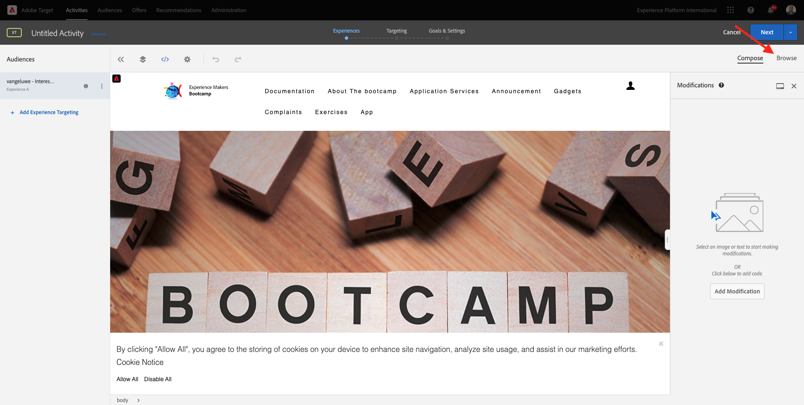
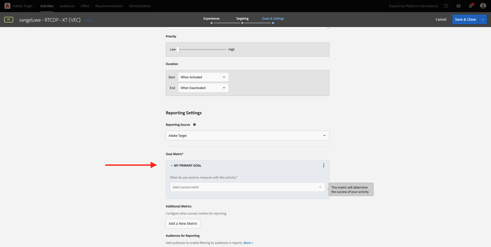

# 1.4 Ação: envie seu segmento para o Adobe Target

Öppna [Adobe Experience Platform](https://experience.adobe.com/platform). Depois de fazer inloggning, você irá acessar a página inicial da Adobe Experience Platform.

Antes de continuar, você preca selecionar um **sandbox**. O nome do sandbox a ser selecionado é Bootcamp. É kapível fazer isso clicando no texto **[!UICONTROL Production Prod]** na linha azul na parte superior da tela. Depois de selecionar o sandbox apropriado, você verá a tela mudando e agora você está em seu [!UICONTROL sandbox] dedikado.

## 1.4.1 Ative seu segmento para o destino do Adobe Target

O Adobe Target está DISonível como um destino do CDP em tempo real. Para configurar sua integração com o Adobe Target, acesse **Destinations** e **Catalog**.

Klicka på **Personalization**, ingen meny **Kategorier**. Você verá o cartão de destino do **Adobe Target**. Klicka på em **Aktivera segment**.

Välj mål ``Bootcamp Target`` e-klient **Nästa**.

Na lista de segmentos display oníveis, selecione o segmento que você criou em [1.3 Crie um segmento](./ex3.md), com o nome `yourLastName - Interest in Real-Time CDP`. Em seguida, clique em **Next**.

Na próxima página, clique em **Next**.

Klicka på **Slutför**.

Seu segmento agora está ativado para o Adobe Target.

>[!IMPORTANT]
>
>Imediatamente após criar seu destino do Adobe Target no Real-Time CDP, pode levar até uma hora para que o destino seja ativado. Este é um tempo de espera único devices à definção da configuração de back-end. Depois que o tempo de espera inicial de 1 hora e a configuração do back end For m gjídos, os segmentos de border a recém-adicionados que são enviados ao destino do Adobe Target estarão DISoníveis para segmentação em tempo real.

## 1.4.2 Konfigurera sua atividade på Adobe Target

Agora que seu segmento Real-Time CDP está configurado para ser enviado ao Adobe Target, é kapível configurar sua atividade de Segmentação por experience ência no Adobe Target. Neste övício, você irá configurar uma atividade baseada no Visual Experience Composer.

Öppna en página inicial da Adobe Experience Cloud acessando [https://experiencecloud.adobe.com/](https://experiencecloud.adobe.com/). Klicka på em **Target** para abrir.

Na página inicial do **Adobe Target**, você verá todas as atividades exists.
Klicka på em **+ Skapa aktivitet** para criar uma nova atividade.

Välj **Experience Targeting**.

Selecione **Visual** e defina a **Activity URL** como `https://bootcamp.aepdemo.net/content/aep-bootcamp-experience/language-masters/en/exercises/particpantXX.html`, mas, antes disso, substitua XX por um número entre 01 e 60.

>[!IMPORTANT]
>
>Cada deltagante da Capitação deve usar uma página da Web separada para evitar a colisão de várias upplevelências do Adobe Target. É kapível escolher uma página da Web e encontrar a URL acessando: [https://bootcamp.aepdemo.net/content/aep-bootcamp-experience/language-masters/en/exercises.html](https://bootcamp.aepdemo.net/content/aep-bootcamp-experience/language-masters/en/exercises.html).
>
>Todas as as páginas compartilham a mesma URL base e terminam com o número do deltagante.
>
>Por example, o deltagante 1 deve usar a URL `https://bootcamp.aepdemo.net/content/aep-bootcamp-experience/language-masters/en/exercises/particpant01.html`, o deltagante 30 deve usar a URL `https://bootcamp.aepdemo.net/content/aep-bootcamp-experience/language-masters/en/exercises/particpant30.html`.

Välj en av arbetsytorna **på Bootcamp**.

Klicka på **Nästa**.

Agora você está no Visual Experience Composer. Pode levar de 20 a 30 segundos até que o site esteja complete amente carregado.

Atualmente, o público padrão são **Alla besökare**. Clique nos **3 dots** ao lado de **All Visitors** e clique em **Change Audience**.

Agora você está vendo a lista de públicos disoníveis, e o segmento da Adobe Experience Platform que você criou anteriormente e enviou ao Adobe Target agora faz parte lista. Selecione o segmento que você criou Anteriormente na Adobe Experience Platform. Klicka på **Tilldela publik**.

Seu segmento da Adobe Experience Platform agora faz parte dessa Atividade de segmentação por experience ência.

Antes de alterar a imagem Principal, você deve clicar em **Allow All** no banner de cookies.

Para isso, vá para **Browse**

Em seguida, clique em **Allow All**.

Fyrkant, retorne para **Compose**.

Agora vamos mudar a imagem Principal na página inicial do site. Klicka på en imagem-huvudnamn padrão ingen plats, klicka på em **Ersätt innehåll** e selecione **Bild**.

Pesquise o arquivo de imagem **rtcdp.png**. Markera ett e-klick som **Spara**.

Você verá a nova experience ência com a nova imagem para o seu Público selecionado

Clique no título da sua atividade no canto superior esquerdo para renomeá-la.

Para nome, use:

- `seuSobrenome - RTCDP - XT (VEC)`

Klicka på **Nästa**.

Klicka på **Nästa**.

Na página **Mål och inställningar**, gå till **Målmått**.

Definiera ett metahuvudkonto för **engagemang** - **tid på plats**. Klicka på **Spara och stäng**.

Agora você está na página **Aktivitetsöversikt**. Você ainda preca ativar sua Atividade.

Klicka på ingen campo **Inaktiv** e selecone **Aktivera**.

Você receberá uma bekräftmação visual de que sua atividade agora está ativa.

Agora sua atividade está ativa e pode ser testada no site do bootcamp.

Se agora você voltar ao seu site de demonstração e visitar a página do produto para **Real-Time CDP**, você se Qualificará instantaneamente para o segmento que criou e verá a atividade do Adobe Target exibida na página inicial em tempo real.

>[!IMPORTANT]
>
>Cada deltagante da Capitação deve usar uma página da Web separada para evitar a colisão de várias upplevelências do Adobe Target. É kapível escolher uma página da Web e encontrar a URL acessando ao link: [https://bootcamp.aepdemo.net/content/aep-bootcamp-experience/language-masters/en/exercises.html](https://bootcamp.aepdemo.net/content/aep-bootcamp-experience/language-masters/en/exercises.html).
>
>Todas as as páginas compartilham a mesma URL base e terminam com o número do deltagante.
>
>Por example, o deltagante 1 deve usar a `https://bootcamp.aepdemo.net/content/aep-bootcamp-experience/language-masters/en/exercises/particpant01.html`, o deltagante 30 deve usar a URL `https://bootcamp.aepdemo.net/content/aep-bootcamp-experience/language-masters/en/exercises/particpant30.html`.

Próxima etapa: [1.5 Ação: envie seu segmento para o Facebook](./ex5.md)

[Retornar para Fluxo de Usuário 1](./uc1.md)

[Retornar para Todos os Módulos](../../overview.md)
