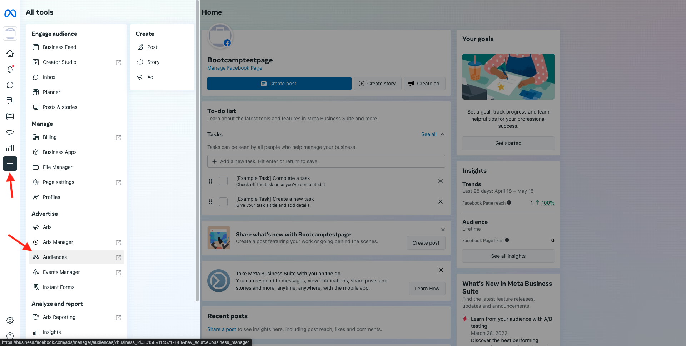

# 1.5 Ação: envie seu segmento para o Facebook

Åtkomst [Adobe Experience Platform](https://experience.adobe.com/platform). Depois de fazer inloggning, você irá acessar a página inicial da Adobe Experience Platform.

Antes de continuar, você preca selecionar um **sandlåda**. O nome do sandbox a ser selecionado é Bootcamp. É beível fazer isso clicando no texto **[!UICONTROL Produktionsprodukt]** na linha azul na parte superior da tela. Depois de selecionar o sandbox apropriado, você verá a tela mudando e agora você está em seu [!UICONTROL sandlåda] dedikat.

Ingen meny à esquerda, vá para **Destinationer** e, em seguida, vá para **Katalog**. Você verá o **Målkatalog**. FM **Destinationer**, clique em **Aktivera segment** no cartão **Facebook Custom Audience**.

Markera **bootcamp-facebook** e clique em **Nästa**.

Na lista de segmentos display oníveis, selecione o segmento que você criou no övício anterior. Clique em **Nästa**.

Na página **Mappning**, verifique se a caixa de seleção **Använd omformning** está marcada. Clique em **Nästa**.

Na página **Segmentschema**, välj en **Målgruppens ursprung** e defina como **Direkt från kunderna**. Clique em **Nästa**.

Por fim, na página **Granska**, clique em **Slutför**.

Seu segmento agora está vinculado aos Públicos Personalizados do Facebook. Sempre que um cliente se Qualificar para esse segmento, um sinal será enviado ao lado do servidor (server-side) do Facebook para includes esse cliente no Público Personalizado no lado do Facebook.

No Facebook, você encontrará seu segmento da Adobe Experience Platform em Públicos Personalizados:

Agora você pode ver seu público personalizado aparecer no Facebook:

[Retornar para Fluxo de Usuário 1](./uc1.md)

[Retornar para Todos os Módulos](../../overview.md)
