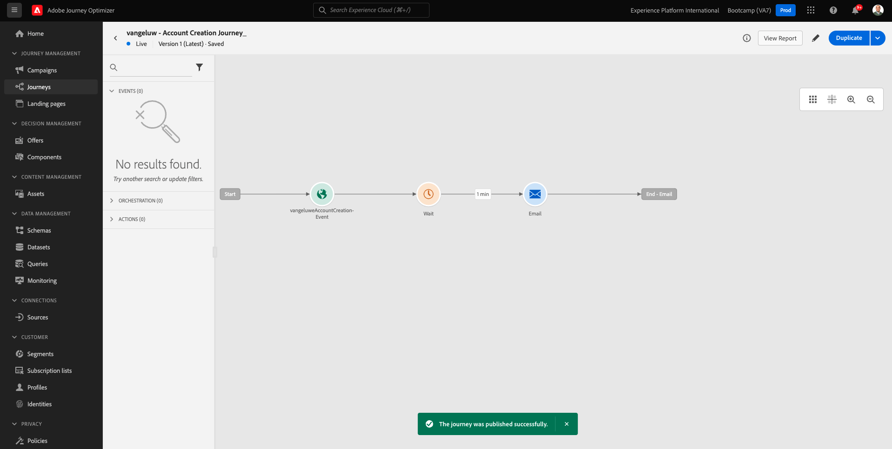

# 2.3 Krim sua janda e mensagem de e-mail

Neste övício, você irá configurar a jnada que preca ser acionada quando alguém criar uma conta no site de demonstração.

Faça-inloggning på Adobe Journey Optimizer acessando a [Adobe Experience Cloud](https://experience.adobe.com). Clique em **Journey Optimizer**.

Você será redirecionado para a visualização da **Startsida**  ingen Journey Optimizer. Primeiro, verifique se você está usando o sandbox correto. O nome do sandbox que deve ser usado `Bootcamp`. Para alternar de um sandbox para outro, clique em **Prod** Vi väljer sandlådelista. Neste exemplo, nome do sandbox é **Bootläger**. Você estará na visualização da **Startsida** do seu, sandlåda `Bootcamp`.

## 2.3.1 Brott mot en sua jnada

Ingen meny à esquerda, clique em **Resor**. Em seguida, clique em **Skapa resa** para criar uma nova journnada.

Você verá uma tela de husnada vazia.

Ingen övício anterior, você criou um novo **Händelse**. Você nomeo o even to `yourLastNameAccountCreationEvent` e substituiu `yourLastName` bl.a. sobrenome. Este foi o resultado da criação do Evento:

Agora você deve Consiar este even to como o o início desta Jornada. Você pode fazer isso indo para o lado esquerdo da tela e procurando pelo seu even to na lista de eventos.

Markera en seu even to, arablone solte o even to na tela de Jornada. Sua Jornada agora deve ser semelhante ao seguinte:

Como segunda etapa da hunada, você deve adicionar uma etapa curta de **Vänta**. Vá para o lado esquerdo da tela até a seção **Orchestration** para encontrar isso. Você usará atributos de perfil e precará garantir que eles sejam preenchidos no Perfil do Cliente em tempo real.

Sua janda agora deve ser semelhante ao seguinte. Ingen lado direito da tela você preca configurar o tempo de espera. Definiera en gemensam minuto. Isso dará bastante tempo para que os atributos do perfil estejam disoníveis após o skilo do even to.

Clique em **OK** para salvar suas alternações.

Como terceira etapa da husnada, você deve adicionar uma ação **E-post**. Vá para o lado esquerdo da tela para **Åtgärder**, selecione a ação **E-post** e arablone solte a ação no segundo nó da sua jnada. Agora o seguinte será exibido.

Ange **Kategori** till **Marknadsföring** och välj en e-postyta som gör att du kan skicka e-post. I det här fallet är e-postytan som ska väljas **E-post**. Se till att kryssrutorna för **Klicka på e-post** och **e-post öppnas** båda är aktiverade.

Definiera en **Kategori** como **Marknadsföring** e selecione uma superfície de e-mail que behörighetita o envio de e-mail. Nesse caso, a superfície e-mail a ser selecionada é E-mail. Certifique-se de que as caixas de seleção **Klicka på e-post** e **e-post öppnas** estejam marcadas.

En próximo etapa é criar sua mensagem. Para isso, clique em **Redigera innehåll**.

## 2.3.2 Krim a sua mensagem

Para criar sua mensagem, clique em **Redigera innehåll**.

O seguinte será exibido.

Clique no campo de texto **Subject line**.

Na área de texto, comece **Olá**

En linha de assunto ainda não está prta. Em seguida, você preca trazer o token de personalização para o **Förnamn** que está armazenado em `profile.person.name.firstName`. Ingen meny à esquerda, role para baixo para encontrar o elemento **Person** e clique na seta para ir um nível mais profundamento.

Agora encontre o elemento **Fullständigt namn** e clique na seta para ir um nível mais profundamento.

Por fim, localize o campo **Förnamn** e clique no símbolo **+**  aao lado dele. Você verá o token de personalização aparecer no campo de texto.

Em seguida, adicione o texto, **agraDecember a sua inscrição!** Clique em Salvar. . Clique em **Spara**.

Então, você irá retornar para esta tela. Clique em **E-postdesigner**  para criar o conteúdo do e-mail.

Na próxima tela, será solyckado que você forneça o conteúdo do e-mail através de 3 métodos diferentes:

- **Designa från grunden**: Comece com uma tela em branco e use o editor WYSIWYG para arrastar e soltar a estrutura e os components de conteúdo para criar visualmente o conteúdo e mail.
- **Koda din egen**: Crie seu próprio modelo de e-mail kodificando usando HTML
- **Importera HTML**: Importe um modelo HTML existente, que você poderá editar.

Clique em **Importera HTML**.

Arablonsolte o arquivo **mailmallebootcamp.html**, que você pode baixa [här](../../assets/html/mailtemplatebootcamp.html.zip). Clique em Importar.

Você verá este modelo de e-mail padrão:

Vamos personalizar o e-mail. Clique ao lado do texto **Olá** e, em seguida, clique no ícone **Lägg till personalisering**.

Em seguida, você preca trazer o token de personalização **Förnamn** que está armazenado em `profile.person.name.firstName`. Ingen meny, lokalisera eller element **Person**, faça uma busca detail hada no elemento **Fullständigt namn** e clique no ícone **+** para adicionar o campo **Förnamn** ao editor de expressão.

Clique em **Spara**.

Agora você verá como o campo de personalização foi adicionado ao seu texto.

Clique em **Spara** para salvar sua mensagem.

Retorne para o smärtel de mensagens clicando na seta ao lado do texto da linha de assunto no canto superior esquerdo.

Agora você final a criação do seu e-mail de cadastro. Clique na seta no canto superior esquerdo para retornar à sua husnada.

Clique em **OK**.

## 2.3.3 Publicera en sua jnada

Você ainda preca dar um Nome à sua jnada. Você pode fazer isso clicando no ícone **Egenskaper** ingen canto superior direito da tela.

Você ainda preca dar um Nome à sua jnada. Você pode fazer isso clicando no ícone `yourLastName - Account Creation Journey`. Clique em **OK** para salvar as mudanças.

Agora você pode publicar sua jnada clicando em **Publicera**.

Clique em **Publicera**  novamente.

Você verá uma barra de bekräftmação verde informando que sua jnada agora está Publicada.

Você terminou este övício.

Próxima etapa: [2.4 Testa sua janda](./ex4.md)

[Retornar para Fluxo de Usuário 2](./uc2.md)

[Retornar para Todos os Módulos](../../overview.md)