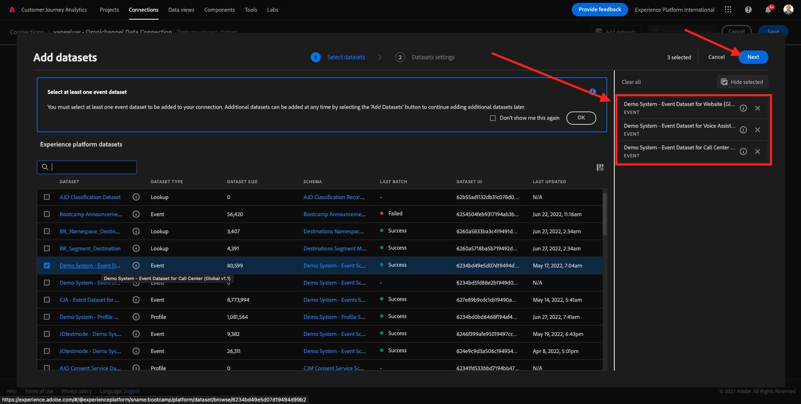
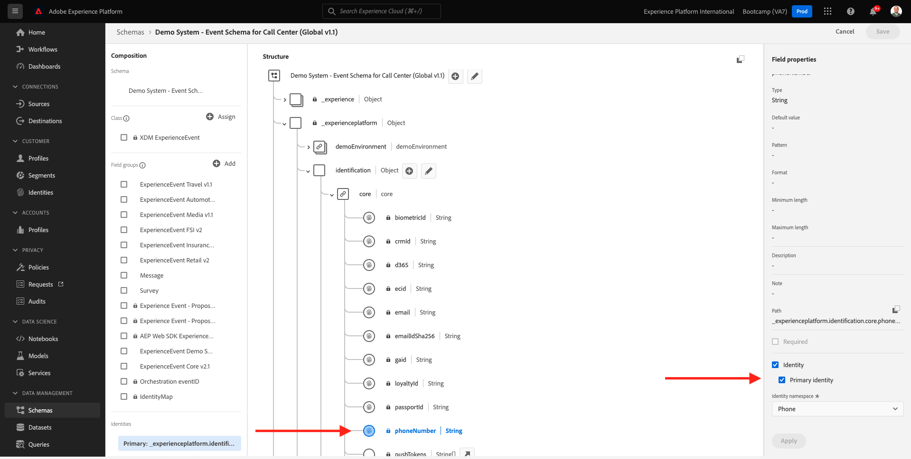

# 4.2 Conecte datasets da Adobe Experience Platform no Customer Journey Analytics

## Objetivos

- Compreenda a UI da conexão de dados
- Traga os dados da Adobe Experience Platform para o CJA
- Entenda a ID da pessoa e a compilação de dados
- Aprenda o conceito de streaming de dados no Customer Journey

## 4.2.1 Conexão

Åtkomst [analytics.adobe.com](https://analytics.adobe.com) para acessar på Customer Journey Analytics.

Na página inicial do Customer Journey Analytics, acesse **Anslutningar**.

Aqui você pode ver todas as diferentes conexões feitas entre o CJA e a Plataforma. Essas conexões têm o mesmo objekttivo dos conjuntos de relórios no Adobe Analytics. Ingen entanto, en coleta dos dados é complete diferente. Todos os dados vêm de datasets da Adobe Experience Platform.

Vamos criar sua primeira conexão. Clique em **Skapa ny anslutning**.

Você verá a UI **Skapa anslutning** Gränssnitt.

Agora você pode dar um nome à sua conexão.

Använd este modelo de nomenklatura: `yourLastName – Omnichannel Data Connection`.

Exempel: `vangeluw - Omnichannel Data Connection`

Você também deve selecionar o sandbox correto para usar. Ingen meny-sandlåda, selektiv seu-sandlåda, que deve-användare `Bootcamp`. Neste exemplo, o sandbox a ser usado é o **Bootläger**. E você também deve definition o **Genomsnittligt antal dagliga händelser** till **mindre än 1 miljon**.

Após selecionar seu sandbox, você pode começar a adicionar datasets a esta conexão. Clique em **Lägg till datauppsättningar**.

## 4.2.2 Välja ut datauppsättningar som Adobe Experience Platform

Datauppsättning i detalj `Demo System - Event Dataset for Website (Global v1.1)`. Clique em **+** para adicionar o dataset a esta conexão.

Agora pesquise e marque as caixas de seleção `Demo System - Event Dataset for Voice Assistants (Global v1.1)` och `Demo System - Event Dataset for Call Center (Global v1.1)`.

Em seguida, você verá a tela abaixo. Clique em **Nästa**.

## 4.2.3 ID da pessoa e compilação de dados

### ID da pessoa

O objectivo agora é juntar esses datasets. Para cada dataset selecionado, você verá um campo chamado **Person-ID**. Cada dataset tem seu próprio campo de ID de pessoa.

Como você pode ver, a majstjärtar o ID da pessoa selecionado automcamente. Isso ocorre porque um identificador pal é selecionado em cada esquema na Adobe Experience Platform. Como exemplo, aqui está o esquema para `Demo System - Event Schema for Call Center (Global v1.1)`, ond você pode ver que o Identificador Primário está defindo como `phoneNumber`.

Inga entanto, você ainda pode influenciar qual identificador será usado para compilar datasets para sua conexão. Você pode usar qualquer identificador configurado no esquema vinculado ao seu dataset. Klicka på ingen meny suspenso para explorar os IDs DISoníveis em cada dataset.

Conforme mencionado, você pode definition diferentes IDs de pessoa para cada dataset. Isso allow ite reunir diferentes datasets de múltiplas origens no CJA. Imagine trazer NPS ou dados de pesquisa que seriam muito interessantes e úteis para compreender o contexto e o motivo de um acontecimento.

O nome do campo ID da pessoa não é importante, desde que o valor nos campos ID da pessoa korda. Digamos que temos `email` em um dataset e `emailAddress` em outro dataset definition do como ID da pessoa. Se `delaigle@adobe.com` tiver o mesmo valor para o campo ID da pessoa em ambos os datasets, o CJA poderá compilar os dados.

Atualmente, existem algumas outras limitações, como compilar o comportamento anônimo para conhecido. Consulte as perguntas frequency entes aqui: [Vanliga frågor](https://experienceleague.adobe.com/docs/analytics-platform/using/cja-overview/cja-faq.html).

### Compilando os dados usando o ID da pessoa

Agora que você compreende o conceito de compilar datasets usando o ID da pessoa, vamos escolher `email` como ID da pessoa para cada dataset.

Acesse cada dataset para atualizar o ID da pessoa.

Agora preencha o campo ID da pessoa escolhendo o `email` en lista suspensa.

Depois de compilar os três datasets, estamos prtos para continuar.

| datauppsättning | Person-ID |
| ----------------- |-------------| 
| Demo System - händelsedatauppsättning för webbplats (Global v1.1) | e-post |
| Demonstrationssystem - händelsedatauppsättning för röstassistenter (Global v1.1) | e-post |
| Demo System - händelsedatauppsättning för callcenter (Global v1.1) | e-post |

Você também preca garantir que, para cada dataset, essas opções estejam habilitadas:

- Importar todos os novos dados
- Preencher gör så att det inte finns några fler
- Preencher tipo de fonte de dados com &quot;Others&quot;
- Preencher a descrição com o mesmo nome do Dataset

Clique em **Lägg till datauppsättningar**.

Clique em **Spara** e vá para o próximo övício. Depois de criar sua **Anslutning**, pode levar algumas horas até que seus dados estejam disoníveis no CJA.

Próxima etapa: [4.3 Crie uma Visualização de Dados](./ex3.md)

[Retornar para Fluxo de Usuário 4](./uc4.md)

[Retornar para Todos os Módulos](./../../overview.md)
