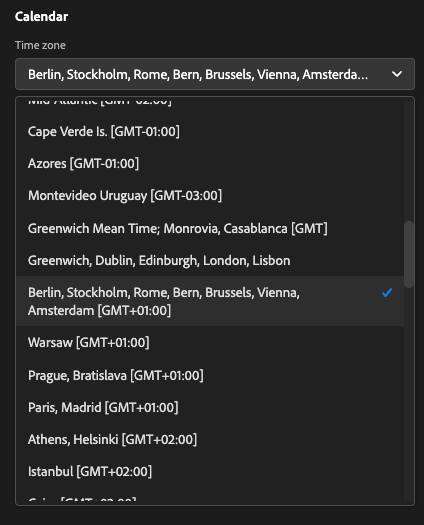

# 4.3 Crie uma Visualização de Dados

## Objetivos

- Entenda a UI de Visualização de Dados
- Compreenda as configurações básicas de definção de visita
- Compreenda a atribuição e a Persistência em uma Visualização de

## 4.3.1 Visualização de Dados

Agora, com sua conexão slutída, é kapível progredir para influenciar a visualização. Uma diferença entre o Adobe Analytics e o CJA é que o CJA precise a de uma visualização de dados para limpar e preparar os dados antes da visualização.

Uma Visualização de Dados é semelhante ao conceito de Virtual Report Suites no Adobe Analytics, ond você estabelece as definções de visita com conheimento de contexto, filtragem e também como os components são chamados.

Será necessary ário, no mínimo, uma Visualização de Dados por conexão. No entanto, para algun casos de uso, é ótimo ter múltiplas Visualizações de Dados para a mesma conexão, com o objectivo de fornecer insights diferentes para equipes distintas. Se você deseja que sua empresa seja orientada por dados, deve adaptar a format como os dados são vibest em cada equipe. Exempel:

- Métricas de UX apenas para a equipe de UX Design
- Använd os mesmos nomes para KPIs e métricas para o Google Analytics e para o Customer Journey Analytics, para que a equipe de análise digital fale apenas 1 idioma.
- Visualização de Dados filtrada para moetter, por exemplo, dados para apenas um mercado, ou uma marca, ou apenas para Disposivos móveis.

Na tela de **Anslutningar** marque a caixa de seleção da conexão que você acabou de criar. Clique em  **Skapa datavy**.

Você será redirecionado para o fluxo de trabalho **Skapa datavy** arbetsflöde.

## 4.3.2 Definição de Visualização de Dados

Agora você pode configurar as definções básicas para sua Visualização de dados.

A **Anslutning** que você criou no övício anterior já está selecionada. Sua conexão se chama `yourLastName – Omnichannel Data Connection`.

Em seguida, dê um nome à sua Visualização de Dados seguindo este modelo de nomenklclatura: `yourLastName – Omnichannel Data View`.

Insira o mesmo valor para a descrição: `yourLastName – Omnichannel Data View`.

| Namn | Beskrivning |
| ----------------- |-------------| 
| `yourLastName – Omnichannel Data View` | `yourLastName – Omnichannel Data View` |

Para **Tidszon**, selecione o fuso horário **Berlim, Estocolmo, Roma, Berna, Bruxelas, Viena, Amsterdam GMT+01:00**. Este é um cenário realmente interessante, pois algumas empresas operam em diferentes países e geografias. Alocar o fuso horário certo para cada país evitará erros típicos de dados, como, por example, acreditar que a Maioria das pessoas compra camisetas à 4h no Peru.

Você também pode modificar a nomenklclatura das métricas Principais (Pessoa, Sessão e Evento). Isso não é obrigatório, mas algun clientes gostam de usar Pessoas, Visitas e Acessos em vez de Pessoa, Sessão e Eventos (kallção de nomenklclatura padrão do Customer Journey Analytics).

Agora você deve ter as seguintes configurações definidas:

Clique em **Spara och fortsätt**.

## 4.3.3 Components da Visualização de Dados

Neste övício, você irá configurar os components necessary ários para analisar os dados e visualizá-los usando o Analysis Workspace. Nesta IE, há três áreas Principais:

- Lado esquerdo: Komponenter disoníveis dos datasets selecionados
- Media: Komponenter adicionados à Visualização de Dados
- Lado direito: Configurações do component

>[!IMPORTANT]
>
>Se você não encontrar uma métrica ou dimensão específica, verifique se o campo `Contains data` foi removido de sua visualização de dados. Caso contrário, exklua esse campo.
>
>

Agora você preca arrastar e soltar os components necessary ários para a análise nos **Komponenter har lagts till**. Para isso, você deve selecionar os components no menu à esquerda e arrastá-los e soltá-los na tela no meio.

Vamos começar com o primeiro component: **Namn (web.webPageDetails.name)**. Pesquise esse component e arablono e solte-o na tela.

Esse component é o nome da página, como você pode derivar da leitura do campo do schema `(web.webPageDetails.name)`.

Ingen entanto, usar **Namn** como o nome não é a melhor Kallção de nomenklclatura para um usuário corporativo compreender rapidamente essa dimensão.

Vamos mudar o nome para **Sidnamn**. Clique no component e o renomeie na área **Komponentinställningar**.

As Configurações de persistência são **Upprepningsinställningar**. Os conceitos de eVars e prop não existem no CJA, mas as configurações de Persistência possibilitam um comportamento semelhante.

Se você não alterar essas configurações o CJA irá interpretar a dimensão como um **Prop** (nível de ocorrência). Além disso, podemos alterar a Persistência para tornar a dimensão uma **eVar** (Perstir o valor ao longo da ejnada).

Se você não estiver Famarizado com eVars e Props [leia mais sobre isso na dokumentação](https://experienceleague.adobe.com/docs/analytics/landing/an-key-concepts.html)..

Vamos deixar o Nome da Página como Prop. Dessa format, você não preca alterar nenhuma **Beständiga inställningar**.

| Komponentnamn att söka efter | Nytt namn | Beständiga inställningar |
| ----------------- |-------------| --------------------| 
| Namn (web.webPageDetails.name) | Sidnamn |          |

Em seguida, escolha a dimensão **phoneNumber** e solte-a na tela. O novo nome deve **Telefonnummer**.

Por fim, vamos alterar as Configurações de persistência, pois o Número do Celular deve persistir no nível do usuário.

Para alterar a Persistência, role para baixo no menu à direita e abra a aba **Persistence**:

Marque a caixa de seleção para modificar as configurações de persistência. Markering **Senaste** e o escopo **Person (rapporteringsfönstret)**, pois nos preocupamos apenas com o último número de celular da pessoa. Se o cliente não preencher o celular em visitas futuras, você ainda verá esse valor preenchido.

| Komponentnamn att söka efter | Nytt namn | Beständiga inställningar |
| ----------------- |-------------| --------------------| 
| phoneNumber | Telefonnummer | Senaste, person (rapportfönster) |

O próximo Componente `web.webPageDetails.pageViews.value`.

Ingen meny à esquerda, pesquise `web.webPageDetails.pageViews.value`. Arablone solte essa métrica na tela.

Altere o nome para **Sidvyer** under **Komponentinställningar**.

| Komponentnamn att söka efter | Nytt namn | Attributinställningar |
| ----------------- |-------------| --------------------| 
| web.webPageDetails.pageViews.value | Sidvisningar |         |

Para as configurações de atribuição, deixaremos em branco.

Observação: Som configurações de persistência nas métricas também podem ser alternadas no Analysis Workspace. Em algun casos, você pode optar por configurá-las aqui para evitar que os usuários de negócios tenham que pensar qual é o melhor modelo de persistência.

Em seguida, você terá que configurar várias Dimensões e Métricas, conforme Indicado na tabela abaixo.

### DIMENSÖ

| Komponentnamn att söka efter | Nytt namn | Beständiga inställningar |
| ----------------- |-------------| --------------------| 
| brandName | Märkesnamn | Senaste, session |
| kallkänsla | Ring |          |
| call ID | Samtalsinteraktionstyp |          |
| callTopic | Ämne för samtal | Senaste, session |
| ecid | ECID | Senaste, person (rapportfönster) |
| e-post | E-post-ID | Senaste, person (rapportfönster) |
| Betalningstyp | Betalningstyp |          |
| Metod för produkttillägg | Metod för produkttillägg | Senaste, session |
| Händelsetyp | Händelsetyp |         |
| Namn (productListItems.name) | Produktnamn |         |
| SKU | SKU (session) | Senaste, session |
| Transaktions-ID | Transaktions-ID |         |
| URL (web.webPageDetails.URL) | URL |         |
| Användaragent | Användaragent | Senaste, session |

### MÉTRICA

| Komponentnamn att söka efter | Nytt namn | Attributinställningar |
| ----------------- |-------------| --------------------| 
| Kvantitet | Kvantitet |          |
| commerce.order.priceTotal | Intäkter |         |

Sua configuração deve ser semelhante ao seguinte:

Não se esqueça de Salvar sua Visualização de Dados. Então clique em **Spara**.

## 4.3.4 Métricas calculadas

Embora tenhamos organizado todos os Componentes na Visualização de dados, você ainda deve adaptar algun stjärtar que os usuários de negócios estejam prtos para iniciar suas análises.

Se você se lembra, não trouxemos especificamente Métricas como Adicionar ao Carrinho, Visualização do produto ou Compras para a Visualização de dados. Ingen entanto, temos uma dimensão chamada: **Händelsetyp**. Então, vamos derivar esses tipos de interação criando 3 métricas calculadas.

Vamos começar com a primeira Métrica: **Produktvyer**.

Ingen lado esquerdo, pesquise **Händelsetyp** Välj en dimensão. Em seguida, arboxo e solte-o na tela **Inkluderade komponenter**.

Clique para selecionar a nova métrica **Händelsetyp**.

Agora alterne o nome e a descrição do component para os seguintes valores:

| Komponentnamn | Komponentbeskrivning |
| ----------------- |-------------| 
| Produktvisningar | Produktvisningar |

Agora vamos contar apenas eventos de **Produktvyer**. Para fazer isso, role para baixo em **Komponentinställningar** até ver Valores de **Inkludera exkluderade värden**. Certifique-se de habilitar a opção **Ange inkluderings-/exkluderingsvärden**.

Como queremos contar apenas **Produktvyer**, especifique **commerce.productViews** nos critérios.

Agora a sua métrica calculada está prta!

Em seguida, repita o mesmo processo para os eventos **Lägg i kundvagnen** e **Inköp**.

### Lägg i kundvagnen

Primeiro, arradin solte a mesma dimensão **Händelsetyp**.

Você verá um alerta pop-up de um Campo Duplicado, pois estamos usando a mesma variável. Clique em **Lägg till ändå**:

Agora, siga o mesmo processo que fizemos para a métrica Visualizações de produto:
- Primeiro alterne o nome e a descrição.
- Por fim, adicione **commerce.productListAdds** como critério para contar apenas Add to Cart

| Namn | Beskrivning | Kriterier |
| ----------------- |-------------| -------------|
| Lägg i kundvagnen | Lägg i kundvagnen | commerce.productListAdds |

### Inköp

Primeiro, arradin solte a mesma dimensão **Händelsetyp** como fizemos para as duas métricas anteriores.

Você verá um alerta pop-up de um Campo Duplicado, pois estamos usando a mesma variável. Clique em **Lägg till ändå**:

Agora, siga o mesmo processo que fizemos para as métricas Product Views e Add to cart:
- Primeiro alterne o nome e a descrição.
- Por fim, adicione **commerce.purchase** como critérios para conabilizar apenas as Compras

| Namn | Beskrivning | Kriterier |
| ----------------- |-------------| -------------|
| Inköp | Inköp | commerce.purchases |

Sua configuração final deve ser semelhante ao seguinte. Clique em **Spara och fortsätt**.

## 4.3.5 Components da Configuração de Dados

Você deve ser redireccionado para esta tela:

Nesta aba, você pode modificar algumas configurações importantes para alterar a forma como os dados são processados. Vamos começar definindo o **Tidsgräns för session** com 30 min. Graças ao registro de data e hora de cada even to de experience ência, você pode estender o conceito de uma sessão em todos os canais. Por example, o que acontece se um cliente ligar para o call center depois de visitar o site? Usando Tempos Limite de Sessão personalizados, você tem muita Fledade para decidir o que é uma sessão e como essa sessão irá mesclar os dados.

Nesta aba você pode modificar outras coisas como filtrar os dados usando um segmento/filtro. Você não precará fazer isso neste övício.

Quando-terminal, clique em **Spara och avsluta**.

>[!NOTE]
>
>Você pode voltar a esta Visualização de dados posteriormente e alterar as configurações e os components a qualquer momento. Som alternativ ações afetarão a forma como os dados históricos são mostrados.

Agora você pode continuar com a parte de visualização e análise!

Próxima etapa: [4.4 Preparação de dados em Customer Journey Analytics](./ex4.md)

[Retornar para Fluxo de Usuário 4](./uc4.md)

[Retornar para Todos os Módulos](./../../overview.md)
