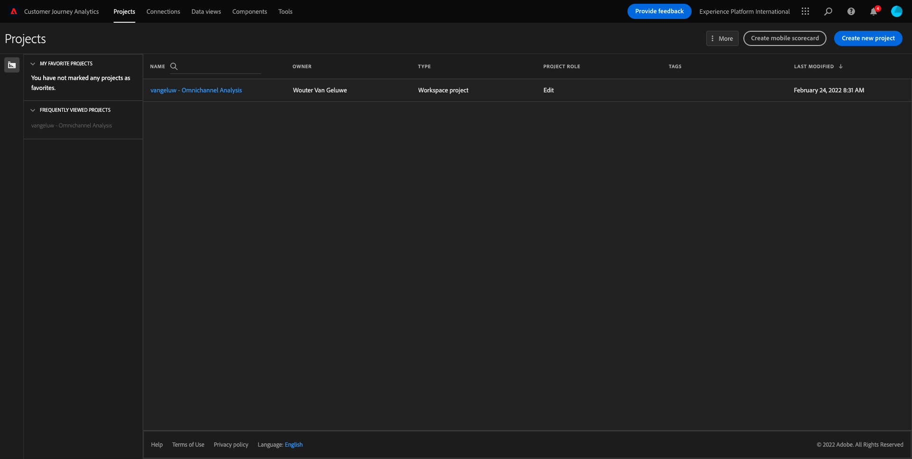
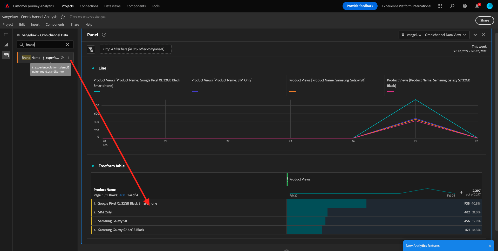
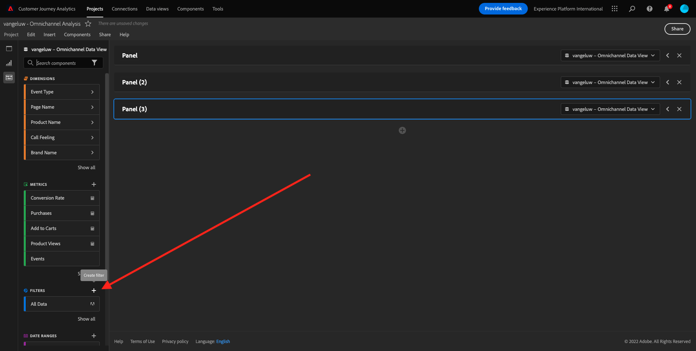

# 4.5 Visualização usando o Customer Journey Analytics

## Objetivos

- Entenda a UI do Analysis Workspace
- Conheça algun recursos que tornam o Analysis Workspace tão diferente.
- Aprenda a analisar no CJA usando o Analysis Workspace

## Sammanhang

Neste övício, você usará o Analysis Workspace no CJA para analisar visualizações de produtos, funis de produtos, rotatividade osv.

Vamos usar o projeto que você criou em  [4.4 Preparação de dados no Analysis Workspace](./ex4.md), então acesse [https://analytics.adobe.com](https://analytics.adobe.com).

Abra seu projeto `yourLastName - Omnichannel Analysis`.

Com seu projeto aberto e Visualização de dados `yourLastName - Omnichannel Analysis` selecionado, você está pronto para começar a construir suas primeiras visualizações.

## Quantas visualizações de produtos temos diariamente?

Em primeiro lugar, precamos selecionar as data as certas para analisar os dados. Gå till Menu suspenso do calendário no lado direito da tela. Clique nele e selecione o intervalo de data as aplicável.

>[!IMPORTANT]
>
>Selecione um intervalo de data como **Den här veckan** Du **Den här månaden**. Os dados DISoníveis mais recentes foram absorvidos em 19 de setembro de 2022.

Ingen meny do lado esquerdo (área de components), encontre as métricas calculadas **Produktvyer**. Selecione-as e arbela solte na tela, no canto superior direito da tabela de format livre.

Automaticamente a dimensão **Dag** será adicionada para criar sua primeira tabela. Agora você pode ver sua pergunta respondida imediatamente.

Em seguida, clique com o botão direito do mouse no resumo da métrica.

Clique em **Visualisera** e selecione **Linje** como visualização.

Você verá as suas visualizações de produto por dia.

Você pode alterar o escopo de tempo para o dia clicando em **Inställningar** na visualização.

Clique no ponto ao lado de **Linje** e **Hantera datakällan**.

Em seguida, clique em **Lås markering** e selecione **Markerade objekt** para bloquear esta visualização para que ela sempre exiba uma linha do tempo de Visualizações de produtos.

## 5 produtos mais vibest

Quais são os 5 products mais vibest?

Lembre-se de salvar o projeto de tempos em tempos.

| OS | Kort klipp |
| ----------------- |-------------| 
| Windows | Ctrl+S |
| Mac | Kommando + S |

Vamos começar a encontrar os 5 produtos mais vibest. Ingen meny do lado esquerdo, encontre o Nome do produto - Dimensão.

Agora arablonsolte **Produktnamn** para substituir a dimensão **Dag**:

Este será o resultatado.

Em seguida, tente dividir um dos produtos por Nome da marca. Pesquise **brandName** e arablonpara baixo do primeiro nome do produto.

Em seguida, faça um detaljhamento usando o Agente de usuário. Pesquise **Användaragent** e arablono para baixo do nome da marca.

Em seguida, será exibida a tela abaixo:

Por fim, você pode adicionar mais visualizações. No lado esquerdo, em visualizações, pesquise `Donut`. Pegue `Donut`, arsucce solte na tela sob a visualização **Linje** 

I tabellen väljer du sedan de första 5 **Användaragent**  rader från den uppdelning vi gjorde under **Google Pixel XL 32 GB svart smarttelefon** > **Citi Signal**. Håll ned **CTRL** eller **Kommando** (på Mac).

Em seguida, na Tabela, selecione as primeiras 5 linhas de **Användaragent** do details hamento que fizemos em **Google Pixel XL 32 GB svart smarttelefon** > **Citi Signal**. Ao selecionar as 5 linhas, segure of botão **CTRL** (inga Windows) eller botão **Kommando** (ingen Mac).

Você verá o gráfico de donut alternado:

Você pode até adaptar o design para ser mais legível, tornando o gráfico de **Linje** e o gráfico de **Munk** um pouco menor para que sejam exibidos lado a lado:

Clique no ponto ao lado de *Munk** para **Hantera datakällan**. Em seguida, clique em **Lås markering** para bloquear essa visualização para que ela sempre exiba uma linha do tempo de Visualizações de produto.

Saiba mais sobre visualizações usando o Analysis Workspace em:

- [https://experienceleague.adobe.com/docs/analytics/analyze/analysis-workspace/visualizations/freeform-analysis-visualizations.html](https://experienceleague.adobe.com/docs/analytics/analyze/analysis-workspace/visualizations/freeform-analysis-visualizations.html)
- [https://experienceleague.adobe.com/docs/analytics/analyze/analysis-workspace/visualizations/t-sync-visualization.html](https://experienceleague.adobe.com/docs/analytics/analyze/analysis-workspace/visualizations/t-sync-visualization.html)

## Funil de interação do produto, da visualização à compra

Befintliga multimediaformat de resolver esta questão. Uma dela é usar o Tipo de Interação de Produto e usá-lo em uma tabela de formato livre. Outra forma é usar uma **Bortfallsvisualisering**. Vamos usar o último, pois queremos visualizar e analisar ao mesmo tempo.

Feche o smärtan atual clicando aqui:

Agora adicione um novo smärte em branco clicando em **+ Lägg till tom panel**.

Clique na visualização de **Utfall**.

Selecione o mesmo intervalo de data do övício anterior.

Em seguida, você verá:

Encontre a dimensão **Händelsetyp** nos components no lado esquerdo:

Clique na seta para abrir a dimensão:

Você verá todos os Tipos de eventos DISoníveis.

Markera ett objekt **commerce.productViews** e arablone solte-o no campo **Lägg till kontaktpunkt** dentro da **Bortfallsvisualisering**.

Faça o mesmo com **commerce.productListAdds** och **commerce.purchase** e solte-os no campo **Lägg till kontaktpunkt** dentro da  **Bortfallsvisualisering**. Sua visualização agora deve ser semelhante ao seguinte:

Você pode fazer muitas coisas aqui. Exempel: Comparar ao longo do tempo, Comparar cada passo por disposivo ou Comparar por fidelidade. No entanto, se quisermos analisar coisas interessantes como porque os clientes não compram depois de adicionar um item ao carrinho, podemos usar a melhor ferramenta do CJA: clicar com o botão direito.

Clique com o botão direito do mouse no touchpoint **commerce.productListAdds**. Em seguida, clique em **Brytningsbortfall vid den här kontaktytan**.

Uma nova tabela de formato livre será criada para analisar o que as pessoas fizeram se não compraram.

Ändra o **Händelsetyp** av **Sidnamn**, na nova tabela de formo livre, para ver em quais páginas eles estão indo, em vez da Página de bekräftmação de compra.

## O que as pessoas fazem no site antes de acessar a página Cancelar serviço?

Novamente, há muitas formas de realizar essa análise. Vamos usar a análise de fluxo para iniciar parte da descoberta.

Feche o smärtan atual clicando aqui:

Agora adicione um novo smärte em branco clicando em **+ Lägg till tom panel**.

Clique na visualização **Flöde**.

Em seguida, será exibido:

Selecione o mesmo intervalo de data do övício anterior.

Encontre a dimensão **Sidnamn** nos components no lado esquerdo:

Clique na seta para abrir a dimensão:

Você encontrará todas as páginas view. Encontre o nome da página: **Avbryt tjänst**.
Arraysolte **Avbryt tjänst** na Visualização de fluxo no campo do meio:

Em seguida, será exibido:

Vamos agora analisar se os clientes que visitaram a página C **Avbryt tjänst** ingen webbplats também ligaram para o call center e qual foi o resultado.

Nas dimensões, retorne e encontre Tipo de interação de chamada. Arraysolte **Samtalsinteraktionstyp** para substituir a primeira interação à direita em **Flödesvisualisering**.

Agora você visualiza o tickets de suporte dos clientes que ligaram para a central de atendimento depois de visitar a página **Avbryt tjänst**.

Em seguida, nas dimensões, procure **Ring**. Arablone solte para substituir a primeira interação à direita na visualização de fluxo.

Em seguida, será exibido:

Como pode ver, exutamos uma análise omnichannel usando a visualização de fluxo. Graças a isso, descobrimos que algun clientes que estavam pensando em cancelar o serviço tiveram uma avaliação positiva depois de ligar para o call center. Talvez tenhamos mudado de ideia com uma promoção?

## Qual é o desempenho dos clientes com um contato de Call center Positivo em relação aos Principais KPIs?

Primeiramente, vamos segmentar os dados para obter apenas usuários com chamadas **positiv**. Ingen CJA, os Segmentos são chamados de Filtros. Acesse para filtros na área de components (no lado esquerdo) e clique em **+**.

Dentro do Construtor de filtro, dê um nome ao filtro

| Namn | Beskrivning |
| ----------------- |-------------| 
| Samtalskunskap - positiv | Samtalskunskap - positiv |

Nej-komponenter (dentro do Construtor de filtro), encontre **Ring** e arablonsolte na Definição do construtor de filtro.

Agora selecione **positiv** como valor para o filtro.

Altere o escopo para o nível **Person**.

Para finalizar, basta clicar em **Spara**.

Então, você irá retornar para esta tela. Se ainda não retornou, feche o smärtel anterior.

Agora adicione um novo smärte em branco clicando em **+ Lägg till tom panel**.

Selecione o mesmo intervalo de data do övício anterior.

Clique em **Frihandsregister**.

Agora arablone solte o filtro que você acabou de criar.

Hora de adicionar algumas métricas. Comece com **Produktvyer**. Arrappe solte na tabela de forma livre. Você também pode excluir a métrica **Händelser**.

Faça o mesmo com **Folk**, **Lägg i kundvagnen** e **Inköp**. Você vai acabar com uma tabela como a seguinte.

Graças à primeira análise de fluxo, uma nova pergunta surgiu. Então decidimos criar esta tabela e verificar algun KPIs em segmento para responder a essa pergunta. Como você pode ver, o tempo de insight é muito mais rápido que usar SQL ou usar outras soluções de BI.

## Rekapitulação do Analysis Workspace e do Customer Journey Analytics

O Analysis Workspace remove todas as limitações típicas de um relório do Analytics. Ele fornece uma tela robusta e flexível para criar projetos de analytics personalizados. Arablone solte qualquer número de tabelas de dados, visualizações e components (dimensões, métricas, segmentos e granularidades de tempo) para um projeto. Você pode criar de format instantânea filtros e analises, gráficos de coorte, alertas, segmentos, análises de fluxo e relórios de curadoria e dagamento para compartilhar com qualquer pessoa em seu negócio.

Próxima etapa: [4.6 De insights a ação](./ex6.md)

[Retornar para Fluxo de Usuário 4](./uc4.md)

[Retornar para Todos os Módulos](./../../overview.md)
