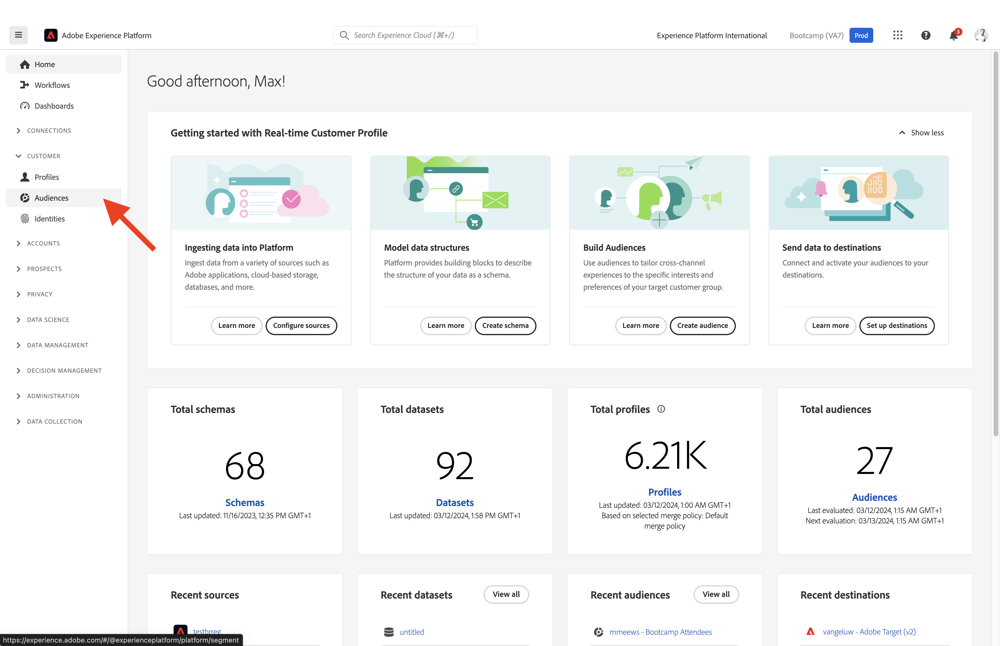

# 1.3 Skapa ett segment - användargränssnitt

I den här övningen skapar du ett segment genom att använda Adobe Experience Platform Segment Builder.

## Artikel

Gå till [Adobe Experience Platform](https://experience.adobe.com/platform). När du har loggat in loggar du in på Adobe Experience Platform hemsida.

Innan du fortsätter måste du välja en **sandlåda**. Sandlådan som ska markeras har namnet ``Bootcamp``. Du kan göra detta genom att klicka på texten **[!UICONTROL Production Prod]** i den blå linjen ovanför skärmen. När du har valt lämplig [!UICONTROL sandbox]kommer du att se skärmändringen och nu är du med på din [!UICONTROL sandbox].

På menyn till vänster går du till **Segment**. På den här sidan visas en översikt över alla befintliga segment. Klicka på **+ Skapa segment** för att börja skapa ett nytt segment.

När du är i segmentbyggaren märker du omedelbart **Attribut** menyalternativ och **Individuell XDM-profil** referens.

Eftersom XDM är det språk som används i upplevelseverksamheten är XDM även grunden för segmentbyggaren. Alla data som är inkapslade i Platform ska mappas mot XDM, och som sådana blir alla data en del av samma datamodell oavsett varifrån dessa data kommer. Detta ger en stor fördel när du skapar segment, eftersom ni från det här segmentbyggargränssnittet kan kombinera data från vilket ursprung som helst i samma arbetsflöde. Segment som byggts i Segment Builder kan skickas till lösningar som Adobe Target, Adobe Campaign och Adobe Audience Manager för aktivering.

Nu måste ni skapa ett segment av alla kunder som har tittat på produkten **Real-Time CDP**.

Om du vill bygga ut det här segmentet måste du lägga till en Experience Event. Du kan hitta alla Experience Events genom att klicka på **Händelser** ikonen i **Fält** menyraden.

Nu kommer du att se den översta nivån, **XDM ExperienceEvents** nod. Klicka på **XDM ExperienceEvent**.

Gå till **Produktlisteobjekt**.

Välj **Namn** och dra och släpp **Namn** objekt från den vänstra menyn på segmentbyggarbetsytan i **Händelser** -avsnitt. Då ser du det här:

Jämförelseparametern ska vara **är lika med** och i inmatningsfältet anger du **CDP i realtid**.

Varje gång du lägger till ett element i segmentverktyget kan du klicka på **Uppdatera offert** för att få en ny uppskattning av populationen i ditt segment.

Som **Utvärderingsmetod**, markera **Kant**.

Till sist ger vi segmentet ett namn och sparar det.

Använd följande som namnkonvention:

- `yourLastName - Interest in Real-Time CDP`

Klicka sedan på **Spara och stäng** för att spara segmentet.

Du kommer nu tillbaka till sidan för segmentöversikt där du får en förhandsgranskning av kundprofiler som är kvalificerade för ditt segment.

Du kan nu fortsätta med nästa övning och använda ditt segment med Adobe Target.

Nästa steg: [1.4 Take Action: send your segment to Adobe Target](./ex4.md)

[Gå tillbaka till användarflöde 1](./uc1.md)

[Gå tillbaka till Alla moduler](../../overview.md)
