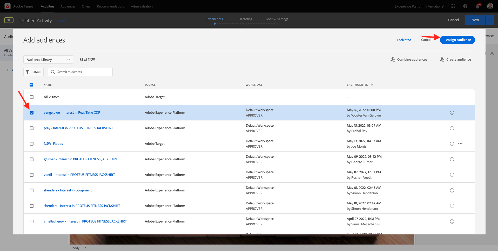
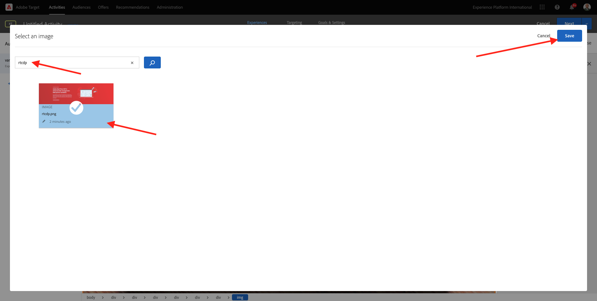
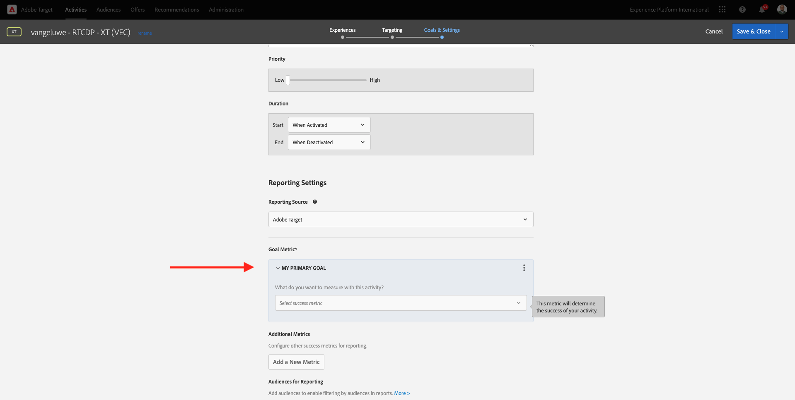

# 1.4 Take Action: send your segment to Adobe Target

Gå till [Adobe Experience Platform](https://experience.adobe.com/platform). När du har loggat in loggar du in på Adobe Experience Platform hemsida.

Innan du fortsätter måste du välja en **sandlåda**. Sandlådan som ska markeras har namnet ``Bootcamp``. Du kan göra detta genom att klicka på texten **[!UICONTROL Production Prod]** i den blå linjen ovanför skärmen. När du har valt lämplig [!UICONTROL sandbox]kommer du att se skärmändringen och nu är du med på din [!UICONTROL sandbox].

## 1.4.1 Aktivera segmentet till Adobe Target

Adobe Target finns som mål från Real-Time CDP. Om du vill konfigurera Adobe Target-integreringen går du till **Destinationer**, till **Katalog**.

Klicka **Personalisering** i **Kategorier** -menyn. Då ser du **Adobe Target** destinationskort. Klicka **Aktivera segment**.

Välj mål ``Bootcamp Target`` och klicka **Nästa**.

I listan med tillgängliga segment väljer du det segment du skapade i [1.3 Skapa ett segment](./ex3.md), som har namnet `yourLastName - Interest in Real-Time CDP`. Klicka sedan på **Nästa**.

På nästa sida klickar du på **Nästa**.

Klicka **Slutför**.

Ditt segment är nu aktiverat mot Adobe Target.

>[!IMPORTANT]
>
>När du just har skapat Adobe Target-destinationen i Real-Time CDP kan det ta upp till en timme innan destinationen är aktiv. Detta är en engångsväntetid på grund av konfigurationen av serverdelskonfigurationen. När den inledande väntetiden på en timme och backend-konfigurationen är klar, kommer nytillagda kantsegment som skickas till Adobe Target-destinationen att vara tillgängliga för målgruppsanpassning i realtid.

## 1.4.2 Konfigurera din formulärbaserade Adobe Target-aktivitet

Nu när ditt Real-Time CDP-segment är konfigurerat att skickas till Adobe Target kan du konfigurera din Experience Targeting-aktivitet i Adobe Target. I den här övningen ska du konfigurera en Visual Experience Composer-baserad aktivitet.

Gå till Adobe Experience Cloud hemsida genom att [https://experiencecloud.adobe.com/](https://experiencecloud.adobe.com/). Klicka **Mål** för att öppna den.

På **Adobe Target** på startsidan ser du alla befintliga aktiviteter.
Klicka **+ Skapa aktivitet** för att skapa en ny aktivitet.

Välj **Experience Targeting**.

Välj **Visual** och ange **Aktivitets-URL** till `https://bootcamp.aepdemo.net/content/aep-bootcamp-experience/language-masters/en/exercises/particpantXX.html`, men innan du gör det ska du ersätta XX med ett tal mellan 01 och 30.

>[!IMPORTANT]
>
>Alla deltagare i aktiveringen bör använda en separat webbsida för att undvika kollision mellan olika Adobe Target-upplevelser. Du kan välja en webbsida och hitta URL-adressen genom att gå hit: [https://bootcamp.aepdemo.net/content/aep-bootcamp-experience/language-masters/en/exercises.html](https://bootcamp.aepdemo.net/content/aep-bootcamp-experience/language-masters/en/exercises.html).
>
>Sidorna har alla samma bas-URL och slutar med deltagarens nummer.
>
>Som exempel bör deltagare 1 använda URL `https://bootcamp.aepdemo.net/content/aep-bootcamp-experience/language-masters/en/exercises/particpant01.html`, deltagare 30 ska använda URL `https://bootcamp.aepdemo.net/content/aep-bootcamp-experience/language-masters/en/exercises/particpant30.html`.

Markera arbetsytan **AT Bootcamp**.

Klicka på **Nästa**.

Du är nu med i Visual Experience Composer. Det kan ta 20-30 sekunder tills webbplatsen är helt inläst.

Standardmålgruppen är för närvarande **Alla besökare**. Klicka på **3 punkter** nästa **Alla besökare** och klicka **Ändra målgrupp**.

Du ser nu en lista över tillgängliga målgrupper, och Adobe Experience Platform-segmentet som du skapade tidigare och skickade till Adobe Target ingår nu i den här listan. Markera det segment som du tidigare har skapat i Adobe Experience Platform. Klicka **Tilldela publik**.

Ditt Adobe Experience Platform-segment är nu en del av denna Experience Targeting Activity.

Innan du kan ändra hjältebilden måste du klicka **Tillåt alla** på kakbanderollen.

Om du vill göra det går du till **Bläddra**

Klicka på Nästa **Tillåt alla**.

Gå tillbaka till **Skapa**.

Nu ska vi ändra hjältebilden på webbplatsens hemsida. Klicka på standardhjältebilden på webbplatsen och klicka på **Ersätt innehåll** och sedan **Bild**.

Sök efter bildfilen **rtcdp.png**. Markera den och klicka sedan på **Spara**.

Du kommer då att se den nya upplevelsen av den nya bilden för den valda målgruppen.

Klicka på aktivitetens titel i det övre vänstra hörnet för att byta namn på den.

För namnet, använd:

- `yourLastName - RTCDP - XT (VEC)`

Klicka på **Nästa**.

Klicka på **Nästa**.

På **Mål och inställningar** - sida, gå till **Målmått**.

Ställ in det primära målet på **Engagemang** - **Tid på plats**. Klicka **Spara och stäng**.

Du är nu på **Översikt över aktivitet** sida. Du måste fortfarande aktivera din aktivitet.

Klicka på fältet **Inaktiv** och markera **Aktivera**.

Sedan får du en visuell bekräftelse på att din aktivitet nu är aktiv.

Din aktivitet finns nu tillgänglig och kan testas på Bootlägers webbplats.

Om du nu går tillbaka till demowebbplatsen och går till produktsidan för **Real-Time CDP** blir du sedan direkt berättigad till det segment du har skapat och du ser Adobe Target-aktiviteten visas på startsidan i realtid.

>[!IMPORTANT]
>
>Alla deltagare i aktiveringen bör använda en separat webbsida för att undvika kollision mellan olika Adobe Target-upplevelser. Du kan välja en webbsida och hitta URL-adressen genom att gå hit: [https://bootcamp.aepdemo.net/content/aep-bootcamp-experience/language-masters/en/exercises.html](https://bootcamp.aepdemo.net/content/aep-bootcamp-experience/language-masters/en/exercises.html).
>
>Sidorna har alla samma bas-URL och slutar med deltagarens nummer.
>
>Som exempel bör deltagare 1 använda URL `https://bootcamp.aepdemo.net/content/aep-bootcamp-experience/language-masters/en/exercises/particpant01.html`, deltagare 30 ska använda URL `https://bootcamp.aepdemo.net/content/aep-bootcamp-experience/language-masters/en/exercises/particpant30.html`.

Nästa steg: [1.5 Take Action: send your segment to Facebook](./ex5.md)

[Gå tillbaka till användarflöde 1](./uc1.md)

[Gå tillbaka till Alla moduler](../../overview.md)
