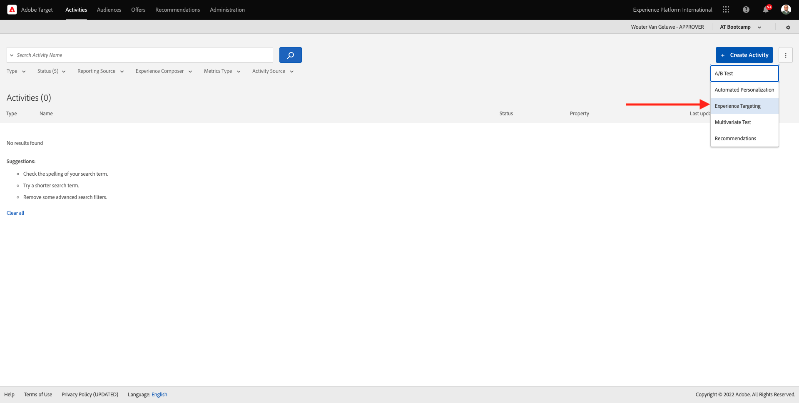
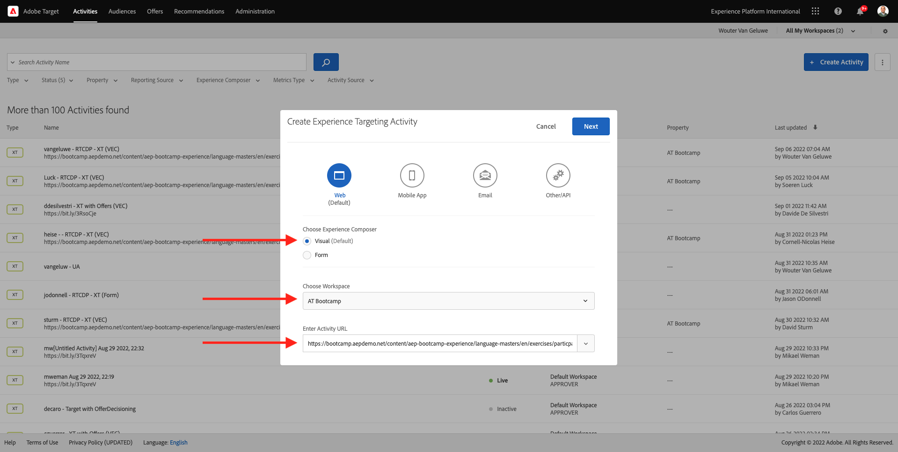

# 1.4 Take Action: send your audition to Adobe Target

Gå till [Adobe Experience Platform](https://experience.adobe.com/platform). När du har loggat in loggar du in på Adobe Experience Platform hemsida.

Innan du fortsätter måste du välja en **sandlåda**. Sandlådan som ska markeras har namnet ``Bootcamp``. Du kan göra detta genom att klicka på texten **[!UICONTROL Production Prod]** i den blå raden ovanför skärmen. När du har valt rätt [!UICONTROL sandbox] visas skärmändringen och nu är du i din dedikerade [!UICONTROL sandbox].

## 1.4.1 Aktivera er målgrupp för Adobe Target

Adobe Target finns som mål från Real-Time CDP. Gå till **Destinationer** och **Katalog** om du vill konfigurera din Adobe Target-integrering.

Klicka på **Personalization** på menyn **Kategorier**. Sedan visas **Adobe Target**-målkortet. Klicka på **Aktivera målgrupper**.

Markera målet ``Bootcamp Target`` och klicka på **Nästa**.

I listan över tillgängliga målgrupper väljer du målgruppen som du skapade i [1.3 Skapa en målgrupp](./ex3.md), som har namnet `yourLastName - Interest in Real-Time CDP`. Klicka sedan på **Nästa**.

På nästa sida klickar du på **Nästa**.

Klicka på **Slutför**.

Din publik är nu aktiv mot Adobe Target.

>[!IMPORTANT]
>
>När du just har skapat Adobe Target-destinationen i Real-Time CDP kan det ta upp till en timme innan destinationen är aktiv. Detta är en engångsväntetid på grund av konfigurationen av serverdelskonfigurationen. När den inledande väntetiden på en timme och serverdelskonfigurationen är klar kommer nytillagda målgrupper som skickas till Adobe Target-destinationen att vara tillgängliga för målgruppsanpassning i realtid.

## 1.4.2 Konfigurera din formulärbaserade Adobe Target-aktivitet

Nu när er Real-Time CDP-målgrupp är konfigurerad att skickas till Adobe Target kan ni konfigurera er Experience Targeting-aktivitet i Adobe Target. I den här övningen ska du konfigurera en Visual Experience Composer-baserad aktivitet.

Gå till Adobe Experience Cloud hemsida på [https://experiencecloud.adobe.com/](https://experiencecloud.adobe.com/). Klicka på **Mål** för att öppna det.

På startsidan för **Adobe Target** visas alla befintliga aktiviteter.
Klicka på **+ Skapa aktivitet** för att skapa en ny aktivitet.

Välj **Experience Targeting**.

Välj **Visuell** och ange **Aktivitets-URL** till `https://bootcamp.aepdemo.net/content/aep-bootcamp-experience/language-masters/en/exercises/particpantXX.html`, men innan du gör det ska du ersätta XX med ett tal mellan 01 och 30.

>[!IMPORTANT]
>
>Alla deltagare i aktiveringen bör använda en separat webbsida för att undvika kollision mellan olika Adobe Target-upplevelser. Du kan välja en webbsida och hitta URL-adressen genom att gå hit: [https://bootcamp.aepdemo.net/content/aep-bootcamp-experience/language-masters/en/exercises.html](https://bootcamp.aepdemo.net/content/aep-bootcamp-experience/language-masters/en/exercises.html).
>
>Sidorna har alla samma bas-URL och slutar med deltagarens nummer.
>
>Som exempel bör deltagare 1 använda URL `https://bootcamp.aepdemo.net/content/aep-bootcamp-experience/language-masters/en/exercises/particpant01.html`, deltagare 30 bör använda URL `https://bootcamp.aepdemo.net/content/aep-bootcamp-experience/language-masters/en/exercises/particpant30.html`.

Välj arbetsytan **AT Bootcamp**.

Klicka på **Nästa**.

Du är nu med i Visual Experience Composer. Det kan ta 20-30 sekunder tills webbplatsen är helt inläst.

Standardmålgruppen är **Alla besökare**. Klicka på **3 punkter** bredvid **Alla besökare** och klicka på **Ändra publik**.

Du ser nu en lista över tillgängliga målgrupper, och Adobe Experience Platform-målgruppen som du skapade tidigare och skickade till Adobe Target ingår nu i listan. Välj den målgrupp du redan har skapat i Adobe Experience Platform. Klicka på **Tilldela målgrupp**.

Din Adobe Experience Platform-publik är nu en del av denna Experience Targeting Activity.

Innan du kan ändra hjältebilden måste du klicka på **Tillåt alla** på cookie-banderollen.

Gå till **Bläddra** om du vill göra det.

Klicka sedan på **Tillåt alla**.

Gå sedan tillbaka till **Disponera**.

Nu ska vi ändra hjältebilden på webbplatsens hemsida. Klicka på standardhjältebilden på webbplatsen, klicka på **Ersätt innehåll** och välj sedan **Bild**.

Sök efter bildfilen **rtcdp.png**. Markera den och klicka sedan på **Spara**.

Du kommer då att se den nya upplevelsen av den nya bilden för den valda målgruppen.

Klicka på aktivitetens titel i det övre vänstra hörnet för att byta namn på den.

För namnet, använd:

- `yourLastName - RTCDP - XT (VEC)`

Klicka på **Nästa**.

Klicka på **Nästa**.

Gå till **Målmått** på sidan **Mål och inställningar** -.

Ange som primärt mål **engagemang** - **tid på plats**. Klicka på **Spara och stäng**.

Du finns nu på sidan **Aktivitetsöversikt**. Du måste fortfarande aktivera din aktivitet.

Klicka på fältet **Inaktiv** och välj **Aktivera**.

Sedan får du en visuell bekräftelse på att din aktivitet nu är aktiv.

Din aktivitet finns nu tillgänglig och kan testas på Bootlägers webbplats.

Om du nu går tillbaka till din demowebbplats och besöker produktsidan för **Real-Time CDP** kan du direkt kvalificera dig för den målgrupp du har skapat och du ser att Adobe Target-aktiviteten visas på startsidan i realtid.

>[!IMPORTANT]
>
>Alla deltagare i aktiveringen bör använda en separat webbsida för att undvika kollision mellan olika Adobe Target-upplevelser. Du kan välja en webbsida och hitta URL-adressen genom att gå hit: [https://bootcamp.aepdemo.net/content/aep-bootcamp-experience/language-masters/en/exercises.html](https://bootcamp.aepdemo.net/content/aep-bootcamp-experience/language-masters/en/exercises.html).
>
>Sidorna har alla samma bas-URL och slutar med deltagarens nummer.
>
>Som exempel bör deltagare 1 använda URL `https://bootcamp.aepdemo.net/content/aep-bootcamp-experience/language-masters/en/exercises/particpant01.html`, deltagare 30 bör använda URL `https://bootcamp.aepdemo.net/content/aep-bootcamp-experience/language-masters/en/exercises/particpant30.html`.

Nästa steg: [1.5 Vidta åtgärd: skicka målgruppen till Facebook](./ex5.md)

[Gå tillbaka till användarflöde 1](./uc1.md)

[Gå tillbaka till Alla moduler](../../overview.md)
