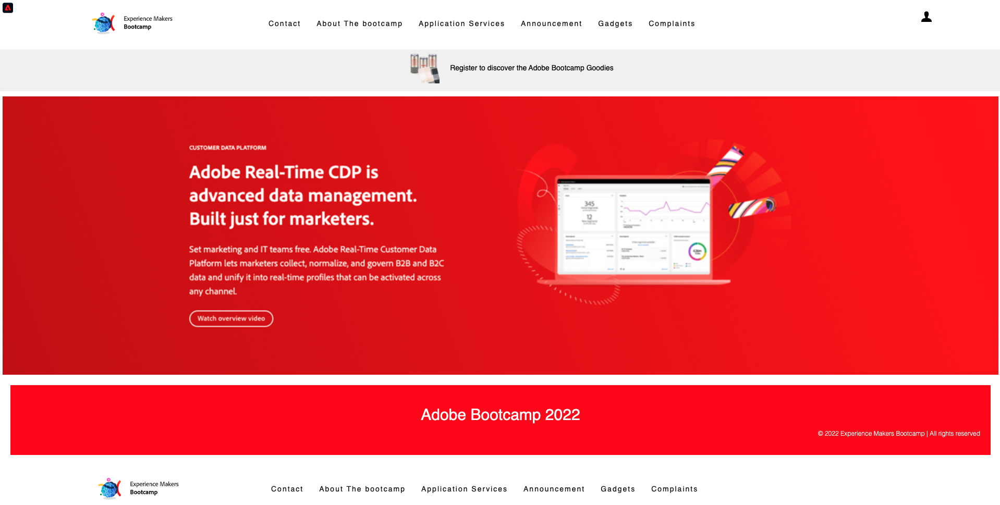

# 2.1 Besök webbplatsen och skapa ett konto

## Kontext

Resan från okänd till känd är en av de viktigaste ämnena bland varumärken nuförtiden, liksom kundresan från förvärv till lojalitet.

Adobe Experience Platform spelar en mycket viktig roll på den här resan. Plattformen är hjärnan för kommunikation, **upplevelsesystemet för posten**.

Plattform är en miljö där ordet kund är bredare än bara de kända kunderna. En okänd besökare på webbplatsen är också en kund ur plattformens perspektiv, och som sådan skickas även allt beteende som en okänd besökare till Platform. Tack vare den metoden kan ett varumärke, när besökaren till slut blir en känd kund, även visualisera det som hände före det ögonblicket. Detta bidrar till att optimera attribuering och upplevelser.

## Kundreseflöde

Gå till [https://bootcamp.aepdemo.net](https://bootcamp.aepdemo.net). Klicka på **Tillåt alla**. Beroende på ditt surfbeteende i det tidigare användarflödet kommer personalisering att ske på webbplatsens hemsida.

Klicka på logotypikonen för Adobe i det övre vänstra hörnet av skärmen för att öppna profilvisningsprogrammet. Ta en titt på panelen Profilvisningsprogram och kundprofilen i realtid med **Experience Cloud ID** som primär identifierare för den okända kunden.

Ni kan också se alla upplevelsehändelser som samlats in baserat på kundens beteende.

Klicka på ikonen **Profil** i skärmens övre högra hörn.

Klicka på **Skapa ett konto**.

Fyll i alla fält i formuläret. Använd ett reellt värde för e-postadress och telefonnummer, eftersom det kommer att användas i senare övningar för att leverera e-post och SMS.

Bläddra nedåt och klicka på **Registrera**.

Då ser du det här.

Du får även det här e-postmeddelandet:

Några minuter senare kommer du också att få det här mejlet:

Låt oss se hur den här introduktionsresan konfigurerades härnäst.

Nästa steg: [2.2 Skapa din aktivitet](./ex2.md)

[Gå tillbaka till användarflöde 2](./uc2.md)

[Gå tillbaka till Alla moduler](../../overview.md)
