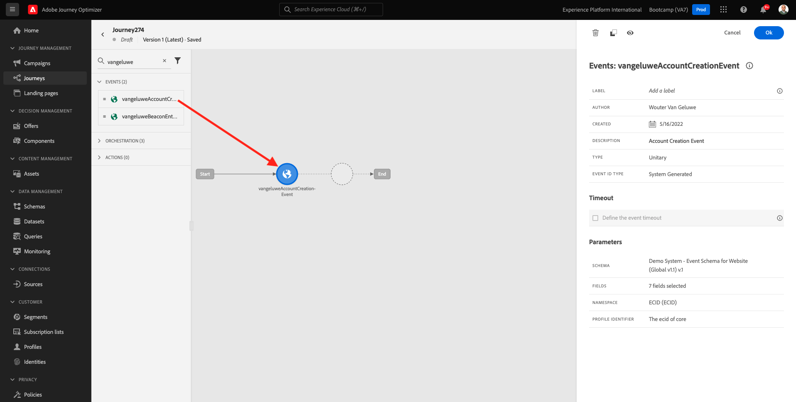
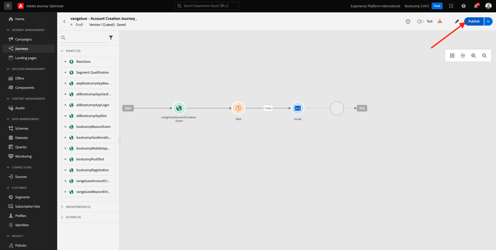

# 2.3 Skapa din resa och ditt e-postmeddelande

I den här övningen konfigurerar du den resa som behöver utlösas när någon skapar ett konto på demowebbplatsen.

Logga in på Adobe Journey Optimizer genom att [Adobe Experience Cloud](https://experience.adobe.com). Klicka **Journey Optimizer**.

Du omdirigeras till **Startsida**  i Journey Optimizer. Kontrollera först att du använder rätt sandlåda. Sandlådan som ska användas anropas `Bootcamp`. Om du vill ändra från en sandlåda till en annan klickar du på **Prod** och välj sandlådan i listan. I det här exemplet heter sandlådan **Bootläger**. Då är du i **Startsida** vy över din sandlåda `Bootcamp`.

## 2.3.1 Skapa din resa

Klicka på **Resor**. Klicka på Nästa **Skapa resa** för att skapa en ny resa.

Då ser du en tom skärm för resan.

I föregående övning skapade du en ny **Händelse**. Du namngav den så här `yourLastNameAccountCreationEvent` och ersatt `yourLastName` med ditt efternamn. Detta var resultatet av händelseskapandet:

Du måste nu ta det här evenemanget som början på den här resan. Du kan göra detta genom att gå till vänster på skärmen och söka efter händelsen i listan med händelser.

Markera händelsen, dra och släpp den på arbetsytan på resan. Din resa ser nu ut så här:

Som det andra steget på resan måste du lägga till en kort **Vänta** steg. Gå till vänster på skärmen till vänster **Orchestration** för att hitta det här. Du kommer att använda profilattribut och måste se till att de är ifyllda i kundprofilen i realtid.

Din resa ser nu ut så här. Till höger på skärmen måste du konfigurera väntetiden. Ställ in den på 1 minut. Detta ger mycket tid för profilattributen att vara tillgängliga när händelsen har utlösts.

Klicka **OK** för att spara ändringarna.

Som det tredje steget på resan måste du lägga till en **E-post** åtgärd. Gå till skärmens vänstra sida för att **Åtgärder** väljer du **E-post** och sedan dra och släppa det på den andra noden på din resa. Nu ser du det här.

Ange **Kategori** till **Marknadsföring** och välj en e-postyta som gör att du kan skicka e-post. I det här fallet är e-postytan som ska väljas **E-post**. Se till att kryssrutorna för **Klicka på e-post** och **e-postöppning** båda är aktiverade.

Nästa steg är att skapa ett meddelande. Det gör du genom att klicka **Redigera innehåll**.

## 2.3.2 Skapa ett meddelande

Klicka på **Redigera innehåll**.

Nu ser du det här.

Klicka på **Subject line** textfält.

Börja skriva i textområdet **Hej**

Ämnesraden är inte färdig än. Därefter måste du ta in en token för anpassning för fältet **Förnamn** som lagras under `profile.person.name.firstName`. Bläddra nedåt i den vänstra menyn för att hitta **Person** och klicka på pilen för att gå en nivå längre.

Nu hittar du **Fullständigt namn** och klicka på pilen för att gå en nivå längre.

Till sist hittar du **Förnamn** och klicka på **+** signera bredvid den. Sedan visas personaliseringstoken i textfältet.

Lägg sedan till texten **, tack för att du registrerar dig!**. Klicka **Spara**.

Du kommer då tillbaka hit. Klicka **E-postdesigner** för att skapa e-postens innehåll.

På nästa skärm får du tre olika metoder för att ange e-postens innehåll:

- **Designa från grunden**: Börja med en tom arbetsyta och använd WYSIWYG-redigeraren för att dra och släppa struktur och innehållskomponenter för att visuellt bygga upp e-postens innehåll.
- **Koda din egen**: Skapa en egen e-postmall genom att koda den med HTML
- **Importera HTML**: Importera en befintlig HTML-mall som du kan redigera.

Klicka **Importera HTML**. Du kan också klicka **Sparade mallar** och välj en mall **Bootcamp - e-postmall**.

Om du valde **Importera HTML** kan du nu dra och släppa filen **mailmallebootcamp.html** som du kan ladda ned [här](../../assets/html/mailtemplatebootcamp.html.zip). Klicka på Importera.

Du kommer då att se den här standardmallen för e-post:

Låt oss personalisera e-postmeddelandet. Klicka bredvid texten **Hej** och klicka sedan på **Lägg till personalisering** -ikon.

Nästa steg är att du måste ta fram **Förnamn** personaliseringstoken som lagras under `profile.person.name.firstName`. På menyn hittar du **Person** -element, gå nedåt till **Fullständigt namn** och sedan klicka på **+** om du vill lägga till fältet Förnamn i uttrycksredigeraren.

Klicka **Spara**.

Nu kommer du att märka hur personaliseringsfältet har lagts till i texten.

Klicka **Spara** för att spara meddelandet.

Gå tillbaka till meddelandekontrollpanelen genom att klicka på **pil** bredvid texten på ämnesraden i det övre vänstra hörnet.

Du har nu skapat e-postmeddelandet med din registrering. Klicka på pilen i det övre vänstra hörnet för att gå tillbaka till din resa.

Klicka **OK**.

## 2.3.3 Publicera din resa

Du måste fortfarande ge din resa ett namn. Du kan göra det genom att klicka på **Penna** ikonen längst upp till vänster på skärmen.

Du kan sedan ange resans namn här. Använd `yourLastName - Account Creation Journey`. Klicka **OK** för att spara ändringarna.

Nu kan du publicera din resa genom att klicka **Publicera**.

Klicka **Publicera** igen.

Då visas ett grönt bekräftelsefält som anger att din resa nu är publicerad.

Du har nu avslutat den här övningen.

Nästa steg: [2.4 Testa din resa](./ex4.md)

[Gå tillbaka till användarflöde 2](./uc2.md)

[Gå tillbaka till Alla moduler](../../overview.md)