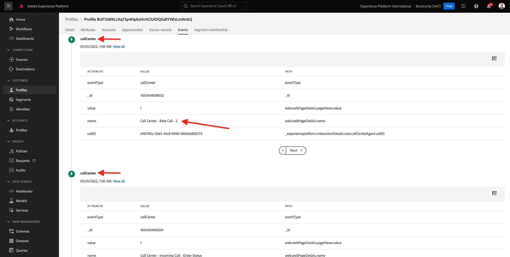

# 2.6 Personalization i call center

Som redan har nämnts flera gånger under bootlägret är personalisering av kundupplevelsen något som bör ske över alla kanaler. Ett callcenter är ofta ganska frånkopplat från resten av kundresan och det leder ofta till frustrerande kundupplevelser, men det behöver inte vara det. Låt oss visa dig ett exempel på hur callcentret enkelt kan anslutas till Adobe Experience Platform i realtid.

## Kundens reseflöde

I föregående övning, med mobilprogrammet, köpte du en produkt genom att klicka på knappen **Köp** .

Låt oss anta att du har en fråga om status för din beställning, vad skulle du göra? Vanligtvis ringer du callcentret.

Innan du anropar callcentret måste du känna till ditt **lojalitets-ID**. Du hittar ditt lojalitets-ID i profilvisningsprogrammet för webbplatsen.

I det här fallet är **Förmåns-ID** **5863105**. Som en del av vår anpassade implementering av funktionen call center i demomiljön måste du lägga till ett prefix i ditt **lojalitets-ID**. Prefixet är **11373**, så det lojalitets-ID som ska användas i det här exemplet är **11373 5863105**.

Låt oss göra det nu. Använd telefonen och ring numret **+1 (323) 745-1670**.

Du ombeds ange ditt lojalitets-ID följt av **#**. Ange ditt lojalitets-ID.

Du hör sedan **Hej, förnamn**. Förnamnet hämtas från kundprofilen i realtid i Adobe Experience Platform. Du har sedan tre valmöjligheter. Tryck på **1**, **Beställningsstatus**.

När du har hört din beställningsstatus kan du välja att trycka på **1** för att gå tillbaka till huvudmenyn. I annat fall trycker du på 2. Tryck på **2**.

Du ombeds sedan betygsätta din samtalscenterupplevelse genom att välja ett nummer mellan 1 och 5, där 1 är lågt och 5 är högt. Gör ditt val.

Ditt samtal till callcenter avslutas nu.

Gå till [Adobe Experience Platform](https://experience.adobe.com/platform). När du har loggat in loggar du in på Adobe Experience Platform hemsida.

Innan du fortsätter måste du välja en **sandlåda**. Sandlådan som ska markeras har namnet ``Bootcamp``. Du kan göra detta genom att klicka på texten **[!UICONTROL Production Prod]** i den blå raden ovanför skärmen. När du har valt rätt [!UICONTROL sandbox] visas skärmändringen och nu är du i din dedikerade [!UICONTROL sandbox].

Gå till **Profiler** och till **Bläddra** på den vänstra menyn.

Markera **Identitetsnamnområdet** **E-postadress** och ange e-postadressen för kundprofilen. Klicka på **Visa**. Klicka för att öppna din profil.

Du kommer att se din kundprofil igen. Gå till **Händelser**.

Under händelser visas 2 händelser med eventType **callCenter**. Den första händelsen är ett resultat av ditt svar på frågan **Betygsätt din samtalstillfredsställelse**.

Bläddra ned en bit så ser du händelsen som spelades in när du valde alternativet att kontrollera din **orderstatus**.

Gå till **Segmentmedlemskap**. Nu kommer du att se att två segment kvalificerar sig för din profil, i realtid, baserat på den interaktion du hade via callcenter. Dessa segmentmedlemskap kan och bör sedan användas för att påverka vad kommunikation och personalisering händer i andra kanaler.

Du har nu avslutat den här övningen.

[Gå tillbaka till användarflöde 2](./uc2.md)

[Gå tillbaka till Alla moduler](../../overview.md)
