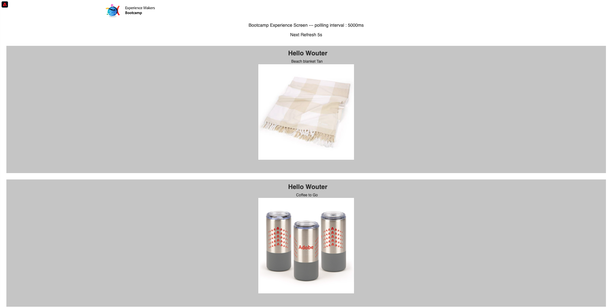

# 3.1 Använda mobilappen och utlösa en fyndighetsinmatning

## Installera mobilappen

Innan du installerar programmet måste du aktivera **Spårning** på din iOS-enhet. Om du vill göra det går du till **Inställningar** > **Integritet och säkerhet** > **Spårning** och se till att alternativet **Tillåt att appar begär att spåras**.

Gå till Apple App Store och sök efter `aepmobile-bootcamp`. Klicka **Installera** eller **Hämta**.

När appen är installerad klickar du på **Öppna**.

Klicka **OK**.

Klicka **Tillåt**.

Klicka **Jag håller med**.

Klicka **Tillåt när appen används**.

Klicka **Tillåt**.

Du är nu med i appen, på hemsidan, redo att gå igenom kundresan.

## Kundreseflöde

Först och främst måste du logga in. Klicka **Inloggning**.

När du skapat ditt konto i de tidigare övningarna såg du detta på webbplatsen. Du måste nu återanvända e-postadressen för kontot som du skapade i appen för att logga in.

Ange den e-postadress du använde på webbplatsen här och klicka på **Inloggning**.

Du får då en bekräftelse på att du är inloggad och du får ett push-meddelande.

Gå tillbaka till startsidan i appen så visas fler funktioner.

Först, gå till **Produkter**. Klicka på valfri produkt, i det här exemplet **Kaffe att gå**.

Du kommer att se **Kaffe att gå** produktsida i appen.

Du simulerar nu en händelse för att lägga in en signal i en offlinebutik. Målet med att simulera detta är att personalisera kundupplevelsen på butiksskärmar. För att visualisera butiksupplevelsen har en sida skapats som dynamiskt visar den information som är relevant för kunden som just har kommit in i butiken.

Öppna den här webbsidan på datorn innan du fortsätter: [https://bootcamp.aepdemo.net/content/aep-bootcamp-experience/language-masters/en/screen.html](https://bootcamp.aepdemo.net/content/aep-bootcamp-experience/language-masters/en/screen.html)

Då ser du det här:

Gå sedan tillbaka till hemsidan. Klicka på **beacon** ikon.

Du kommer då att se det här. Välj först **Bootcamp Screen Beacon** och klicka sedan på **entry** -knappen. På så sätt kan du simulera ett fynd.

Titta nu på butiksskärmen. Där visas den senaste produkten du visade inom fem sekunder.

Gå sedan tillbaka till **Produkter**. Klicka på valfri produkt, i det här exemplet **Strandfilt Tan**.

Gå sedan tillbaka till hemsidan. Klicka på **beacon** ikon.

Du kommer då att se det här. Välj först **Bootcamp Screen Beacon** och klicka sedan på **entry** igen. På så sätt kan du simulera ett fynd.

Titta nu på butiksskärmen igen. Där visas den senaste produkten du visade inom fem sekunder.

Nu ska vi också titta på din profilvisare på webbplatsen. Där finns många händelser som lagts till för att visa att all interaktion med en kund samlas in och lagras i Adobe Experience Platform.

I nästa övning kommer du att konfigurera och testa din egen neoningresa.

Nästa steg: [3.2 Skapa en aktivitet](./ex2.md)

[Gå tillbaka till användarflöde 3](./uc3.md)

[Gå tillbaka till Alla moduler](../../overview.md)
