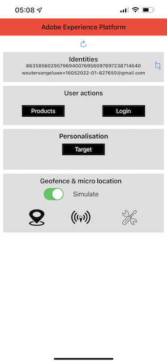

# 3.1 Använda mobilappen och utlösa en fyndighetsinmatning

## Installera mobilappen

Innan du installerar appen måste du aktivera **spårning** på din iOS-enhet. Det gör du genom att gå till **Inställningar** > **Sekretess och säkerhet** > **Spårning** och se till att alternativet **Tillåt appar att begära spårning**.

Gå till Apple App Store och sök efter `aepmobile-bootcamp`. Klicka på **Installera** eller **Hämta**.

När appen har installerats klickar du på **Öppna**.

Klicka på **OK**.

Klicka på **Tillåt**.

Klicka på **Jag godkänner**.

Klicka på **Tillåt när appen används**.

Klicka på **Tillåt**.

Du är nu med i appen, på hemsidan, redo att gå igenom kundresan.

## Kundreseflöde

Först och främst måste du logga in. Klicka på **Logga in**.

När du skapat ditt konto i de tidigare övningarna såg du detta på webbplatsen. Du måste nu återanvända e-postadressen för kontot som du skapade i appen för att logga in.

Ange den e-postadress som du använde på webbplatsen här och klicka på **Logga in**.

Du får sedan en bekräftelse på att du är inloggad och du får ett push-meddelande.

Gå tillbaka till startsidan i appen så visas fler funktioner.

Gå först till **Produkter**. Klicka på en produkt, i det här exemplet **Kaffe för att gå**.

Produktsidan **Kaffe för att gå** visas i appen.

Du simulerar nu en händelse för att lägga in en signal i en offlinebutik. Målet med att simulera detta är att personalisera kundupplevelsen på butiksskärmar. För att visualisera butiksupplevelsen har en sida skapats som dynamiskt visar den information som är relevant för kunden som just har kommit in i butiken.

Öppna den här webbsidan på datorn innan du fortsätter: [https://bootcamp.aepdemo.net/content/aep-bootcamp-experience/language-masters/en/screen.html](https://bootcamp.aepdemo.net/content/aep-bootcamp-experience/language-masters/en/screen.html)

Då ser du det här:

Gå sedan tillbaka till hemsidan. Klicka på ikonen **fyr** .

Då ser du det här. Välj först **Bootlägers skärmfyr** och klicka sedan på knappen **post** . På så sätt kan du simulera ett fynd.

Titta nu på butiksskärmen. Där visas den senaste produkten du visade inom fem sekunder.

Gå sedan tillbaka till **Produkter**. Klicka på en produkt, i det här exemplet **Beach filet Tan**.

Gå sedan tillbaka till hemsidan. Klicka på ikonen **fyr** .

Då ser du det här. Välj först **Beacon för startlägets skärm** och klicka sedan på knappen **post** igen. På så sätt kan du simulera ett fynd.

Titta nu på butiksskärmen igen. Där visas den senaste produkten du visade inom fem sekunder.

Nu ska vi också titta på din profilvisare på webbplatsen. Där finns många händelser som lagts till för att visa att all interaktion med en kund samlas in och lagras i Adobe Experience Platform.

I nästa övning kommer du att konfigurera och testa din egen neoningresa.

Nästa steg: [3.2 Skapa din aktivitet](./ex2.md)

[Gå tillbaka till användarflöde 3](./uc3.md)

[Gå tillbaka till Alla moduler](../../overview.md)
