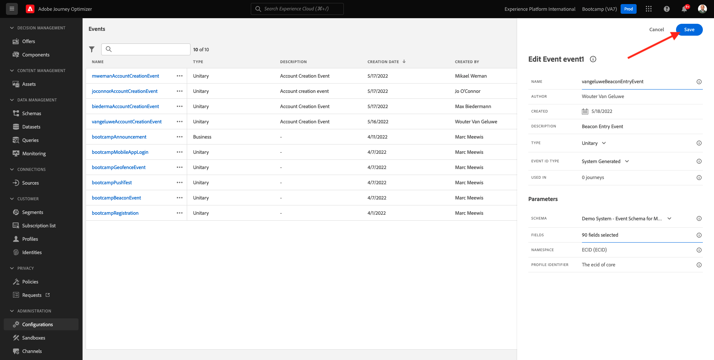

# 3.2 Skapa en aktivitet

Logga in på Adobe Journey Optimizer genom att gå till [Adobe Experience Cloud](https://experience.adobe.com). Klicka **Journey Optimizer**.

Du omdirigeras till **Startsida**  i Journey Optimizer. Kontrollera först att du använder rätt sandlåda. Sandlådan som ska användas anropas `Bootcamp`. Om du vill ändra från en sandlåda till en annan klickar du på **Prod** och välj sandlådan i listan. I det här exemplet heter sandlådan **Bootcamp2**. Då är du i **Startsida** vy över din sandlåda `Bootcamp`.

Bläddra nedåt i den vänstra menyn och klicka på **Konfigurationer**. Klicka sedan på **Hantera** knapp under **Händelser**.

Därefter visas en översikt över alla tillgängliga händelser. Klicka **Skapa händelse** för att börja skapa en egen händelse.

Ett nytt, tomt händelsefönster öppnas sedan.

Först och främst ger du evenemanget ett namn som detta: `yourLastNameBeaconEntryEvent` och lägg till en beskrivning som denna `Beacon Entry Event`.

Kontrollera sedan att **Typ** är inställd på **Unitary** och för **Typ av händelse-ID** markering, markera **Systemgenererat**.

Nästa steg är schemavalet. Ett schema förbereddes för den här övningen. Använd schemat `Demo System - Event Schema for Mobile App (Global v1.1) v.1`.

När du har valt schemat visas ett antal fält i **Fält** -avsnitt. Nu ska du hovra över **Fält** så visas tre popup-fönster med ikoner. Klicka på **Redigera** ikon.

Du får se en **Fält** fönsterpopup, där du måste markera några av de fält som vi behöver för att anpassa resan.  Vi väljer andra profilattribut senare med de data som redan finns i Adobe Experience Platform.

Bläddra nedåt tills du ser objektet `Place context` och markera kryssrutan. På så sätt blir kundens hela kontext tillgänglig för resan. Klicka **OK** för att spara ändringarna.

Du borde se det här då. Klicka **Spara** ännu en gång för att spara ändringarna.

Din händelse är nu konfigurerad och sparad.

Klicka på aktiviteten igen för att öppna **Redigera händelse** skärm igen. Hovra över **Fält** igen för att se de tre ikonerna. Klicka på **Visa** ikon.

Nu visas ett exempel på den förväntade nyttolasten.
Händelsen har ett unikt ID för Orchestration-händelse som du kan hitta genom att rulla nedåt i nyttolasten tills du ser `_experience.campaign.orchestration.eventID`.

Händelse-ID:t är det som måste skickas till Adobe Experience Platform för att utlösa den resa som du ska bygga i någon av de kommande övningarna. Kom ihåg detta eventID, som du kanske behöver det senare.
`"eventID": "e76c0bf0c77c3517e5b6f4c457a0754ebaf5f1f6b9357d74e0d8e13ae517c3d5"`

Klicka **OK**, följt av att klicka **Avbryt**.

Du har nu avslutat den här övningen.

Nästa steg: [3.3 Skapa din resa och skicka push-meddelanden](./ex3.md)

[Gå tillbaka till användarflöde 3](./uc3.md)

[Gå tillbaka till Alla moduler](../../overview.md)
