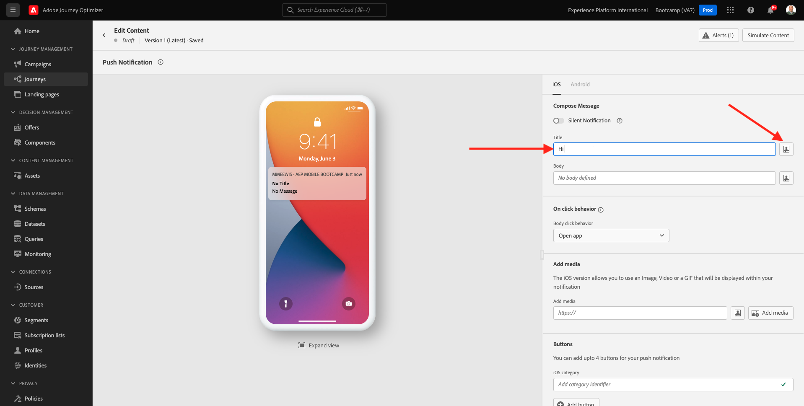
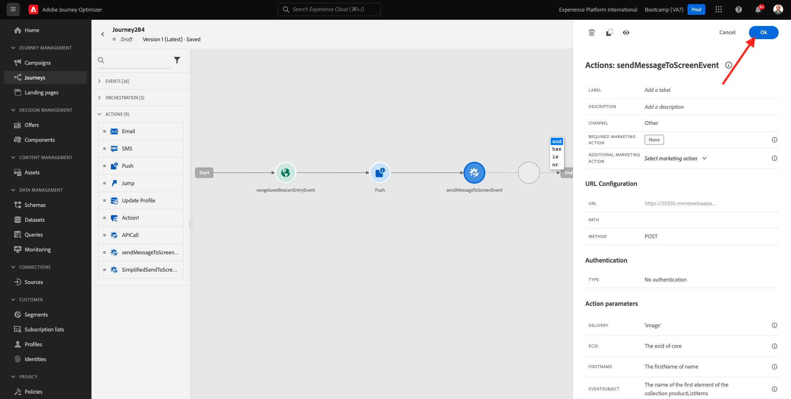

# 3.3 Skapa din resa och skicka push-meddelanden

I den här övningen ska du konfigurera den resa och det meddelande som ska utlösas när någon går in i en sändare med mobilappen.

Logga in på Adobe Journey Optimizer på [Adobe Experience Cloud](https://experience.adobe.com). Klicka på **Journey Optimizer**.

Du omdirigeras till vyn **Hem** i Journey Optimizer. Kontrollera först att du använder rätt sandlåda. Sandlådan som ska användas kallas `Bootcamp`. Om du vill ändra från en sandlåda till en annan klickar du på **Prod** och väljer sandlådan i listan. I det här exemplet heter sandlådan **Bootcamp**. Du kommer sedan att vara i vyn **Hem** i din sandlåda `Bootcamp`.

## 3.3.1 Skapa din resa

Klicka på **Resor** på den vänstra menyn. Klicka sedan på **Skapa resa** för att skapa en ny resa.

Då ser du en tom skärm för resan.

I föregående övning skapade du en ny **Event**. Du gav den ett namn som `yourLastNameBeaconEntryEvent` och ersatte `yourLastName` med ditt efternamn. Detta var resultatet av händelseskapandet:

Du måste nu ta det här evenemanget som början på den här resan. Du kan göra detta genom att gå till vänster på skärmen och söka efter händelsen i listan med händelser.

Markera händelsen, dra och släpp den på arbetsytan för resan. Din resa ser nu ut så här. Klicka på **OK** om du vill spara ändringarna.

Som det andra steget i resan måste du lägga till en **push**-åtgärd. Gå till vänster på skärmen till **Åtgärder**, välj åtgärden **Skjut** och dra och släpp den på den andra noden på resan.

Till höger på skärmen måste du nu skapa ett push-meddelande.

Ange **kategorin** till **Marknadsföring** och välj en push-yta som gör att du kan skicka push-meddelanden. I det här fallet är den push-yta som ska väljas **mmeewis-app-mobile-bootcamp**.

## 3.3.2 Skapa ett meddelande

Klicka på **Redigera innehåll**.

Då ser du det här:

Låt oss definiera innehållet i push-meddelandet.

Klicka på textfältet **Titel**.

Börja skriva **Hi** i textområdet. Klicka på personaliseringsikonen.

Du måste nu hämta en personaliseringstoken för fältet **Förnamn** som lagras under `profile.person.name.firstName`. Välj **Profilattribut** på den vänstra menyn, rulla nedåt/navigera för att hitta elementet **Person** och klicka på pilen för att gå en nivå längre tills du når fältet `profile.person.name.firstName`. Klicka på ikonen **+** för att lägga till fältet på arbetsytan. Klicka på **Spara**.

Du kommer då tillbaka hit. Klicka på personaliseringsikonen bredvid fältet **Brödtext**.

Skriv `Welcome at the ` i textområdet.

Klicka sedan på **Sammanhangsberoende attribut** och **Journey Orchestration**.

Klicka på **Händelser**.

Klicka på namnet på händelsen som ska se ut så här: **yourLastNameBeaconEntryEvent**.

Klicka på **Montera kontext**.

Klicka på **POI Interaction**.

Klicka på **POI-detalj**.

Klicka på ikonen **+** på **POI-namn**.
Då ser du det här. Klicka på **Spara**.

Meddelandet är nu klart. Klicka på pilen i det övre vänstra hörnet för att gå tillbaka till din resa.

Klicka på **OK**.

## 3.3.2 Skicka ett meddelande till en skärm

Som det tredje steget i resan måste du lägga till en **sendMessageToScreen**-åtgärd. Gå till vänster på skärmen till **Åtgärder**, markera åtgärden **sendMessageToScreen** och dra och släpp den på den tredje noden på resan. Då ser du det här.

Åtgärden **sendMessageToScreen** är en anpassad åtgärd som publicerar ett meddelande till slutpunkten som används av butiksskärmen. Åtgärden **sendMessageToScreen** förväntar sig ett antal variabler som ska definieras. Du kan se dessa variabler genom att rulla nedåt tills du ser **åtgärdsparametrar**.

Du måste nu ange värden för varje åtgärdsparameter. Följ den här tabellen för att förstå vilka värden som krävs var.

| Parameter | value |
|:-------------:| :---------------:|
| LEVERANS | `'image'` |
| ECID | `@{yourLastNameBeaconEntryEvent._experienceplatform.identification.core.ecid}` |
| FÖRNAMN | `#{ExperiencePlatform.ProfileFieldGroup.profile.person.name.firstName}` |
| EVENTSUBJECT | `#{ExperiencePlatform.ProductListItems.experienceevent.first(currentDataPackField.eventType == "commerce.productViews").productListItems.first().name}` |
| EVENTSUBJECTURL | `#{ExperiencePlatform.ProductListItems.experienceevent.first(currentDataPackField.eventType == "commerce.productViews").productListItems.first()._experienceplatform.core.imageURL}` |
| SANDLÅDA | `'bootcamp'` |
| CONTAINERID | `''` |
| ACTIVITYID | `''` |
| PLACEMENTID | `''` |

{style="table-layout:auto"}

Klicka på ikonen **Redigera** om du vill ange dessa värden.

Välj sedan **Avancerat läge**.

Klistra sedan in värdet baserat på tabellen ovan. Klicka på **OK**.

Upprepa den här processen om du vill lägga till värden för varje fält.

>[!IMPORTANT]
>
>Det finns en referens till händelsen `yourLastNameBeaconEntryEvent` för fältet-ECID. Ersätt `yourLastName` med ditt efternamn.

Slutresultatet ska se ut så här:

Bläddra uppåt och klicka på **OK**.

Du måste fortfarande ge din resa ett namn. Du kan göra det genom att klicka på ikonen **Penna** längst upp till vänster på skärmen.

Du kan sedan ange resans namn här. Använd `yourLastName - Beacon Entry Journey`. Klicka på **OK** om du vill spara ändringarna.

Nu kan du publicera din resa genom att klicka på **Publish**.

Klicka på **Publish** igen.

Då visas ett grönt bekräftelsefält som anger att din resa nu är publicerad.

Din resa är nu live och kan utlösas.

Du har nu avslutat den här övningen.

Nästa steg: [3.4 Testa din resa](./ex4.md)

[Gå tillbaka till användarflöde 3](./uc3.md)

[Gå tillbaka till Alla moduler](../../overview.md)
