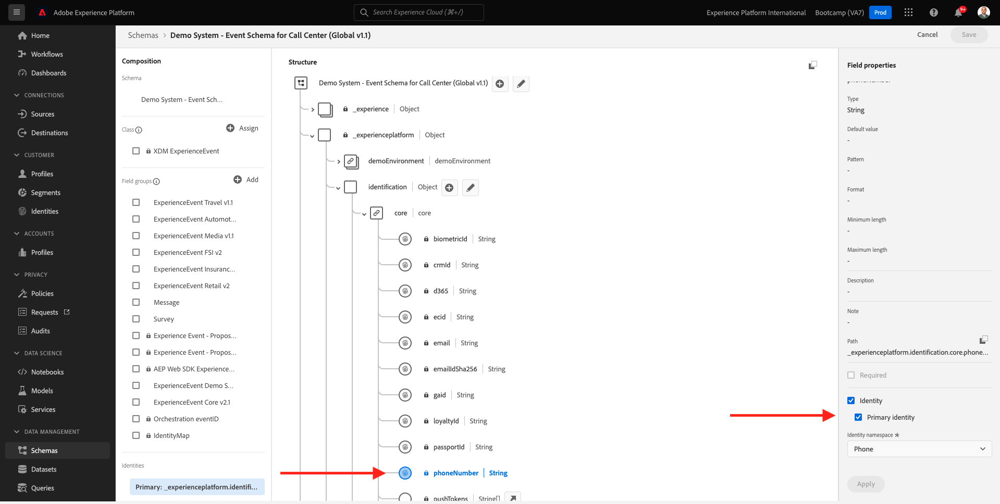

# 4.2 Ansluta Adobe Experience Platform-datauppsättningar i Customer Journey Analytics

## Mål

- Förstå användargränssnittet för dataanslutning
- Använd Adobe Experience Platform-data i CJA
- Förstå person-ID och datasammanfogning
- Lär dig mer om dataströmning i Customer Journey Analytics

## 4.2.1 Anslutning

Gå till [analytics.adobe.com](https://analytics.adobe.com) för att få tillgång till Customer Journey Analytics.

På Customer Journey Analytics-hemsidan går du till **Anslutningar**.

Här ser du alla olika anslutningar mellan CJA och Platform. Dessa anslutningar har samma mål som rapporteringsprogram i Adobe Analytics. Insamlingen av data är dock helt annorlunda. Alla data kommer från Adobe Experience Platform datamängder.

Låt oss skapa din första anslutning. Klicka **Skapa ny anslutning**.

Då ser du **Skapa anslutning** Gränssnitt.

Nu kan du ge anslutningen ett namn.

Använd den här namnkonventionen: `yourLastName – Omnichannel Data Connection`.

Exempel: `vangeluw - Omnichannel Data Connection`

Du måste också välja rätt sandlåda att använda. Välj sandlådan som ska vara `Bootcamp`. I det här exemplet är den sandlåda som ska användas **Bootläger**. Du måste också ange **Genomsnittligt antal dagliga händelser** till **mindre än 1 miljon**.

När du har valt sandlådan kan du börja lägga till datauppsättningar i den här anslutningen. Klicka **Lägg till datauppsättningar**.

## 4.2.2 Välj Adobe Experience Platform-datauppsättningar

Sök efter datauppsättningen `Demo System - Event Dataset for Website (Global v1.1)`. Klicka **+** för att lägga till datauppsättningen i den här anslutningen.

Sök och markera kryssrutorna för `Demo System - Event Dataset for Voice Assistants (Global v1.1)` och `Demo System - Event Dataset for Call Center (Global v1.1)`.

Du får den här då. Klicka på **Nästa**.

## 4.2.3 Person-ID och datatitlar

### Person-ID

Målet är nu att gå med i dessa datauppsättningar. För varje datamängd som du har valt visas ett fält med namnet **Person-ID**. Varje datauppsättning har ett eget fält för person-ID.

Som du ser har de flesta automatiskt valt person-ID. Detta beror på att en primär identifierare har valts i alla scheman i Adobe Experience Platform. Här följer till exempel schemat för `Demo System - Event Schema for Call Center (Global v1.1)`, där du ser att den primära identifieraren är inställd på `phoneNumber`.

Du kan dock fortfarande påverka vilken identifierare som ska användas för att sammanfoga datauppsättningar för din anslutning. Du kan använda valfri identifierare som är konfigurerad i det schema som är länkat till din datauppsättning. Klicka på listrutan för att utforska de ID:n som finns på varje datauppsättning.

Som vi nämnt kan du ange olika person-ID:n för varje datauppsättning. På så sätt kan du samla olika datauppsättningar från flera ursprung i CJA. Tänk dig att ta in NPS-data eller enkätdata som skulle vara mycket intressant och till hjälp för att förstå sammanhanget och varför något har hänt.

Namnet på fältet för person-ID är inte viktigt, så länge som värdet i fälten för person-ID motsvarar det. Säg att vi har `email` i en enda datauppsättning och `emailAddress` i en annan datauppsättning som definieras som person-ID. If `delaigle@adobe.com` är samma värde för fältet Person-ID för båda datauppsättningarna. CJA kan sammanfoga data.

För närvarande finns det några andra begränsningar som att knyta det anonyma beteendet till kända. Läs Frågor och svar här: [Vanliga frågor](https://experienceleague.adobe.com/docs/analytics-platform/using/cja-overview/cja-faq.html).

### Ställa in data med användar-ID

Nu när du förstår konceptet med att sy ihop datauppsättningar med person-ID:t väljer vi `email` som ditt person-ID för varje datauppsättning.

Gå till varje datauppsättning för att uppdatera person-ID:t.

Fyll i fältet Person-ID och välj `email` i listrutan.

När du har sytt ihop de tre datauppsättningarna är vi redo att fortsätta.

| datauppsättning | Person-ID |
| ----------------- |-------------| 
| Demo System - händelsedatauppsättning för webbplats (Global v1.1) | e-post |
| Demonstrationssystem - händelsedatauppsättning för röstassistenter (Global v1.1) | e-post |
| Demo System - händelsedatauppsättning för callcenter (Global v1.1) | e-post |

Du måste också se till att följande alternativ är aktiverade för varje datauppsättning:

- Importera alla nya data
- Fyll i alla befintliga data

Klicka **Lägg till datauppsättningar**.

Klicka **Spara** och gå till nästa övning.
När du har skapat **Anslutning** det kan ta några timmar innan dina data är tillgängliga i CJA.

Nästa steg: [4.3 Skapa en datavy](./ex3.md)

[Gå tillbaka till användarflöde 4](./uc4.md)

[Gå tillbaka till Alla moduler](./../../overview.md)
