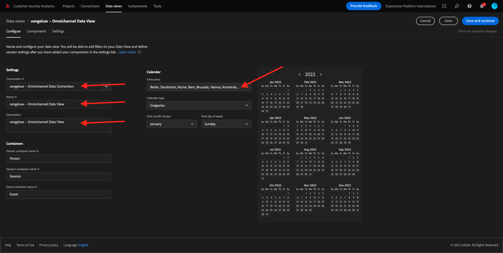
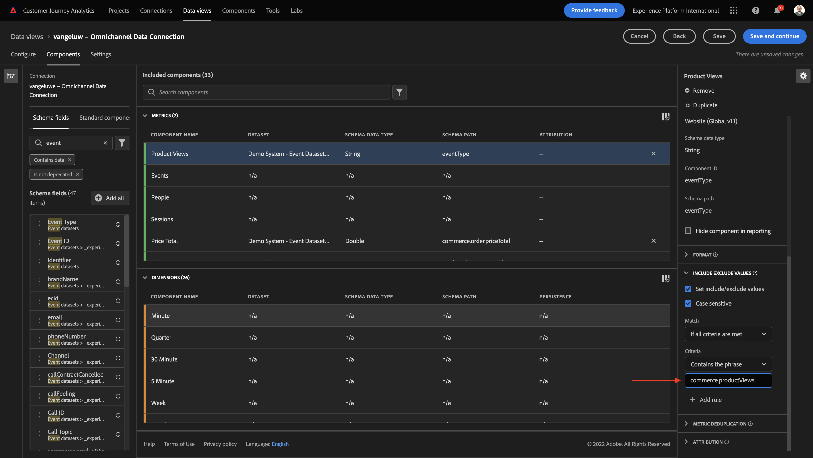
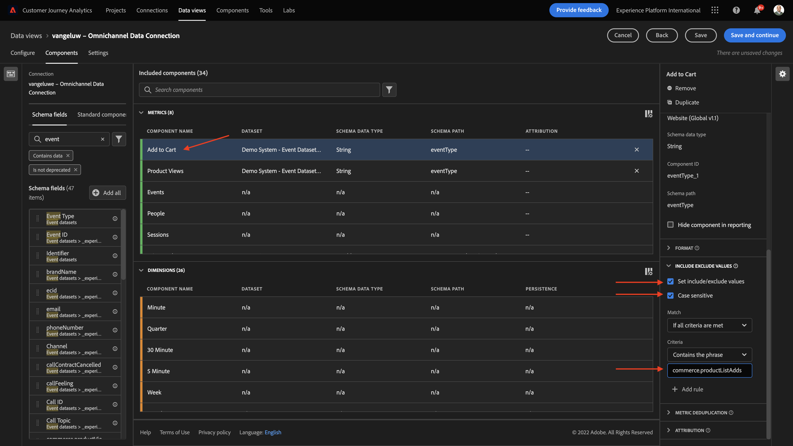

# 4.3 Skapa en datavy

## Mål

- Förstå användargränssnittet för datavy
- Förstå grundläggande inställningar för besöksdefinition
- Förstå attribuering och beständighet i en datavy

## 4.3.1 Datavy

När anslutningen är klar kan du nu gå vidare och påverka visualiseringen. En skillnad mellan Adobe Analytics och CJA är att CJA behöver en datavy för att rensa och förbereda data före visualisering.

En datavy liknar begreppet Virtual Report Suites i Adobe Analytics, där du definierar kontextmedvetna besöksdefinitioner, filtrering och även hur komponenterna anropas.

Du behöver minst en datavy per anslutning. Men för vissa fall är det bra att ha flera datavyer för samma anslutning, med målet att ge olika insikter till olika team.
Om ni vill att ert företag ska bli datadrivet bör ni anpassa hur data ska visas i varje team. Några exempel:

- UX-värden endast för UX-designteamet
- Använd samma namn för KPI:er och Metrics för Google Analytics som för Customer Journey Analytics så att de digitala analysteamen bara kan tala ett språk.
- Datavy filtrerad för att exempelvis visa data för en marknad, ett varumärke eller endast för mobila enheter.

På **Anslutningar** markerar du kryssrutan framför den anslutning du just skapade. Klicka **Skapa datavy**.

Du omdirigeras till **Skapa datavy** arbetsflöde.

## 4.3.2 Datavy Definition

Nu kan du konfigurera de grundläggande definitionerna för din datavy.

The **Anslutning** du skapade i föregående övning är redan markerad. Din anslutning har ett namn `yourLastName – Omnichannel Data Connection`.

Ge sedan datavyn ett namn enligt den här namnkonventionen: `yourLastName – Omnichannel Data View`.

Ange samma värde för beskrivningen: `yourLastName – Omnichannel Data View`.

| Namn | Beskrivning |
| ----------------- |-------------| 
| `yourLastName – Omnichannel Data View` | `yourLastName – Omnichannel Data View` |

För **Tidszon** väljer du tidszon **Berlin, Stockholm, Rom, Bern, Bryssel, Wien, Amsterdam GMT+01:00**. Det här är en intressant situation eftersom vissa företag är verksamma i olika länder och i olika geografiska områden. Genom att tilldela rätt tidszon för varje land undviks typiska datafel, som att tro att majoriteten av människorna i Peru till exempel köper T-shirts klockan 04:00.

Du kan också ändra huvudmåttsnamnet (person, session och händelse). Detta är inte obligatoriskt, men vissa kunder gillar att använda Personer, Besök och träffar i stället för Person, Session och Events (standardnamnkonvention från Customer Journey Analytics).

Du bör nu ha följande inställningar konfigurerade:

Klicka **Spara och fortsätt**.

## 4.3.3 Datavy Components

I den här övningen ska du konfigurera de komponenter du behöver för att analysera data och visualisera dem med Analysis Workspace. I det här användargränssnittet finns det tre huvudområden:

- Vänster sida: Tillgängliga komponenter från markerade datauppsättningar
- Mitten: Tillagda komponenter i datavyn
- Höger sida: Komponentinställningar

>[!IMPORTANT]
>
>Om du inte kan hitta ett specifikt mått eller dimension kontrollerar du om fältet `Contains data` tas bort från datavyn. Om inte, ta bort det fältet.
>
>

Nu måste du dra och släppa de komponenter du behöver för analysen till **Komponenter har lagts till**. För att göra detta måste du markera komponenterna i den vänstra menyn och dra och släppa dem på arbetsytan i mitten.

Låt oss börja med den första komponenten: **Namn (web.webPageDetails.name)**. Sök efter den här komponenten och dra och släpp den på arbetsytan.

Den här komponenten är sidnamnet, som du kan härleda när du läser schemafältet `(web.webPageDetails.name)`.

Med **Namn** eftersom namnet inte är den bästa namnkonventionen för en affärsanvändare som snabbt kan förstå den här dimensionen.

Låt oss ändra namnet till **Sidnamn**. Klicka på komponenten och byt namn på den i **Komponentinställningar** område.

Något som verkligen är viktigt är **Upprepningsinställningar**. Begreppet evar och prop finns inte i CJA, men inställningarna för persistence gör att liknande beteende kan användas.

Om du inte ändrar de här inställningarna tolkar CJA dimensionen som en **Prop** (träffnivå). Vi kan också ändra Persistence för att göra dimensionen till en **eVar** (bevara värdet under hela resan).

Om du inte är bekant med eVars och Props kan du [läsa mer om dem i dokumentationen](https://experienceleague.adobe.com/docs/analytics/landing/an-key-concepts.html).

Låt oss lämna sidnamnet som en propp. Därför behöver du inte ändra några **Beständiga inställningar**.

| Komponentnamn att söka efter | Nytt namn | Beständiga inställningar |
| ----------------- |-------------| --------------------| 
| Namn (web.webPageDetails.name) | Sidnamn |  |

Välj sedan dimensionen **phoneNumber** och släpp det på arbetsytan. Det nya namnet ska vara **Telefonnummer**.

Äntligen ändrar vi inställningarna för Upprepning eftersom mobilnumret ska finnas kvar på användarnivå.

Om du vill ändra Persistence rullar du ned på den högra menyn och öppnar dialogrutan **Persistence** tab:

Markera kryssrutan för att ändra inställningarna för beständighet. Välj **Senaste** och **Person (rapporteringsfönstret)** eftersom vi bara bryr oss om den personens sista mobilnummer. Om kunden inte fyller i mobilen vid framtida besök kommer ni fortfarande att se det här värdet fyllas i.

| Komponentnamn att söka efter | Nytt namn | Beständiga inställningar |
| ----------------- |-------------| --------------------| 
| phoneNumber | Telefonnummer | Senaste, person (rapportfönster) |

Nästa komponent är `web.webPageDetails.pageViews.value`.

På den vänstra menyn söker du efter `web.webPageDetails.pageViews.value`. Dra och släpp mätvärdena på arbetsytan.

Ändra namnet som ska **Sidvyer** under **Komponentinställningar**.

| Komponentnamn att söka efter | Nytt namn | Attributinställningar |
| ----------------- |-------------| --------------------| 
| web.webPageDetails.pageViews.value | Sidvisningar |  |

För attribueringsinställningarna lämnas detta tomt.

Obs! Du kan även ändra inställningarna för persistence för mått i Analysis Workspace. I vissa fall kan du välja att ställa in den här för att undvika att företagsanvändare behöver tänka på vilken som är den bästa persistensmodellen.

Därefter måste du konfigurera många Dimensioner och mått enligt tabellen nedan.

### Dimensioner

| Komponentnamn att söka efter | Nytt namn | Beständiga inställningar |
| ----------------- |-------------| --------------------| 
| brandName | Märkesnamn | Senaste, session |
| kallkänsla | Ring |  |
| call ID | Samtalsinteraktionstyp |  |
| callTopic | Ämne för samtal | Senaste, session |
| ecid | ECID | Senaste, person (rapportfönster) |
| e-post | E-post-ID | Senaste, person (rapportfönster) |
| Betalningstyp | Betalningstyp |  |
| Metod för produkttillägg | Metod för produkttillägg | Senaste, session |
| Händelsetyp | Händelsetyp |  |
| Namn (productListItems.name) | Produktnamn |  |
| SKU | SKU (session) | Senaste, session |
| Transaktions-ID | Transaktions-ID |  |
| URL (web.webPageDetails.URL) | URL |  |
| Användaragent | Användaragent | Senaste, session |
| nivå | Lojalitetsnivå |  |
| punkter | Kundens livstidsvärde |  |

### METRIK

| Komponentnamn att söka efter | Nytt namn | Attributinställningar |
| ----------------- |-------------| --------------------| 
| Kvantitet | Kvantitet |  |
| commerce.order.priceTotal | Intäkter |  |

Din konfiguration bör sedan se ut så här:

Glöm inte att **Spara** din datavy. Så klicka **Spara** nu.

## 4.3.4 Beräknade värden

Även om vi har organiserat alla komponenter i datavyn måste du fortfarande anpassa några av dem, så att företagsanvändare är redo att börja analysera.

Om du kommer ihåg det har vi inte särskilt fört in Metrics, som Add to Cart, Product View eller Purchases, i datavyn.
Men vi har en dimension som heter: **Händelsetyp**. Låt oss härleda de här interaktionstyperna genom att skapa 3 beräknade värden.

Låt oss börja med första måttet: **Produktvyer**.

Till vänster kan du söka **Händelsetyp** och välj dimensionen. Dra och släpp den sedan i **Inkluderade komponenter** arbetsyta.

Klicka för att välja det nya måttet **Händelsetyp**.

Ändra nu komponentnamnet och beskrivningen till följande värden:

| Komponentnamn | Komponentbeskrivning |
| ----------------- |-------------| 
| Produktvisningar | Produktvisningar |

Endast tillåtet **Produktvyer** händelser. Det gör du genom att rulla nedåt på **Komponentinställningar** tills du ser **Inkludera exkluderade värden**. Se till att aktivera alternativet **Ange inkluderings-/exkluderingsvärden**.

Som vi bara vill räkna **Produktvyer**, specificera **commerce.productViews** enligt kriterierna.

Ditt beräknade mätvärde är nu klart!

Upprepa sedan samma process för **Lägg i kundvagnen** och **Inköp** händelser.

### Lägg i kundvagnen

Dra och släpp samma dimension först **Händelsetyp**.

Du kommer att se en popup-varning för ett duplicerat fält när vi använder samma variabel. Klicka på **Lägg till ändå**:

Nu följer du samma process som vi gjorde för mätbara produktvyer:
- Ändra först namn och beskrivning.
- Lägg slutligen till **commerce.productListAdds** som villkor för att endast räkna Lägg i kundvagn

| Namn | Beskrivning | Kriterier |
| ----------------- |-------------| -------------|
| Lägg i kundvagnen | Lägg i kundvagnen | commerce.productListAdds |

### Inköp

Dra och släpp samma dimension först **Händelsetyp** som vi gjorde för båda tidigare mätvärden.

Du kommer att se en popup-varning för ett duplicerat fält när vi använder samma variabel. Klicka på **Lägg till ändå**:

Nu följer du samma process som vi gjorde för måtten Produktvyer och Lägg i kundvagnen:
- Ändra först namn och beskrivning.
- Lägg slutligen till **commerce.purchase** som villkor för att endast räkna inköp

| Namn | Beskrivning | Kriterier |
| ----------------- |-------------| -------------|
| Inköp | Inköp | commerce.purchases |

Din slutliga konfiguration bör sedan se ut ungefär så här. Klicka **Spara och fortsätt**.

## 4.3.5 Datavy Settings

Du bör omdirigeras till den här skärmen:

På den här fliken kan du ändra några viktiga inställningar för att ändra hur data bearbetas. Vi börjar med att ställa in **Tidsgräns för session** till 30 min Tack vare varje upplevelsehändelses tidsstämpel kan du utöka begreppet session över alla kanaler. Vad händer till exempel om en kund ringer callcenter efter att ha besökt webbplatsen? Med anpassade tidsgränser för sessioner kan du bestämma vad en session är och hur den sessionen ska sammanfoga data.

På den här fliken kan du ändra andra saker, t.ex. filtrera data genom att använda ett segment/filter. Du behöver inte göra det i den här övningen.

När du är klar klickar du **Spara och avsluta**.

>[!NOTE]
>
>Du kan när som helst gå tillbaka till den här datavyn och ändra inställningar och komponenter. Ändringarna påverkar hur historiska data visas.

Nu kan du fortsätta med visualiserings- och analysdelen!

Nästa steg: [4.4 Dataförberedelse i Customer Journey Analytics](./ex4.md)

[Gå tillbaka till användarflöde 4](./uc4.md)

[Gå tillbaka till Alla moduler](./../../overview.md)
