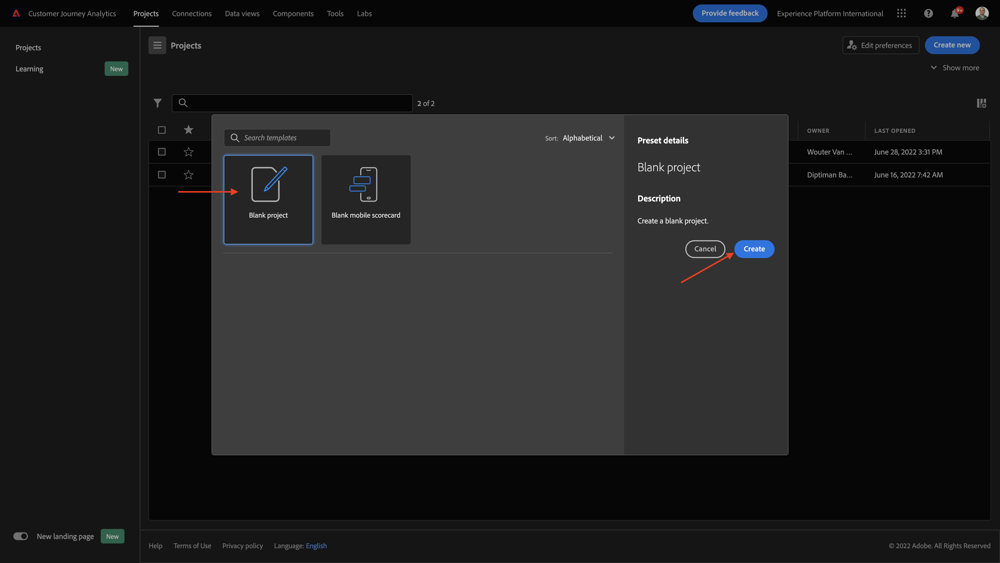

# 4.4 Dataförberedelser i Analysis Workspace

## Mål

- Förstå Analysis Workspace gränssnitt i CJA
- Förstå koncepten för dataförberedelser i Analysis Workspace
- Lär dig hur du utför databeräkningar

## 4.4.1 Analysis Workspace-gränssnitt i CJA

Analysis Workspace tar bort alla vanliga begränsningar i en enda Analytics-rapport. Den ger en robust, flexibel arbetsyta för att skapa anpassade analysprojekt. Dra och släpp valfritt antal datatabeller, visualiseringar och komponenter (mått, mått, mätvärden, segment och tidsdetaljer) till ett projekt. Skapa snabbt indelningar och segment, skapa kohorter för analys, skapa aviseringar, jämföra segment, göra flödes- och bortfallsanalyser samt strukturera och schemalägg rapporter för delning med vem som helst i företaget.

Customer Journey Analytics lägger denna lösning ovanpå plattformsdata. Vi rekommenderar starkt att du tittar på den här fyrminutersvideon med en översikt:

>[!VIDEO](https://video.tv.adobe.com/v/35109?quality=12&learn=on&enablevpops)

Om du inte har använt Analysis Workspace tidigare rekommenderar vi att du tittar på den här videon:

>[!VIDEO](https://video.tv.adobe.com/v/26266?quality=12&learn=on&enablevpops)

### Skapa ditt projekt

Nu är det dags att skapa ditt första CJA-projekt. Gå till projektfliken i CJA.
Klicka på **Skapa ny**.

Då ser du det här. Välj **Tomt projekt** och klicka sedan på **Skapa**.

Då ser du ett tomt projekt.

Kontrollera först att du har valt rätt datavy i skärmens övre högra hörn. I det här exemplet är den datavy som ska väljas `CJA Bootcamp - Omnichannel Data View`.

Sedan sparar du projektet och ger det ett namn. Du kan använda följande kommando för att spara:

| OS | Kort klipp |
| ----------------- |-------------| 
| Windows | Ctrl+S |
| Mac | Kommando + S |

Den här popup-rutan visas:

Använd den här namnkonventionen:

| Namn | Beskrivning |
| ----------------- |-------------| 
| `yourLastName - Omnichannel Analysis` | `yourLastName - Omnichannel Analysis` |

Klicka sedan på **Spara**.

## 4.4.2 Beräknade värden

Även om vi har organiserat alla komponenter i datavyn måste du fortfarande anpassa några av dem, så att företagsanvändare är redo att börja analysera. Under alla analyser kan du också skapa beräknade mätvärden för att gå djupare in på insikterna.

Vi kommer till exempel att skapa en beräknad **konverteringsgrad** med hjälp av det mått/den händelse för **Inköp** som vi definierade i datavyn.

### Konverteringsgrad

Låt oss börja öppna verktyget för beräknade mätvärden. Klicka på **+** för att skapa ditt första beräknade mått i Analysis Workspace.

**Beräknad metrisk byggare** visas:

Hitta **Inköp** i listan med mått på den vänstra menyn. Under **Metrisk** klickar du på **Visa alla**

Dra sedan måttet **Inköp** till den beräknade måttdefinitionen.

Oftast innebär konverteringsgraden **Konverteringar/sessioner**. Låt oss göra samma beräkning i den beräknade arbetsytan för metrisk definition. Hitta måttet **Sessioner** och dra och släpp det i definitionsbyggaren under händelsen **Inköp**.

Observera att divisionsoperatorn väljs automatiskt.

Konverteringsgraden anges vanligtvis i procent. Låt oss ändra formatet så att det blir procenttal och även välja 2 decimaler.

Äntligen ändrar du namnet och beskrivningen för det beräknade måttet:

| Titel | Beskrivning |
| ----------------- |-------------| 
| yourLastName - konverteringsgrad | yourLastName - konverteringsgrad |

Du kommer att ha något liknande på din skärm:

Glöm inte att **spara** det beräknade måttet.

## 4.4.3 Beräknade dimensioner: Filter (segmentering) och datumintervall

### Filter: Beräknade dimensioner

Beräkningar ska inte vara enbart för Metrics. Innan du påbörjar någon analys är det också intressant att skapa några **beräknade dimensioner**. Detta innebar i princip **segment** tillbaka i Adobe Analytics. I Customer Journey Analytics kallas dessa segment för **filter**.

Genom att skapa filter kan företagsanvändare påbörja analysen med några värdefulla beräknade mått. Detta automatiserar vissa uppgifter och hjälper till vid implementeringen. Här är några exempel:

1. Egna media, betalmedia,
2. Nya eller återkommande besök
3. Kunder med övergiven kundvagn

Dessa filter kan skapas före eller under analysdelen (som du gör i nästa övning).

### Datumintervall: Beräknade tidsdimensioner

Tidsdimensioner är en annan typ av beräknade dimensioner. Vissa har redan skapats, men du kan även skapa egna anpassade tidsdimensioner under dataförberedelsefasen.

Dessa beräknade tidsdimensioner hjälper analytiker och affärsanvändare att komma ihåg viktiga datum och använda dem för att filtrera och ändra rapporteringstiden. Typiska frågor och tvivel som kommer till vår kännedom när vi analyserar:

- När var Black Friday förra året? 21-29?
- När ledde vi den TV-kampanjen i december?
- Från och med när gjorde vi 2018 års sommarförsäljning? Jag vill jämföra det med 2019. Förresten, vet du de exakta dagarna 2019?

Du har nu slutfört dataförberedelsen med CJA Analysis Workspace.

Nästa steg: [4.5 Visualisering med Customer Journey Analytics](./ex5.md)

[Gå tillbaka till användarflöde 4](./uc4.md)

[Gå tillbaka till Alla moduler](./../../overview.md)
