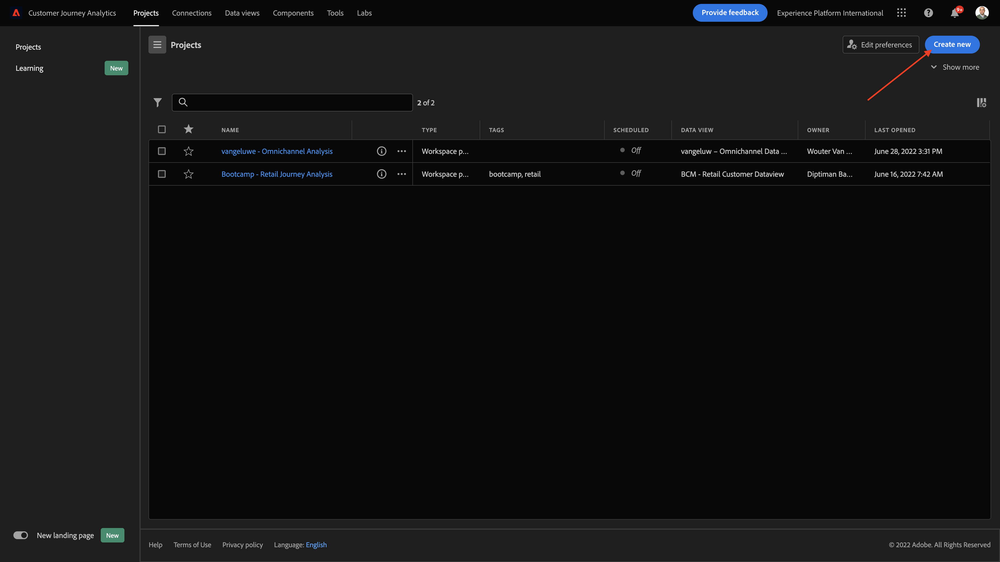
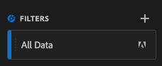

# 4.4 Dataförberedelser i Analysis Workspace

## Mål

- Förstå Analysis Workspace gränssnitt i CJA
- Förstå koncepten för dataförberedelser i Analysis Workspace
- Lär dig hur du utför databeräkningar

## 4.4.1 Analysis Workspace-gränssnitt i CJA

Med Analysis Workspace slipper ni alla de vanliga begränsningarna i en Analytics-rapport. Det utgör en robust och flexibel arbetsyta för att skapa anpassade analysprojekt. Dra och släpp valfritt antal datatabeller, visualiseringar och komponenter (mått, mått, mätvärden, segment och tidsdetaljer) till ett projekt. Skapa snabbt uppdelningar och segment, skapa kohorter för analys, skapa aviseringar, jämför segment, kör flödes- och bortfallsanalyser samt strukturera och schemalägg rapporter för delning med alla i företaget.

Customer Journey Analytics lägger den här lösningen ovanpå plattformsdata. Vi rekommenderar starkt att du tittar på den här fyrminutersvideon med en översikt:

>[!VIDEO](https://video.tv.adobe.com/v/35109?quality=12&learn=on)

Om du inte har använt Analysis Workspace tidigare rekommenderar vi att du tittar på den här videon:

>[!VIDEO](https://video.tv.adobe.com/v/26266?quality=12&learn=on)

### Skapa ditt projekt

Nu är det dags att skapa ditt första CJA-projekt. Gå till projektfliken i CJA.
Klicka **Skapa nytt**.

Du kommer då att se det här. Välj **Tomt projekt** och sedan klicka **Skapa**.

Då ser du ett tomt projekt.

Kontrollera först att du har valt rätt datavy i skärmens övre högra hörn. I det här exemplet är datavyn som ska väljas `CJA Bootcamp - Omnichannel Data View`.

Sedan sparar du projektet och ger det ett namn. Du kan använda följande kommando för att spara:

| OS | Kort klipp |
| ----------------- |-------------| 
| Windows | Ctrl+S |
| Mac | Kommando + S |

Den här popup-rutan visas:

Använd den här namnkonventionen:

| Namn | Beskrivning |
| ----------------- |-------------| 
| `yourLastName - Omnichannel Analysis` | `yourLastName - Omnichannel Analysis` |

Klicka på **Spara**.

## 4.4.2 Beräknade värden

Även om vi har organiserat alla komponenter i datavyn måste du fortfarande anpassa några av dem, så att företagsanvändare är redo att börja analysera. Under alla analyser kan du också skapa beräknade mätvärden för att gå djupare på insikterna.

Som exempel skapar vi en **Konverteringsgrad** med **Inköp** mått/händelse definierades i datavyn.

### Konverteringsgrad

Låt oss börja öppna verktyget för beräknade mätvärden. Klicka på **+** för att skapa dina första beräknade mätvärden i Analysis Workspace.

The **Beräknad metrisk Builder** visas:

Hitta **Inköp** i listan med mått på den vänstra menyn. Under **Mått** klicka **Visa alla**

Dra och släpp **Inköp** mått i den beräknade måttdefinitionen.

Normalt innebär konverteringsgraden **Konverteringar/sessioner**. Låt oss göra samma beräkning i den beräknade arbetsytan för metrisk definition. Hitta **Sessioner** mätvärden och dra och släpp dem i definitionsverktyget, under **Inköp** -händelse.

Observera att divisionsoperatorn väljs automatiskt.

Konverteringsgraden anges vanligtvis i procent. Låt oss ändra formatet så att det blir procenttal och även välja 2 decimaler.

Äntligen ändrar du namnet och beskrivningen för det beräknade måttet:

| Titel | Beskrivning |
| ----------------- |-------------| 
| yourLastName - konverteringsgrad | yourLastName - konverteringsgrad |

Du kommer att ha något liknande på din skärm:

Glöm inte att **Spara** Beräknade mått.

## 4.4.3 Beräknade Dimensioner: Filter (segmentering) och datumintervall

### Filter: Beräknade Dimensioner

Beräkningar ska inte vara enbart för Metrics. Innan du börjar någon analys är det också intressant att skapa **Beräknade Dimensioner**. Detta innebar i stort sett **segment** i Adobe Analytics. I Customer Journey Analytics anropas dessa segment **Filter**.

Genom att skapa filter kan företagsanvändare påbörja analysen med några värdefulla beräknade mått. Detta automatiserar vissa uppgifter och hjälper till vid implementeringen. Här är några exempel:

1. Egna media, betalmedia,
2. Nya eller återkommande besök
3. Kunder med övergiven kundvagn

Dessa filter kan skapas före eller under analysdelen (som du gör i nästa övning).

### Datumintervall: Dimensioner för beräknad tid

Dimensioner är en annan typ av beräknade dimensioner. Vissa har redan skapats, men du kan även skapa egna anpassade Dimensioner för tid i dataförberedelsefasen.

Dessa Dimensioner för beräknad tid hjälper analytiker och affärsanvändare att komma ihåg viktiga datum och använda dem för att filtrera och ändra rapporteringstiden. Typiska frågor och tvivel som kommer till vår kännedom när vi analyserar:

- När var Black Friday förra året? 21-29?
- När ledde vi den TV-kampanjen i december?
- Från och med när gjorde vi 2018 års sommarförsäljning? Jag vill jämföra det med 2019. Förresten, vet du de exakta dagarna 2019?

Du har nu slutfört dataförberedelsen med CJA Analysis Workspace.

Nästa steg: [4.5 Visualisering med Customer Journey Analytics](./ex5.md)

[Gå tillbaka till användarflöde 4](./uc4.md)

[Gå tillbaka till Alla moduler](./../../overview.md)
