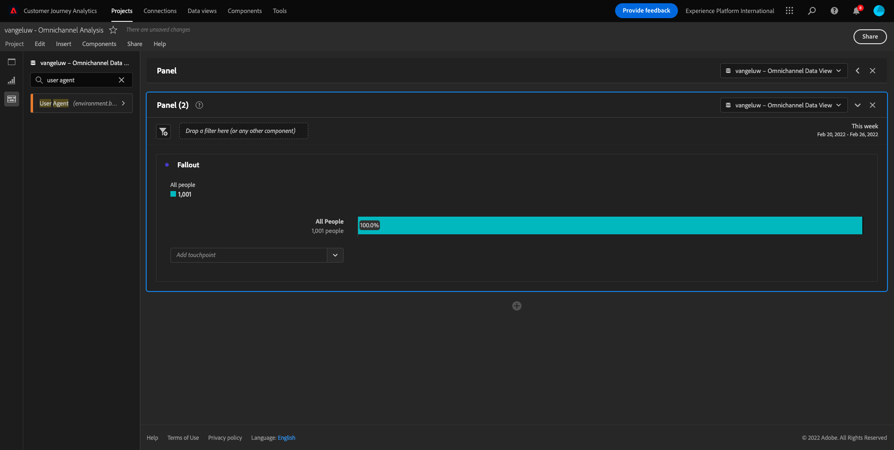
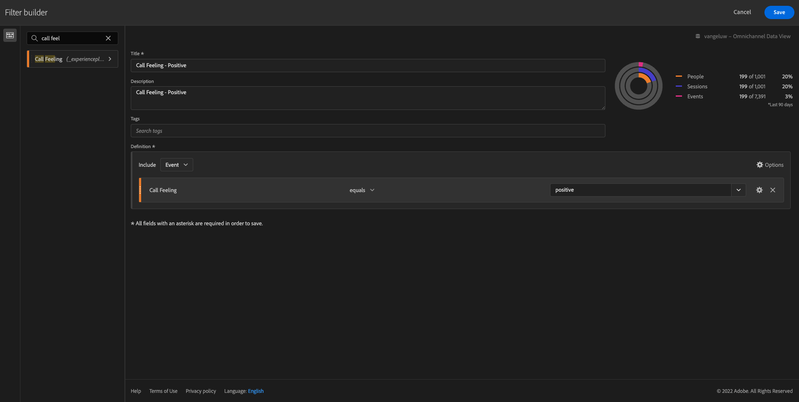

# 4.5 Visualisering med Customer Journey Analytics

## Mål

- Förstå Analysis Workspace användargränssnitt
- Lär dig något som gör Analysis Workspace så annorlunda.
- Lär dig hur du analyserar i CJA med Analysis Workspace

## Kontext

I den här övningen kommer du att använda Analysis Workspace i CJA för att analysera produktvyer, produkttrattar, urn osv.

Låt oss använda projektet som du skapade i [4.4 Dataförberedelser i Analysis Workspace](./ex4.md)så gå till [https://analytics.adobe.com](https://analytics.adobe.com).

Öppna ditt projekt `yourLastName - Omnichannel Analysis`.

När ditt projekt är öppet och datavyn `CJA Bootcamp - Omnichannel Data View` är du redo att börja skapa dina första visualiseringar.

## Hur många produktvisningar har vi dagligen?

Först och främst måste vi välja rätt datum för att analysera data. Gå till kalenderlistrutan till höger på arbetsytan. Klicka på den och välj ett datumintervall.

>[!IMPORTANT]
>
>De senast tillgängliga data har importerats 2022-09-19. Välj ett datumintervall som innehåller det här datumet.

På den vänstra menyn (komponentområdet) hittar du beräkningsmåttet **Produktvyer**. Markera den och dra och släpp den på arbetsytan högst upp till höger i frihandstabellen.

Dimensionen automatiskt **Dag** läggs till för att skapa din första tabell. Nu kan du se hur din fråga besvaras direkt.

Högerklicka sedan på sammanfattningen.

Klicka på **Visualisera** och sedan markera **Linje** som visualisering.

Du ser dina produkter per dag.

Du kan ändra tidsintervallet till dag genom att klicka på **Inställningar** inom visualiseringen.

Klicka på punkten bredvid **Linje** till **Hantera datakällan**.

Klicka på **Lås markering** och markera **Markerade objekt** om du vill låsa den här visualiseringen så att den alltid visar en tidslinje med produktvyer.

## Viktiga 4 produkter

Vilka är de fyra främsta produkterna?

Kom ihåg att spara projekt då och då.

| OS | Kort klipp |
| ----------------- |-------------| 
| Windows | Ctrl+S |
| Mac | Kommando + S |

Vi börjar hitta de fyra bästa produkterna som visas. På den vänstra menyn hittar du **Produktnamn** - Dimension.

Dra och släpp **Produktnamn** som ersätter **Dag** dimension:

Detta blir resultatet

Försök sedan att dela upp en av produkterna efter varumärkesnamn. Sök efter **brandName** och dra den under förnamnet.

Gör sedan en uppdelning med lojalitetsnivån. Sök efter **Lojalitetsnivå** och dra det under varumärkesnamnet.

Då ser du det här:

Slutligen kan du lägga till fler visualiseringar. På vänster sida, under visualiseringar, söker du efter `Donut`. Ta `Donut`, dra och släpp det på arbetsytan under **Linje** visualisering.

I tabellen väljer du sedan 3 **Lojalitetsnivå**  rader från den uppdelning vi gjorde under **Google Pixel XL 32 GB svart smarttelefon** > **Citi Signal**. Håll ned **CTRL** eller **Kommando** (på Mac).

Du kommer att se att mundiagrammet ändras:

Du kan till och med anpassa designen så att den blir mer läsbar genom att göra båda **Linje** diagram och **Munk** ett diagram mindre så att de får plats intill varandra:

Klicka på punkten bredvid **Munk** till **Hantera datakällan**.
Klicka på **Lås markering** om du vill låsa den här visualiseringen så att den alltid visar en tidslinje med produktvyer.

Läs mer om visualiseringar med Analysis Workspace här:

- [https://experienceleague.adobe.com/docs/analytics/analyze/analysis-workspace/visualizations/freeform-analysis-visualizations.html](https://experienceleague.adobe.com/docs/analytics/analyze/analysis-workspace/visualizations/freeform-analysis-visualizations.html)
- [https://experienceleague.adobe.com/docs/analytics/analyze/analysis-workspace/visualizations/t-sync-visualization.html](https://experienceleague.adobe.com/docs/analytics/analyze/analysis-workspace/visualizations/t-sync-visualization.html)

## Produktinteraktionstru, från visning till köp

Det finns många sätt att lösa denna fråga. En av dem är att använda produktinteraktionstyp och använda den på frihandsritbord. Ett annat sätt är att använda en **Bortfallsvisualisering**. Låt oss använda den sista som vi vill visualisera och analysera samtidigt.

Stäng den aktuella panelen genom att klicka här:

Lägg nu till en ny tom panel genom att klicka på **+ Lägg till tom panel**.

Klicka på visualiseringen **Utfall**.

Välj samma datumintervall som i föregående övning.

Du kommer då att se det här.

Hitta dimensionen **Händelsetyp** under komponenterna till vänster:

Klicka på pilen för att öppna dimensionen:

Du kommer att se alla tillgängliga händelsetyper.

Markera objektet **commerce.productViews** och dra och släpp det på **Lägg till kontaktpunkt** fält inuti **Bortfallsvisualisering**.

Gör likadant med **commerce.productListAdds** och **commerce.purchase** och släpp dem på **Lägg till kontaktpunkt** fält inuti **Bortfallsvisualisering**. Din visualisering ser nu ut så här:

Du kan göra många saker här. Några exempel: jämföra steg för steg eller jämföra dem efter lojalitet. Men om vi vill analysera intressanta saker som varför kunderna inte köper efter att ha lagt till en artikel i kundvagnen kan vi använda det bästa verktyget i CJA: högerklicka.

Högerklicka på kontaktytan **commerce.productListAdds**. Klicka sedan på **Brytningsbortfall vid den här kontaktytan**.

En ny friformstabell kommer att skapas för att analysera vad personerna gjorde om de inte köpte något.

Ändra **Händelsetyp** av **Sidnamn**, i den nya frihandstabellen, för att se vilka sidor de ska gå i stället för bekräftelsesidan.

## Vad gör folk på webbplatsen innan de kommer till sidan Avbryt tjänst?

Det finns många sätt att utföra den här analysen. Låt oss använda flödesanalysen för att starta identifieringsdelen.

Stäng den aktuella panelen genom att klicka här:

Lägg nu till en ny tom panel genom att klicka på **+ Lägg till tom panel**.

Klicka på visualiseringen **Flöde**.

Då ser du det här:

Välj samma datumintervall som i föregående övning.

Hitta dimensionen **Sidnamn** under komponenterna till vänster:

Klicka på pilen för att öppna dimensionen:

Alla sidor visas. Sök efter sidnamnet: **Avbryt tjänst**.
Dra och släpp **Avbryt tjänst** till Flödesvisualisering i mittfältet:

Då ser du det här:

Nu ska vi analysera om kunder som besökt **Avbryt tjänst** på webbplatsen kallas även callcenter och vad resultatet blev.

Under dimensionerna går du tillbaka och letar upp **Samtalsinteraktionstyp**.
Dra och släpp **Samtalsinteraktionstyp** att ersätta den första interaktionen till höger i dialogrutan **Flödesvisualisering**.

Nu ser du supportbiljetten till de kunder som ringde till callcentret efter att ha besökt **Avbryt tjänst** sida.

Sök sedan efter **Ring**.  Dra och släpp den för att ersätta den första interaktionen till höger i **Flödesvisualisering**.

Då ser du det här:

Som du ser har vi gjort en flerkanalsanalys med hjälp av Flödesvisualisering. Tack vare att vi har kommit fram till att vissa kunder som funderade på att säga upp sin tjänst hade en positiv känsla efter att ha ringt callcenter. Har vi ändrat oss med en befordran?

## Hur fungerar kunder med en positiv Callcenter-kontakt jämfört med nyckeltal?

Låt oss först segmentera data för att bara få användare med **positiv** samtal. I CJA kallas segment för filter. Gå till filter i komponentområdet (till vänster) och klicka på **+**.

I filterverktyget ger du filtret ett namn

| Namn | Beskrivning |
| ----------------- |-------------| 
| Samtalskunskap - positiv | Samtalskunskap - positiv |

Under komponenterna (i Filter Builder) hittar du **Ring** och dra och släpp det i filterverktyget.

Välj nu **positiv** som värde för filtret.

Ändra omfånget som ska **Person** nivå.

Klicka bara på **Spara**.

Du kommer då tillbaka hit. Stäng den föregående panelen om du inte är klar ännu.

Lägg nu till en ny tom panel genom att klicka på **+ Lägg till tom panel**.

Välj samma datumintervall som i föregående övning.

Klicka på **Frihandsregister**.

Dra och släpp det filter du just skapat.

Det är dags att lägga till lite statistik. Börja med **Produktvyer**. Dra och släpp i frihandstabellen. Du kan även ta bort **Händelser** mätvärden.

Gör likadant med **Folk**,  **Lägg i kundvagnen** och **Inköp**. Du får ett bord som det här.

Tack vare den första flödesanalysen kom en ny fråga i minnet. Därför bestämde vi oss för att skapa den här tabellen och kontrollera några nyckeltal mot ett segment för att svara på den frågan. Som du ser går det mycket snabbare att få insikter än att använda SQL eller andra BI-lösningar.

## Customer Journey Analytics och Analysis Workspace recap

Som ni har lärt er i labbet sammanfogar Analysis Workspace data från alla kanaler för att analysera hela kundresan. Tänk också på att du kan hämta in data till samma arbetsyta som inte är sammansatt med resan.
Det kan vara mycket användbart att föra in data som inte är kopplade till varandra i analysen för att ge resan ett sammanhang. Några exempel är exempelvis NPS-data, undersökningar, Facebook Ads-händelser eller offlineinteraktioner (ej identifierad).

Nästa steg: [4.6 Från insikter till handling](./ex6.md)

[Gå tillbaka till användarflöde 4](./uc4.md)

[Gå tillbaka till Alla moduler](./../../overview.md)
