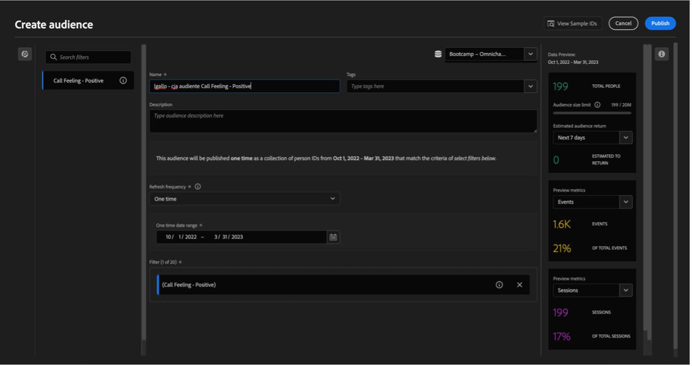
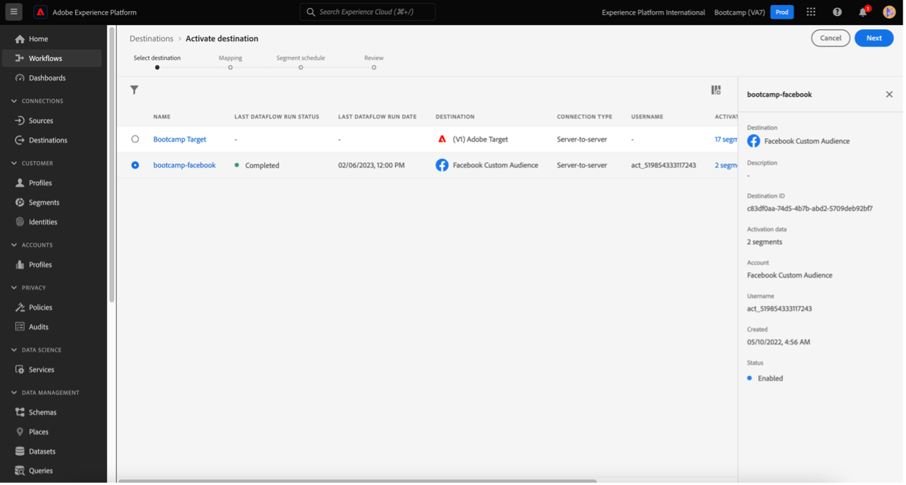

# 4.6 Från insikter till handling

## Mål

- Förstå hur man bygger en målgrupp baserat på en vy som samlats in i Customer Journey Analytics
- Använd den här målgruppen i Real-Time CDP och Adobe Journey Optimizer

## 4.6.1 Skapa en målgrupp och publicera den

I ditt projekt skapade du ett filter som kallas **Utlysningar** och kunde visa antalet användare som hade sina samtal till callcentret klassificerade som **positiv**. Nu kan du skapa ett segment med de här användarna och aktivera dem på resor eller i kommunikationskanaler.

Det första steget är: Markera en rad i panelen som skapades i den senaste övningen **1. Samtalskunskap - positiv**, högerklicka och välj **Skapa målgrupp från urval** alternativ:

Ge sedan målgruppen ett namn som följer modellen **yourLastName - CJA-publiken känner sig positiv**:

Observera att det går att förhandsgranska den målgrupp som skapas:

Klicka slutligen **Publicera**.

## 4.6.2 Använda er målgrupp som en del av ett segment

Gå tillbaka till Adobe Experience Platform, gå till **Segment > Bläddra** och du kommer att kunna se ditt segment som skapats i CJA klart och tillgängligt för användning i dina aktiveringar och resor!

Nu ska vi använda det här segmentet i en aktivering av Facebook och på en kundresa!

## 4.6.3 Använda ditt segment i Real-Time CDP i realtid

I Adobe Experience Platform går du till **Segment > Bläddra** och hitta den målgrupp du skapat i CJA:

Klicka på segmentet och klicka sedan på **Aktivera till mål**:

Markera målet med namnet **bootcamp-facebook** och klicka sedan på **Nästa**.

Klicka **Nästa** igen.

Välj **Målgruppens ursprung** och ange **Direkt från kunderna**, klicka **Nästa**.

Klicka **Slutför**.

Ditt segment är nu anslutet till Facebook anpassade målgrupper. Nu ska vi använda samma segment i Adobe Journey Optimizer.

## 4.6.4 Använda ditt segment i Adobe Journey Optimizer

I Adobe Experience Platform klickar du på **Journey Optimizer** och klicka sedan på **Resor** och börja skapa en resa genom att klicka **Skapa resa**.

Sedan, på den vänstra menyn, under **Händelser**, markera **Segmentkvalificering** och dra den till resan:

Klicka under Segment **Redigera** för att markera ett segment:

Välj den målgrupp du skapade tidigare i CJA och klicka på  **Spara**.

Redo! Härifrån kan ni skapa en resa för kunder som är kvalificerade för det här segmentet.

[Gå tillbaka till användarflöde 4](./uc4.md)

[Voltar para todos os módulos](./../../overview.md)
