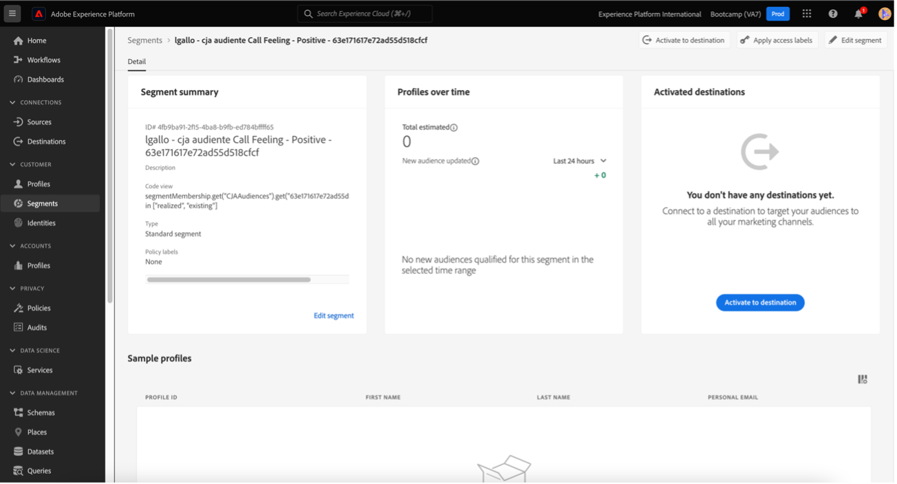

# 4.6 Från insikter till handling

## Mål

- Förstå hur man bygger en målgrupp baserat på en vy som samlats in i Customer Journey Analytics
- Använd den här målgruppen i Real-Time CDP och Adobe Journey Optimizer

## 4.6.1 Skapa en målgrupp och publicera den

I ditt projekt skapade du ett filter med namnet **Ring samtal** och kunde visa antalet användare som hade sina samtal till callcentret klassificerade som **positivt**. Nu kan du skapa ett segment med de här användarna och aktivera dem på resor eller i kommunikationskanaler.

Det första steget är: Markera rad **1 på panelen som skapades i den senaste övningen. Anropsfunktion - Positiv**, högerklicka och välj alternativet **Skapa målgrupp från urval**:

Ge sedan målgruppen ett namn som följer modellen **yourLastName - CJA-målgruppsanropet som känns positivt**:

Observera att det går att förhandsgranska den målgrupp som skapas:

Klicka slutligen på **Publish**.

## 4.6.2 Använda er målgrupp som en del av ett segment

Gå tillbaka till Adobe Experience Platform, gå till **Segment > Bläddra** så ser du att ditt segment som skapats i CJA är klart och tillgängligt att användas i dina aktiveringar och resor!

Nu ska vi använda det här segmentet i en aktivering av Facebook och på en kundresa!

## 4.6.3 Använda ditt segment i Real-Time CDP i realtid

I Adobe Experience Platform går du till **Segment > Bläddra** och söker efter den målgrupp du har skapat i CJA:

Klicka på ditt segment och sedan på **Aktivera till mål**:

Välj målet **bootcamp-facebook** och klicka sedan på **Next**.

Klicka på **Nästa** igen.

Välj alternativet **Publiken** som har sitt ursprung och ange det som **Direkt från kunderna**. Klicka sedan på **Nästa**.

Klicka på **Slutför**.

Ditt segment är nu anslutet till Facebook anpassade målgrupper. Nu ska vi använda samma segment i Adobe Journey Optimizer.

## 4.6.4 Använda ditt segment i Adobe Journey Optimizer

I Adobe Experience Platform klickar du på **Journey Optimizer** och sedan på **Resor** på den vänstra menyn. Klicka sedan på **Skapa resa** för att börja skapa en resa.

Välj sedan **Segmentkvalificering** under **Händelser** på den vänstra menyn och dra den till resan:

Under Segment klickar du på **Redigera** för att markera ett segment:

Markera målgruppen som du skapade tidigare i CJA och klicka på **Spara**.

Redo! Härifrån kan ni skapa en resa för kunder som är kvalificerade för detta segment.

[Gå tillbaka till användarflöde 4](./uc4.md)

[Voltar para todos os módulos](./../../overview.md)
