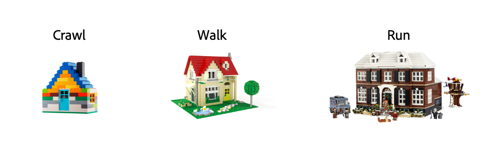

# Slutsats

Som ni har märkt under det här bootlägret handlar innehållsleveranskedjan inte om produkter, utan snarare om samverkan mellan produkter. Denna synergi leder till många fördelar, till exempel:

- **Utgiftsrationalisering**
   - Lägg in material internt när det går till lägre kostnad
   - Konsolidera och fördela utgifterna effektivare mellan olika myndigheter
- **Återanvändning av resurser**
   - Eliminera slöseri med att återskapa befintliga resurser genom enhetlig åtkomst
   - Öka användningen och få ut produkterna på marknaden snabbare med helhetsförbättrad global sökning
- **Minska tiden för skapande**
   - Minska den administrativa bördan genom arbetssamordning och samarbete
   - Snabba upp cyklerna med integrerade säkra gransknings- och godkännandefunktioner
- **Optimera automatisering**
   - Generera resursvariationer automatiskt för flera kanaler och enheter
   - Generera automatiskt lokaliserade versioner av resurser för flera marknader/geografiska områden
- **Effektiv mätning av prestanda**
   - Optimera arbetsflöden med hjälp av budget- och projekttrestandaanalys
   - Prioritera mer värdefullt material via avancerade resultatinsikter

Men det är lika viktigt att understryka att innehållsleveranskedjan inte är en magisk lösning på alla era problem. Det är ett sätt att arbeta som gör att ni kan vara mer effektiva och hantera alla upplevelser ni vill ge kunderna. Du måste krypa innan du kan gå och till slut springa.

[Gå tillbaka till fas 4 - insikter för en marknadschef](./phases/insights/marketing-manager.md)

[Gå tillbaka till Alla moduler](./overview.md)
