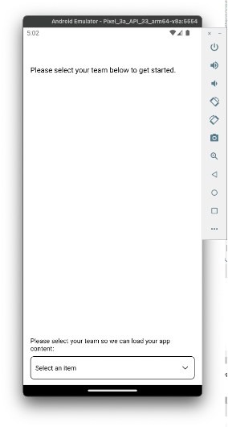

# Verifiera mobilapp

## Android

- Hämta mobilappen från [här](https://tinyurl.com/CSCBootcampApp) på din Android-enhet. Du kan hämta den på en [Android-emulator](https://developer.android.com/studio/run/emulator) eller din fysiska Android-enhet.

- Öppna den hämtade filen genom att trycka på den.

- Klicka på installationsknappen i popup-fönstret och bekräfta sedan genom att klicka på Installera ändå.

- När appen har installerats kan du öppna den genom att klicka på knappen Öppna.

## iOS

>[!WARNING]
>
> Kontrollera att du är ansluten till Bootcamp Wifi-nätverket. Detta är viktigt eftersom programmet bara fungerar om du är i samma Wifi-nätverk.

Eftersom detta inte är en officiellt distribuerad app är iOS-konfigurationen något annorlunda än vad du är van vid.

- Hämta Expo Go-appen från [App Store](https://itunes.apple.com/app/apple-store/id982107779).

- I appen iPhone Camera kan du skanna den QR-kod som Adobe-teamet ska projicera på bootlägret. När du uppmanas till det klickar du på knappen som visas.

- Då öppnas en webbsida där du kan öppna appen på din iPhone. Klicka på knappen &quot;Expo Go&quot; för att öppna den i det program du just laddat ned.

- I den dialogruta som öppnas väljer du&quot;Öppna&quot; så att programmet Expo Go kan läsas in med rätt information.

- När programmet Expo Go har öppnats uppmanas du att söka efter enheter i det lokala nätverket. Som tidigare nämnts är detta nödvändigt så att vi kan hämta appen från våra Adobe-enheter till din telefon. Klicka på Tillåt för att läsa in det här.

- Du kan få en felsida först. Klicka bara på knappen &quot;Försök igen&quot; för att slutligen läsa in appen på din enhet. Observera att om du stänger programmet Expo Go eller kopplar från din enhet från WiFi-nätverket kommer programmet inte längre att svara.

## Navigera i programmet

I appen kan du välja ditt team i listrutan. Detta läses dynamiskt in i innehållet som du skapade i AEM. Om du inte är nöjd med innehållet kan du alltid uppdatera det i det innehållsfragment som vi skapade tidigare och sedan publicera innehållet igen. Du ser sedan ändringarna som återspeglas i appen.

Nästa steg: [Fas 3 - Leverans: Skapa sida i AEM](./page-in-aem.md)

[Gå tillbaka till fas 2 - produktion: Skapa mobilappsinnehåll](../production/app.md)

[Gå tillbaka till Alla moduler](../../overview.md)
