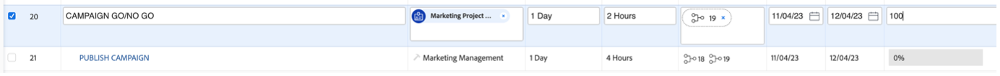

# Kampanj GO/NO-GO

## Godkänna kampanjen i Adobe Workfront

Eftersom vi nu har slutfört alla uppgifter och därmed lagt alla uppgifter på 100 % behöver vi bara&quot;Campaign go/no go&quot; - som är en gransknings- och godkännandeuppgift - för att kunna publicera kampanjen.

Vi godkänner naturligtvis vår kampanj, så ange aktivitet 20 &#39;CAMPAIGN GO/NO GO&#39; till 100 % färdig. Detta startar automatiskt en gransknings- och godkännandeprocess:

Låt oss titta på den process vi har på plats. Klicka på namnet &quot;CAMPAIGN GO/NO GO&quot; för uppgift 20:

Nu ska vi titta på godkännandeavsnittet:

Vi kan se att det är en tvåstegsprocess där antingen jag, Petra eller någon av er behöver granska och/eller godkänna det här gången som ett första steg, och sedan kan Olivia (som är vår Director för marknadsföringsåtgärder) ge henne sitt sista försök.

Därför visas mina godkännandeknappar längst upp till höger och jag kan nu godkänna det här&quot;Go No/Go&quot; för första steget. Klicka på den gröna bocken för att godkänna:

Alla våra projekt väntar nu på Olivias godkännande. När hon har godkänt - vilket hon naturligtvis kommer att göra - kan vår kampanj publiceras.

## Starta kampanjen för sociala medier

Eftersom vi nu har verifierat att vår kampanj är redo att lanseras och vi är redo att börja sälja våra cyklar, är det dags att ta ett steg framåt. Och vilket bättre sätt kan du göra det på, sedan med ett inlägg i sociala medier?

Eftersom vi redan har skapat och godkänt ett inlägg i sociala medier kan vi nu publicera det på vårt Instagram-konto för demo.

>[!WARNING]
> Vissa regler för hushållning
> 
> Det här är ett konto som bara används för att slutföra historien om vårt bootläger. Den är **inte avsedd att delas, följas upp eller publiceras**. Behåll ditt inlägg **respektfullt och professionellt**. **Dela inte inloggningsuppgifterna** med någon utanför bootlägret, och observera **att alla enheter loggas ut** efter den här övningen.

- Du får lösenordet för ett Instagram-konto med namnet &quot;csc_bootcamp_emea&quot;.
- Skapa ett nytt inlägg där du som sista del av bildtexten lägger till den plats du är medlem från samt datum och ditt teamnummer.
- Du kan bläddra till alla olika inlägg och se hur andra team har tagit lite konstnärlig frihet med samma material.

## Grattis! Din kampanj har publicerats!

Nästa steg: [Fas 4 - Insikter: Översikt](../insights/overview.md)

[Gå tillbaka till fas 3 - leverans: Skapa sida i AEM](./app.md)

[Gå tillbaka till Alla moduler](../../overview.md)
