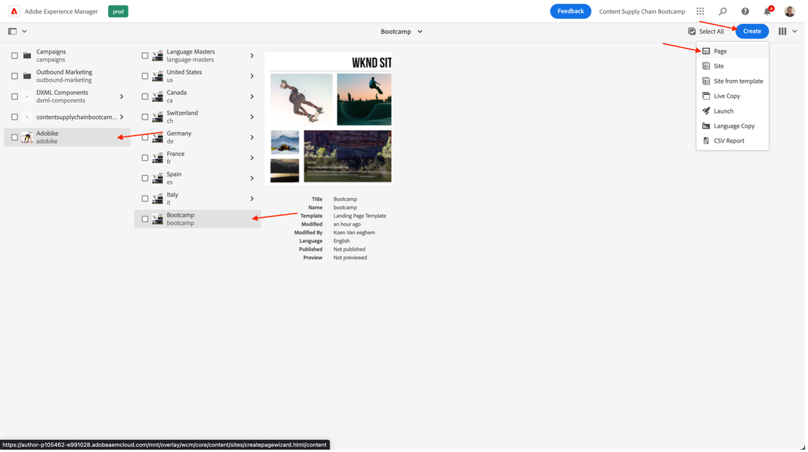

# Skapa sida i AEM

AEM innehåller två miljöer: författarmiljön och Publish-miljön. Dessa interagerar så att ni kan göra innehållet tillgängligt på er webbplats - så att besökarna kan uppleva det.

I redigeringsmiljön finns mekanismer för att skapa, uppdatera och granska innehållet innan det publiceras:

- En författare skapar och granskar innehållet (detta kan vara av flera typer, t.ex. sidor, resurser, publikationer osv.)
- som någon gång kommer att publiceras på er webbplats.

Som författare måste du ordna din webbplats inom AEM. Detta innebär att du skapar och namnger innehållssidorna så att:

- Du kan enkelt hitta dem i redigeringsmiljön
- Besökare på webbplatsen kan enkelt hitta dem i publiceringsmiljön

Strukturen på en webbplats kan ses som en trädstruktur som innehåller dina innehållssidor. Namnen på dessa innehållssidor används för att skapa URL-adresserna, medan titeln visas när sidinnehållet visas. I exemplet nedan blir den tillgängliga URL:en för sidan /content/adobike/language-masters/en.html

Vi ska granska hur man lägger till nya sidor på en befintlig webbplats och hur man återanvänder visst innehåll.

## Skapa hemsidan

Så som förklaras i föregående avsnitt fungerar AEM sidhierarki som en trädstruktur. Det innebär att vi börjar med sidan på den högsta nivån: startsidan.

- Gå till AEM författare på [https://author-p71057-e991028.adobeaemcloud.com/](https://author-p71057-e991028.adobeaemcloud.com/) och logga in med de autentiseringsuppgifter som vi har angett.

- På AEM Start-meny väljer du Navigering \> Platser

- Först navigerar vi den befintliga trädstrukturen till den plats där vi vill skapa vår hemsida. Navigera i trädstrukturen genom att välja &quot;AdobeCycle&quot; i första kolumnen och sedan &quot;Bootcamp&quot; i andra kolumnen. Om du vill skapa en sida under den här sidan klickar du på knappen &quot;Skapa&quot; och väljer &quot;Sida&quot; på menyn som visas.

- Då öppnas en ny skärm där du kan konfigurera den nya sidan. Först måste vi välja en sidmall. Med sidmallar i AEM kan du definiera strukturen för en sida, samt definiera vilket innehåll som kan användas på den här sidan. När vi vill skapa startsidan, som är en landningssida, väljer vi landningssidmallen och klickar sedan på Nästa för att fortsätta.

- På nästa skärm kan du fylla sidan med viss inledande information. Den viktigaste informationen är titeln (en obligatorisk egenskap som anges med ett \*), som är avsedd för att du ska kunna ge sidan ett beskrivande namn. Om du inte fyller i rutan Namn, kommer AEM automatiskt att generera den URL som sidan är tillgänglig på, enligt SEO:s bästa praxis. I så fall kan du lämna det här fältet tomt. Vissa andra egenskaper kan även fyllas i, men för det här bootlägret fylls inga andra egenskaper ut ännu. När du är klar klickar du bara på knappen &quot;Skapa&quot;.

- AEM skapar nu sidan. När du är klar visas ett popup-fönster där du kan öppna den nya sidan genom att klicka på knappen&quot;Öppna&quot;.

- Du kommer nu till AEM. Det här är en&quot;vad du ser är vad du får&quot;-redigerare (eller WYSIWYG-redigerare) där du kan dra och släppa komponenter på en sida för att skapa sidan. Låt oss titta på navigeringen:
  
   - Till vänster finns sidopanelen med de resurser du kan använda på sidorna, komponenterna (eller byggblocken) som du kan använda på den här sidan och en praktisk trädvy som visar hur sidan är strukturerad. Klicka på någon av de här ikonerna för att öppna vyn.
   - Till höger ser du &quot;layoutbehållaren&quot;. Här kan du släppa de önskade komponenterna.
   - Låt oss fylla i vår sida med lite innehåll. Du kan fylla hemsidan när du vill. I exemplet nedan har vi använt en bildkomponent som länkar till produktsidan samt två teaser-komponenter.

## Återanvänd upplevelser genom att utnyttja Experience Fragments

Nu har vi skapat hemsidan, som är helt klar för lanseringen av Adobe. Men en del av innehållet där, till exempel de unika säljpunkterna i vår cykel, kan återanvändas på flera sidor.

Helst vill vi bara skapa denna unika säljpoäng en gång så att vi kan hantera den centralt och säkerställa en personaliserad och enhetlig upplevelse. I AEM kan vi göra detta med&quot;Experience Fragments&quot;. Ett Experience Fragment är en grupp med en eller flera komponenter, inklusive innehåll och layout, som kan refereras till på sidor. De kan innehålla alla komponenter.

Låt oss använda den här direkt:

- Gå till AEM författare på [https://author-p71057-e991028.adobeaemcloud.com/](https://author-p71057-e991028.adobeaemcloud.com/) och logga in med de autentiseringsuppgifter som vi har angett.

- På AEM Start-meny väljer du Navigering \> Upplevelsefragment

- På följande skärm skapar vi en mapp som teamet kan använda för att lagra återanvändbara upplevelser. I kolumnvyn navigerar du till Adobe Cycle \> Bootcamp och klickar sedan på knappen Skapa \> Mapp.

- I de modala popup-fönstren ger du mappen namnet på ditt team. Du kan lämna namnfältet tomt, AEM genererar det automatiskt åt dig. När du har gett mappen ett namn klickar du på knappen Skapa för att skapa mappen.

- Nu bör du se mappfönstret. Klicka på den och sedan på knappen Skapa \> Experience Fragment.

- Först väljer vi en Experience Fragment-mall. Precis som på sidor kan Experience Fragments baseras på flera mallar, som alla förutser en fördefinierad upplevelse. Eftersom vi vill återanvända innehållet på vår webbplats väljer vi i vårt fall&quot;Experience Fragment Web Variation Template&quot; (Mallar för upplevelsefragment-webbvariationer) genom att markera kryssrutan längst upp till vänster och sedan klicka på&quot;Next&quot; (Nästa).

- Ge ert upplevelsefragment en meningsfull titel, t.ex.&quot;Adobe-program&quot;, och klicka sedan på knappen Skapa.

- När ditt upplevelsefragment har skapats klickar du på knappen&quot;Öppna&quot; i modala så att vi kan lägga till en del innehåll i vårt upplevelsefragment.

- Precis som när du redigerar en sida kan du se en layoutbehållare där du kan lägga till innehåll.

- Vi kopierar komponenterna från startsidan. På en ny flik navigerar du till hemsidan enligt beskrivningen i föregående kapitel, markerar komponenten som du vill kopiera över och klickar sedan på kopieringsikonen.

- Klicka sedan på layoutbehållaren i ditt upplevelsefragment och klicka på knappen Klistra in.

>[!NOTE]
>
> Tips! AEM kan du använda&quot;layoutläge&quot; på valfri sida eller i något fragment. På så sätt kan ni ändra storlek på komponenterna och optimera upplevelserna för alla enheter.

- Öppna listrutan på den översta menyn och välj Layout för att öppna layoutläget.

- Sedan kan du markera en komponent och ändra storlek på den genom att dra i handtagen på komponentens båda sidor för att fästa mot de kolumner som visas på skärmen.

- Som standard redigeras alla brytpunkter. Om du vill redigera för en viss brytpunkt kan du välja en matchande enhet i verktygsfältet överst på sidan. Brytpunkten som du sedan redigerar för markeras.

- Som du ser ser ser en layout med två kolumner på mobilen inte bra ut. Låt oss skapa en enda spaltlayout på mobilen. Som du kan se på datorn är upplevelsen densamma, men på mobilen har vi nu en bättre upplevelse med bara en innehållskolumn.

- Slutligen kan vi nu återanvända den här upplevelsen på hemsidan. Dra och släpp en&quot;Experience Fragment&quot;-komponent på sidan där du vill att innehållet ska visas. Du kan ta bort innehållet som vi kopierade över, eftersom vi kommer att använda det från upplevelsefragmentet.

- Öppna konfigurationsdialogrutan för upplevelsefragmentkomponenten och använd sökvägsväljaren för att välja den plats där du skapade ditt upplevelsefragment.

- Slutligen har vi nu en återanvändbar upplevelse på vår sida.

## Skapa produktsidan

När du använder Adobe Commerce som är integrerat med AEM kan du ha en allmän produktinformationssida som används när du navigerar på webbplatsen från de genererade översikterna. Men ibland vill vi också se en inspirerande sida som kombinerar produktspecifikt innehåll med inspirerande innehåll. Låt oss kopiera över butiken så som vi har förberett, så skapar vi en inspirerande produktsida.

- Gå till AEM författare på [https://author-p71057-e991028.adobeaemcloud.com/](https://author-p71057-e991028.adobeaemcloud.com/) och logga in med de autentiseringsuppgifter som vi har angett.

- På AEM Start-meny väljer du Navigering \> Platser

- I kolumnöversikten navigerar du till den fördefinierade webbplatsen: Adobe Cycle \> Language Masters \> Adobe Cycle \> Shop. Markera sedan Shop-sidan med kryssrutan och klicka på Create \> Live Copy. Utan att gå in på för mycket information skapar detta en kopia av sidan som du kan använda på webbplatsen, så att du kan återanvända befintliga sidor och befintligt innehåll med hjälp AEM Multi Site Manager.

- På skärmen som visas markerar du din teams-webbplats som mål genom att markera kryssrutan bredvid dess namn. Klicka sedan på knappen Nästa.

- Eftersom vi inte kommer att gå djupare in i Multi Site Manager kan du bara ta över den här konfigurationen.\
  Title: Shop\
  Namn: shop\
  Konfiguration för utrullning: Standardkonfiguration för utrullning\
  När du har konfigurerat live-kopian klickar du på knappen Skapa.

>[!NOTE]
>
> Vill du veta mer om live-kopior? Kolla in [&quot;Skapa och synkronisera live-kopior&quot;.](https://experienceleague.adobe.com/docs/experience-manager-cloud-service/content/sites/administering/reusing-content/msm/creating-live-copies.html?lang=en)

- När du är klar bör du nu se butiken som finns på webbplatsen. Välj den och klicka sedan på Create \> Page för att skapa vår inspirerande produktsida.

- Eftersom vi vill visa produktinformation på sidan skapar vi nu en sida med produktsidans mall. Markera den och klicka sedan på knappen Nästa.

- Fyll i sidans metadata och klicka sedan på knappen Skapa, precis som för hemsidan. När sidan har skapats kan du öppna den genom att klicka på knappen Öppna. Som du ser innehåller den redan en komponent med produktinformation.

- Först lägger vi till vårt upplevelsefragment som vi skapade tidigare. Sedan kan vi lägga till ytterligare innehåll som vi fortfarande vill ha på sidan. Slutligen ska vi konfigurera produktinformationsdelen så att den visar vår Adobe-produkt genom att välja produktsökaren i konfigurationsdialogrutan, välja vår Adobe-kategori och markera rutan bredvid produkten. Klicka sedan på knappen Lägg till.

- Vi har nu en komplett inspirerande sida, med centralt hanterat innehåll och produktinformation från Adobe Commerce.

Nästa steg: [Fas 3 - Leverans: Kampanj GO/NO-GO](./go-nogo.md)

[Gå tillbaka till fas 3 - leverans: Verifiera mobilapp](./app.md)

[Gå tillbaka till Alla moduler](../../overview.md)
