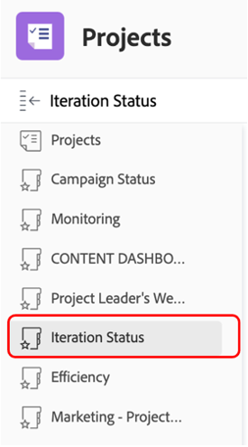

# Insikter för en Marketing Manager

## Veckovy för projektledare

Klicka på Veckovy för projektledare i den vänstra kolumnen:

Här finns en mängd olika rapporter, som alltid går att klicka på/hantera för mer information:

- The **aktiviteter som förfaller den här veckan efter projekt**

- The **Projektledningens kommande milstolpar** :

- The **Öppna ärenden efter prioritet**

- The **Sena uppgifter per avdelning**

- The **Sena uppgifter per individ**

## SCRUM-relaterade insikter

Klicka på Iteration Status i den vänstra kolumnen

Om era team arbetar med SCRUM-metoden är detta en intressant uppsättning rapporter:

- **Hastighet efter iteration**

- **Genomsnittlig hastighet per team**

- **Aktuella iterationer slutförda timsummor per tilldelad**

- **Iterationer per team**

## Effektivitetsrapportering

Klicka på Effektivitet i den vänstra kolumnen

- **Planerat/ej planerat förhållande** (av det utförda arbetet)

- **Slutförda begäranden per vecka**

## Projektinsikter direkt

Klicka fortfarande på Marknadsföring - pågående projekt i den vänstra kolumnen

- **Status för pågående projekt**

- **Projekt efter villkor efter månad**

- Lista, förlopp och ekonomisk information om **Projekt under flygning**

## Visualisera beroenden (mellan projekt)

Gå tillbaka till PIN-koden och klicka på Portfolio Gant View:

Här har du en **Vyn Gant-schema för en grupp projekt** med möjliga beroenden (föregångare) mellan projekt

## Integrationsinsikter från tredje part

>[!NOTE]
>
> Detta är ett exempel på en integrering med en programvara från tredje part. Det här är en integrering med Adobe Campaign som illustration. Det importerar resultat från slutförda kampanjer i Adobe Campaigns.

På PIN-koden klickar du på Kampanjsammanfattning:

- **Adobe Campaign Summary**

- **Adobe Campaign skickat till öppningar**

- **Adobe Campaign öppnas och klickas**

Nästa steg: [Slutsats](../../conclusion.md)

[Gå tillbaka till fas 4 - insikter för en projektledare](./project-manager.md)

[Gå tillbaka till Alla moduler](../../overview.md)
