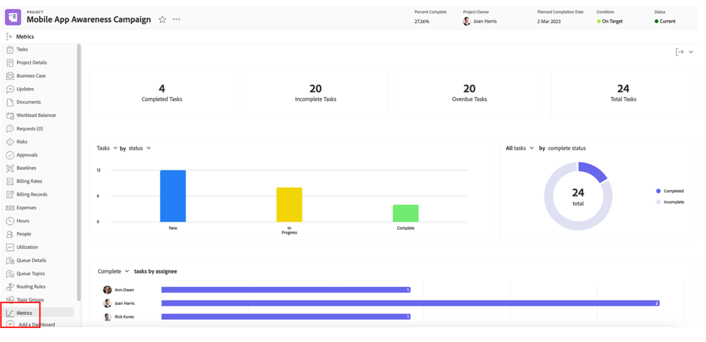
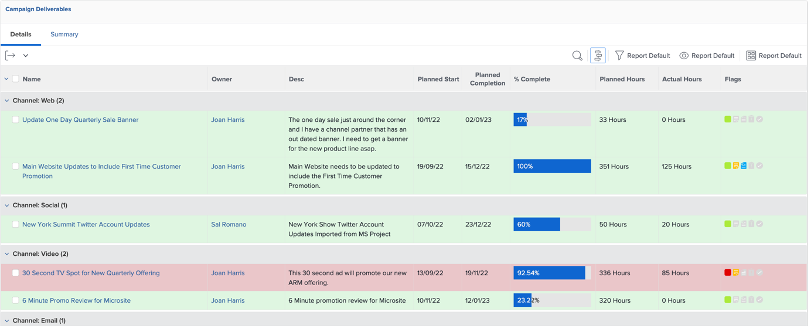
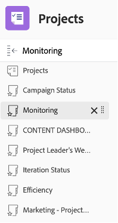

# Insikter för en projektledare

## Interaktiva projektstatusrapporter

På PIN-koden klickar du på&quot;Mobil appmedvetenhet&quot; och sedan på&quot;Metrics&quot;:

Här får du en grafisk översikt över status för ett enskilt projekt/en enskild kampanj.

>[!NOTE]
>
> Du kan klicka på de olika områdena för mer information, vilket är fallet för de flesta insikter i Workfront. Ge den ett försök!

## Kampanjspecifika rapporter

På PIN-kodsraden klickar du på Projekt:

Klicka på Campaign Status i den vänstra kolumnen:

Den översta delen ger er insikter om 1 enskild kampanj om 1/ Campaign **planerad kontra faktisk** vistelse i timmar och 2/ **Kampanjvillkor** för varje kanal:

Den nedre delen ger dig insikter om statusen **Kampanjslutprodukter**:

## Insikter baserade på flera projekt

Klicka fortfarande på Övervakning i den vänstra kolumnen

Den övre delen ger dig insikter om statusen för en grupp med projekt, både från **aktivitetsstatus** -vyn och från **projektvillkoret**:

I den nedre delen visas alla **som löper risk att godkännas** och som behöver jagas:

## Kontrollpanelen för innehåll

Klicka på CONTENT DASHBOARD i den vänstra kolumnen:

Den översta delen ger god insikt i hur många versioner av ditt **dokument som har godkänts** (är det godkänt, hur många versioner vi behövde, osv.)

Den nedre delen är en **korrekturgranskning av godkännande** som ger en annan synvinkel för korrekturens godkännandestatus:

Nästa steg: [Fas 4 - Insikter för en marknadsföringsansvarig](./marketing-manager.md)

[Gå tillbaka till fas 4 - Insikter: Översikt](./overview.md)

[Gå tillbaka till Alla moduler](../../overview.md)
