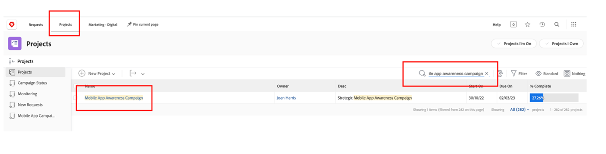
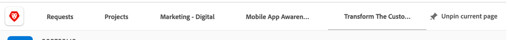

# Planering

>[!NOTE]
>
> Under Bootlägret kommer du att ha på dig flera hattar: Beställare, projektledare, designer och Upper Management. Då får du en överblick över varje profils användarupplevelse.

Nu ska vi titta på Work Management Platform, Adobe Workfront. Workfront gör målen synliga för hela organisationen så att alla kan prioritera arbetet strategiskt, spåra framsteg och mäta resultat. Och i takt med att era mål utvecklas skickar Workfront information till team som utför arbeten på plats. Resultatet? Större justering, fokus och snabbhet för att nå framgång.

Logga in på din Workfront-profil genom att gå till [adobebootcampemea-02032301.testdrive.workfront.com](https://adobebootcampemea-02032301.testdrive.workfront.com) och logga in med inloggningsuppgifterna som Adobe-teamet har gett dig.

Du kommer att ställas inför den här inloggningssidan.  Logga in med din professionella e-postadress som du prenumererar på som användarnamn till bootlägret:

När du har loggat in kommer du att stöta på följande hemsida:

## Förbereda Workfront för användning

Vi kommer nu att förbereda vår hemsida som om vi använde Workfront regelbundet.  Det innebär att vi kommer att gå och hämta relevanta sidor för vårt arbetsflöde senare och&quot;PIN&quot; dem på vår hemsida.

Först av allt, vi går och hämtar teamets sida för arbetsbelastning.  Klicka på vågen högst upp till höger och välj Teams

När vårt TEAM (Marketing - Digital) visas på skärmen&quot;PIN&quot; det bara på det översta menyfliksområdet:

Det bästa menyfliksområdet bör nu se ut så här:

Låt oss nu fästa ett projekt som vi kommer att analysera närmare senare.  Klicka på sidan Fäst projekt och klicka på sökknappen.  Skriv&quot;Kampanj för medvetenhet om mobilappar&quot; och klicka på projektnamnet:

När projektet finns på skärmen fyller du i det i det övre menyfliksområdet som vi gjorde tidigare:

Det bästa menyfliksområdet bör nu se ut så här:

Klicka slutligen en gång till på den övre högra vågen och välj PORTFOLIO.

Klicka på sökknappen och skriv &quot;TRANSFORM&quot;.  Klicka på Portfolio&quot;Transform The Customer Experience&quot; för att öppna den:

När Portfolio är öppet fästs den vid det övre menyfliksområdet:

Det bästa menyfliksområdet bör nu se ut så här:

Vi är nu redo att påbörja vårt arbetsflöde med ett gränssnitt som visar exakt det vi behöver regelbundet.

## Begärande

Vi börjar nu det faktiska arbetsintaget med begärarens hatt. En beställare, till exempel en Product Manager, vill vi formalisera en begäran för vår nya Adobe Campaign och lämna information i Marketing Brief.

- Klicka på Begäranden längst upp till vänster:

- Klicka sedan på Ny begäran:

- Som begärandetyp väljer du&quot;Marknadsföringsförfrågningar&quot; och sedan&quot;CSB - Kampanjförfrågningar&quot;:

- Ange ämnet: &quot;Adobe Cycle Campaign - \*team\*&quot; (fyll i ditt teamnummer). Du kan lägga till en beskrivning och en prioritet.

- Allt under rubriken&quot;CSB - Marketing Campaign Brief&quot; är helt anpassningsbart. I det här fallet är det alla anpassade fält som ni kan anpassa efter era behov av en rapport för marknadsföring. Här är de kortfattade fälten som vi har skapat för Bootlägret:

- Vi börjar fylla i rapporten:

   - Ange startdatum till 01/06/2023 - Ange slutdatum till 30/06/2023:

   

   - Välj AEM Assets eftersom vi kommer att ha tillgång till resurser som kan användas i kampanjen här:

   

   - Observera att om du klickar på Ja visas ett extra (villkorligt) fält med en tidsradsvarning:

   

   - Eftersom vi har en snäv deadline, låt oss ändra vårt val till &quot;NO&quot;:

   

   - På kanalerna valde vi att förvälja vissa som standard. Och det är de vi kommer att behöva för nästa steg, så ingen förändring behövs här:

   

   - Adobe Commerce, välj Ja:

   

- Slutligen kan du i dokumentavsnittet lägga till relevant dokumentation för din begäran.  Här kommer vi att använda AEM-kontakten för att visa hur du kan hämta befintligt innehåll från vår AEM Assets-instans.

   - Klicka på Lägg till eller länka filer och välj Länk från Experience Manager.

   

   - Du har nu att göra med AEM Assets-mapparna och du kan bläddra igenom dem (och/eller använda sökmotorn) för att hämta de dokument/resurser som du behöver för din begäran:

   

   - Du kan bifoga alla artiklar från AEM Assets som du anser kan vara relevanta för projektet, om det finns några. När du är klar klickar du antingen på Länka för att länka till resurser eller på Stäng om du inte länkar någon mapp.

   

- Vi har nu slutfört vår begäran och kan skicka den:

## Projektledare

Nu när vi har skickat in vår begäran som &quot;Requestor&quot; (t.ex. Product Manager) ska vi ändra hatt och använda den som är Project Manager.

- Klicka på logotypen Adobe så kommer du till sidan&quot;New Marketing Requests&quot; (det här är en vanlig&quot;Project Manager&quot;-hemsida):

- Under avsnittet Marknadsföring - Nya kampanjförfrågningar hittar du din nya begäran:

- Klicka på begärans namn:

- Klicka på &quot;Begär information&quot;:

- Bläddra ned till avsnittet CSB - Marketing Campaign Brief (CSB - Marketing Campaign Brief) och expandera det:

- Du kan se all information i den begärande personens sammanfattning och med den här informationen kan du påbörja en projektplan baserad på en mall.
   - Klicka på de tre punkterna intill namnet på din begäran:

   

   - Klicka på Konvertera till projekt från mall:

   

   - Välj &#39;CSB - Marketing Campaign&#39; och klicka sedan på &#39;Use template&#39;:

   

   - Klicka på Konvertera till projekt längst ned på sidan:

   

- Vi har nu vårt arbetsflöde för Campaign-projekt baserat på mallen. Låt oss PIN-koda vårt projekt till senare. Klicka på Fäst aktuell sida:

- Några områden som bör uppmärksammas:

1. Varaktighet - Det är fönstret där du kan slutföra en uppgift.\
   Notion med planerade timmar - det är den faktiska tid som krävs för att slutföra en uppgift.

1. Notion med Föregående (kallas beroenden) - dessa är de begränsningsuppgifter som kan ha mellan varandra (vanligtvis kan den här aktiviteten inte startas innan den andra är slutförd). Det gör att vi kan ha ett tydligt Gant-schema med den kritiska vägen för varje projekt. Klicka på ikonen nedan för att visa Gant-schemat:
   

1. Obs! Uppdrag - När projektet skapas är tilldelningarna fortfarande generaliserade när de kommer från en mall. De är antingen placerade i arbetsroller, som representeras av hammesikonen (dvs. en grupp personer som har kunskaper att utföra den här uppgiften) eller i team, som representeras av personikonen (dvs. en som definieras av din företagsgrupp). Nu är det dags att tilldela dessa uppgifter till individer.

- Idag ska vi fokusera på föruppgifter för team och hur vi ska tilldela dessa till individer.

- Som du ser tilldelas uppgift 11&quot;Producera annonsering i sociala medier&quot; till&quot;Marketing - Digital&quot;-teamet:
   

- Låt oss se hur detta påverkar teamets planering genom att öppna sidan Resurshantering. Klicka på PIN-koden&quot;Marknadsföring - digital&quot; överst på sidan:
   

- Du har nu den här vyn för teamplanering:

1. Den översta delen omfattar det otilldelade arbetet för just det teamet. Här listas de projekt som teamet har uppdrag att utföra och genom att klicka på pilen här visas de exakta uppgifter som behöver täckas av projektet:
   

1. Den nedre delen omfattar det tilldelade arbetet för individerna i teamet, men inte bara: den visar faktiskt den faktiska arbetsbördan för varje teammedlem, men även deras tidsplan (t.ex. Mon-Fri eller Mon-Sat), deras helgdagar osv.
   

- Om du vill tilldela en uppgift till en individ drar du bara uppgiften från den övre delen till raden längst ned i den undre delen - Se hur Beas arbetsbelastning har justerats och detaljerna om hennes uppgiftstilldelningar har lagts till:
   

Nästa steg: [Fas 1 - Planering: Annat förarbete](./prework.md)

[Gå tillbaka till Creative Brief](../../creative-brief.md)

[Gå tillbaka till Alla moduler](../../overview.md)
