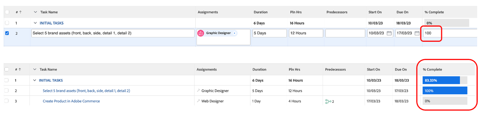

# Annat förarbete

## Select Brand Assets

Enligt beskrivningen i den kreativa översikten finns det vissa resurser som behövs för att lansera vår kampanj på ett effektivt sätt. Dessa varumärkesresurser kommer att läggas till i kampanjen i Workfront så att vi har tillgång till dem centralt.

- Expandera aktiviteten 1,&quot;INLEDANDE UPPGIFTER&quot;, och öppna sedan aktiviteten&quot;Välj 5 varumärkesresurser (framsida, baksida, ...)&quot; genom att klicka på den.

- Klicka på &#39;Dokument&#39; och sedan &#39;Lägg till nytt:

- Välj Från Experience Manager. På så sätt kan vi välja varumärkesresurser som redan finns på AEM Assets:

- När mapphierarkin i AEM visas går du till följande sökväg: experience-manager > Adobe Cycle Assets > Bike shots Select 5 assets och klickar sedan på Link.

- Nu har vi vårt varumärke på vår uppgift. Det innebär att vi kan ställa in uppgifter 2 som 100 % slutförda:

## Demo av Adobe Commerce

Adobe Commerce är en av många produkter i Adobe Experience Cloud som kan hjälpa er att leverera de bästa digitala upplevelserna till era kunder. Men det fanns helt enkelt för lite tid för att göra allt tillsammans under bootlägret.

I den här videon lär du dig Adobe Commerce och visar den produkt vi har skapat så att du kan använda den i Bootlägret. I verkligheten skulle du ladda upp de tidigare valda varumärkesresurserna till Adobe Commerce till produktkonfigurationen.

>[!VIDEO](https://video.tv.adobe.com/v/3418945?quality=12&learn=on&enablevpops)

När uppgiften är klar kan du markera uppgift 3 som 100 % slutförd i Workfront.

## Flexibla kampanjer är en förutsättning

När vi gick igenom vår arbetsplan märkte vi ett litet problem: vår Product Manager (den begärande) har lagt till en uppdatering som han glömde begära för en&quot;Product Homepage Banner&quot;.  Vi ska lägga till detta i vår projektplan.

- Gå till uppgiftslistan och lägg till aktiviteten&quot;Skapa produktstartsidebanderoll&quot; precis under åtgärd 4&quot;PRODUKTION&quot;. Det gör du genom att välja aktiviteten Förbered innehåll för mobilappar och klicka på ikonen Lägg till uppgift ovan:

- Ge den tillagda aktiviteten ett beskrivande namn, t.ex.&quot;Skapa produktstartsidesbanderoll&quot;.

- Nu när vi har skapat uppgiften kan vi lägga till lite innehåll. Klicka på de tre punkterna till höger om projekttiteln och välj &#39;Bifoga mall&#39;:

- Välj Skapa produktstartsidebanderoll och klicka på Anpassa och bifoga:

- På anpassningsskärmen ser du till att du anger aktiviteten Skapa hemsidesbanderoll som överordnad:

- Slutligen måste du markera den överordnade uppgiften &#39;Skapa hemsida för produkt&#39; med en föregångare till uppgift 3, eftersom ingen produktion kan startas förrän produkten har skapats i Adobe Commerce:

Nu har vi en kampanj som är färdig och planerad, vilket innebär att vi kan börja med produktionen och leveransen av vår kampanj!

Nästa steg: [Fas 2 - Produktion: Skapa produktstartsidbanderoll](../production/banner.md)

[Gå tillbaka till fas 1 - Planering: Planering](./planning.md)

[Gå tillbaka till Alla moduler](../../overview.md)
