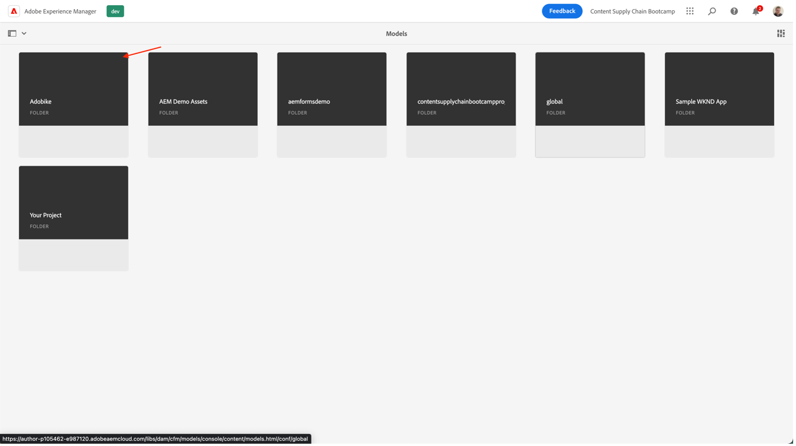
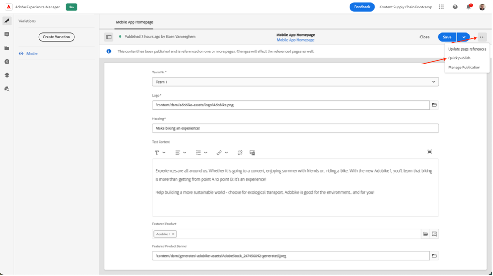

# Skapa mobilappsinnehåll

## Vad är headless content delivery?

Med ett headless content management-system är serverdelen och frontend nu frikopplade. Den headless delen är innehållets serverdel, eftersom ett headless CMS är ett innehållshanteringssystem som utformats och byggts explicit som ett innehållsarkiv som gör innehåll tillgängligt via ett API för visning på alla enheter.

FrontLine, som utvecklas och underhålls oberoende av varandra, hämtar innehåll från den headless-delen med ett Content Delivery API, vanligtvis i JSON-format. Detta kan till exempel vara en webbapp eller i vårt fall en mobilapp.

En headless CMS-serverdel kräver vanligtvis att innehållet är strukturerat, baserat på en modell eller ett schema. Detta underlättar för klientprogram som begär rätt innehåll för att återge en upplevelse. Vissa CMS-system, som AEM, kan visa både strukturerat och ostrukturerat innehåll i JSON-format.

En viktig egenskap i denna topologi är att innehåll som hanteras av det headless CMS i JSON-format är rent innehåll, utan design- eller layoutinformation. I en headless CMS-implementering hanteras all formatering och layout av det fristående klientprogrammet.

En viktig fördel med en headless CMS-topologi är möjligheten att återanvända innehåll i flera kanaler, som kan använda olika klientimplementeringar. Detta kan effektivisera utvecklingsprocessen. Men det innebär också att utvecklingsprocessen för upplevelser kan bli mycket kods- och IT-inriktad, och IT-avdelningen äger i huvudsak upplevelsen.

## Hur fungerar headless Content Delivery i AEM?

AEM as a Cloud Service är ett flexibelt verktyg för den headless-implementeringsmodellen med tre kraftfulla funktioner:

1. Innehållsmodeller
   - Innehållsmodeller är strukturerade representationer av innehåll.
   - Innehållsmodeller definieras av informationsarkitekter i AEM Content Fragment Model Editor.
   - Innehållsmodeller fungerar som bas för innehållsfragment.
1. Innehållsfragment
   - Innehållsfragment skapas baserat på en innehållsmodell.
   - Skapas av innehållsförfattare med AEM Content Fragment editor.
   - Innehållsfragment lagras i AEM Assets och hanteras i gränssnittet Resurser Admin.
1. Innehålls-API för leverans
   - AEM GraphQL API stöder leverans av innehållsfragment.
   - AEM Assets REST API stöder CRUD-åtgärder för innehållsfragment.
   - Direktleverans av innehåll är också möjligt med [JSON-export av kärnkomponenten för innehållsfragment](https://experienceleague.adobe.com/docs/experience-manager-core-components/using/components/content-fragment-component.html?lang=en).

## Utövning

För det här bootlägret fokuserar vi på&quot;innehållsdelen&quot; - trots allt är det innehållsleveranskedjan vi är ute efter. Vi har redan förutsett en innehållsmodell samt de nödvändiga API:erna för leverans, så att ni kan fokusera på det som är viktigt.

Låt oss först utforska vår innehållsmodell: det är det&quot;kontrakt&quot; vi har med det headless CMS, så vi vet vilket innehåll som kan komma i vägen och i vilket format.

- Gå till AEM [https://author-p105462-e991028.adobeaemcloud.com/](https://author-p105462-e991028.adobeaemcloud.com/) och logga in med de autentiseringsuppgifter som vi har angett.

- På AEM Start-menyn väljer du Verktyg \> Allmänna \> Modeller för innehållsfragment

- På nästa skärm får du en översikt över alla webbplatser som använder headless-innehåll. På så sätt kan ni behålla styrningen över flera headless-sajter, utan att behöva oroa er för att de kommer att störa varandra. I vårt fall arbetar vi med Adobesajten, så välj den modellen.

- I den här mappen kan vi se en del tekniskt headless-innehåll som vi använder på Adobes webbplats. Är du intresserad av att veta mer? Känn dig fri att nå ut. För tillfället ska vi fokusera på uppgiften före händerna: mobilappen. Hovra över mobilappens hemsideskort och klicka på pennikonen för att öppna innehållsmodellen.

- I modellredigeraren för innehållsfragment kan du se information om en viss innehållsmodell. I det här fallet kan vi se hemsidan för vår mobilapp: Adocykellogotypen, en rubrik, fri text och en valfri produkt. Alla dessa objekt är enkla att konfigurera och uppdatera, så om innehållsmodellen behöver extra element kan detta göras utan att utvecklaren behöver göra något på CMS-sidan.

>[!WARNING]
>
> **Observera att om du ändrar innehållsmodellen påverkas ytterligare nedåt**, eftersom mobilappen förlitar sig på att få viss information för att kunna visa rätt element. Var extra försiktig när du uppdaterar eller tar bort fält. Om du lägger till fält får det ingen effekt.

Nu när vi har en uppfattning om vad vårt innehåll bör bestå av kan vi skapa vårt innehåll som fragment.

- Klicka på AEM logotyp i det övre vänstra hörnet för att öppna navigeringen och navigera sedan till Navigering \> Innehållsfragment.

- I följande gränssnitt får du en översikt över allt befintligt innehåll i AEM. Filtren till vänster kan användas för att begränsa nedåt om du söker efter ett visst innehållsfragment. Vi skapar ett nytt innehållsfragment genom att klicka på knappen&quot;Skapa&quot; överst till höger.

- I det modala som öppnas ser du att vissa fält ännu inte kan redigeras. Detta är logiskt: beroende på var vi skapar vårt fragment kommer olika modeller att finnas tillgängliga.
   
   - Välj först var vi ska skapa fragmentet genom att klicka på mappikonen bredvid fältet Plats. Expandera innehållsträdet genom att klicka på mapparna &quot;adocycle&quot; \> &quot;en&quot; \> &quot;mobile-app&quot; och sedan bekräfta urvalet genom att klicka på knappen &quot;Choose&quot; (Välj).
      
   - Du kommer att märka att fältet&quot;Modell för innehållsfragment&quot; nu kan redigeras. Klicka på pilen bredvid fältet för att öppna listrutan och välja innehållsmodellen som vi tittade på tidigare: &quot;Startsida för mobilappar&quot;.
   - Ge sedan ditt innehållsfragment en meningsfull titel (tips: inkludera ditt teamnummer för att enkelt hitta tillbaka till ditt innehåll). Du kommer att lägga märke till att fältet &quot;Namn&quot; automatiskt fyller i - det här är för att göra livet enklare: det namn som systemet använder för att identifiera ditt fragment och bör inte röras.
   - Klicka slutligen på knappen&quot;Skapa och öppna&quot;, som anger att du skapar innehållsfragmentet och öppnar det så att du kan redigera det direkt.

- Här kan ditt team bestämma vilket innehåll som ska visas i mobilappen. 
   - Se till att du väljer ditt teamnummer så att du kan kontrollera ditt innehåll senare i mobilappen.
   - Om du vill välja bildresurser klickar du på mappikonen och bläddrar till rätt bild i AEM Assets.
   - För den aktuella produkten klickar du på produktsökningsikonen så att du enkelt kan välja vår&quot;Adobe-produkt 1&quot; så att den handelsrelaterade informationen läses in i appen.
   - Var noga med att klicka på Spara när du är klar för att spara allt redigerat innehåll och publicera ändringarna.
      

Nu när vi har förutsett mobilappen med visst innehåll är vi redo att leverera vår kampanj.

Nästa steg: [Fas 3 - Leverans: Verifiera mobilapp](../delivery/app.md)

[Gå tillbaka till fas 2 - produktion: Skapa annonser för sociala medier](./social.md)

[Gå tillbaka till Alla moduler](../../overview.md)
