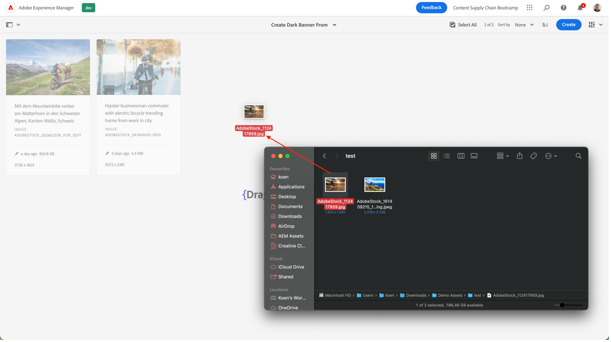
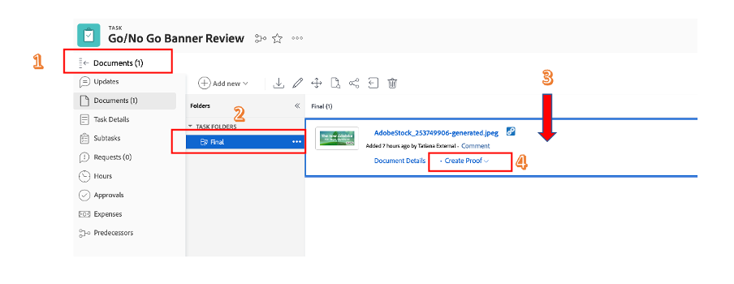

# Skapa produktstartsidans banderoll

## Banderollens produktion

Med innehållsautomatisering får marknadsförarna tillgång till kraften i Adobe Creative Cloud i Experience Manager Assets och kan automatisera materialproduktionen i stor skala, vilket dramatiskt snabbar upp framtagningen av variationer. Låt oss använda de här funktionerna för att skapa en banderoll som ska användas på hemsidan!

- Gå till AEM författare på [https://author-p105462-e991028.adobeaemcloud.com/](https://author-p105462-e991028.adobeaemcloud.com/) och logga in med de autentiseringsuppgifter som vi har angett.

- Gå till Verktyg \> Assets \> Bearbetningsprofiler på startsidan.

- I gränssnittet visas alla befintliga bearbetningsprofiler. De kan användas för att möjliggöra vissa automatiseringar.

- Följande är intressanta:
   - Adobe-cykelbanderoll mörk: skapar en Adobe-banderoll med en mörk övertäckning, baserat på den valda resursen
     
   - Adobe Cycle Banner Light: skapar en Adobe-banderoll med lätt övertäckning, baserat på vald mediefil
     
   - Adobe-cykelbanderollgrön: skapar en Adobe-banderoll med en grön övertäckning som baseras på den valda resursen
     

- När du har valt vilken typ av banderoll du vill skapa markerar du den bearbetningsprofilen och väljer sedan &quot;Använd profil för mapp(ar)&quot;.

- På nästa skärm går du till teamets mapp i AEM Assets. Välj sedan knappen &quot;Skapa&quot; längst upp till vänster för att skapa en ny mapp och ge den ett beskrivande namn, till exempel &quot;Skapa mörk banderoll&quot;.

- När du har skapat mappen markerar du rutan bredvid dess namn och klickar sedan på knappen &quot;Använd&quot; längst upp till höger.

Nu när vi har gjort den nödvändiga konfigurationen ska vi skapa vår banderoll.

- Klicka på AEM logotyp i det övre vänstra hörnet för att öppna navigeringen och navigera sedan till Navigering \> Assets \>-filer.

- Gå till mappen&quot;Generated Adobe Cycle Assets&quot; och öppna den genom att klicka på kortet. Här visas de genererade bannerarna.

- Öppna en ny flik och gå till AEM Assets igen. Navigera sedan till mappen som vi tillämpade bearbetningsprofilen på.

- I mappen överför du bilden som du vill skapa en banderoll för genom att dra och släppa den i webbläsaren, eller genom att klicka på Skapa \> filer i det övre högra hörnet av gränssnittet.

- Vänta en stund tills resursen bearbetas och läs sedan in skärmen igen. Om du ser resursen i läget &quot;Nytt&quot; vet du att den har bearbetats.

- Gå tillbaka till föregående flik och läs in skärmen igen här. Du bör lägga märke till en ny resurs i läget &quot;Nytt&quot;. Det här är vår banderoll, allt från DAM! Ser du den inte än? Vänta en minut till och läs sedan in skärmen igen.

>[!NOTE]
>
> Är du inte nöjd med resultatet? Du kan använda en annan bearbetningsprofil för mappen och överföra resursen på nytt för att generera en annan banderoll (eller överföra en annan resurs, förstås). Under den nya överföringen frågar systemet dig vad du vill göra med den befintliga resursen och väljer&quot;Ersätt&quot;.
> 

Vi har nu en banderoll som vi kan använda senare under lanseringen av vår kampanj. Var noga med att publicera banderollen genom att markera den och sedan klicka på Snabb-Publish på menyfliksområdet.

## Uppföljning i Workfront

Om ni behöver en formell och kontrollerbar granskning och godkännande av er Assets är Workfront den rätta platsen.

>[!NOTE]
>
> Även om vi uttryckligen nämner det här, är det avsikten att uppdatera uppgifterna i Workfront när du är klar med dem. Du bör alltid sträva efter ett Skapa > Granska > Godkänn-flöde.

- Vi går tillbaka till vårt projekt och expanderar dragspelsfönstret&quot;Go/No Go Banner Review&quot; för att öppna den här uppgiften genom att klicka på den:

- Klicka på dokumentdelen av uppgiften (den vänstra kolumnen) och klicka sedan på den länkade AEM Assets-mappen &quot;Slutlig&quot;. Välj resursen genom att klicka på dess zon och klicka på Skapa korrektur. Ett bevis är möjligheten att korrekturläsa innehåll, t.ex. bild, text, video, webbplats, osv., på ett strukturerat och samarbetsbaserat sätt, där kommentarer, korrigeringar, ändringar av berörda intressenter samlas in, versioner och resultat kan jämföras och slutligt godkännas med ett enda klick.

- Välj Avancerat korrektur när vi vill ha en detaljerad godkännandeprocess.

>[!NOTE]
>
> Vi kommer att besluta manuellt vem som ska granska och/eller godkänna våra bevis i det här bootlägret. I de flesta fall skulle vi använda en förinställd mall för godkännandeflöden som redan definierats för varje typ av korrektur.

- Som standard är vi i arbetsflödestypen&quot;grundläggande&quot; och vi ska välja din Workfront Bootcamp-specialist som granskare och godkännare. Skriv ditt namn på Bootcamp Workfront-specialist där det står &#39;Skriv kontaktnamn eller e-postadress för att lägga till en mottagare:

- Ange dem som &#39;Granskare och godkännare&#39;:

- Klicka på Skapa korrektur. Workfront kommer att ta en stund att generera beviset:

- Din Workfront-specialist kommer nu att få ett nytt meddelande som informerar dem om att de har ett bevis för att granska och/eller godkänna:

- När de har klickat på meddelandet kommer de att få ditt korrektur och kunna kommentera och/eller godkänna det här korrekturet.

   - De kan klicka på&quot;Lägg till kommentar&quot; högst upp på skärmen om de har kommentarer:

  

   - De kan då inte bara lägga in kommentarer utan även använda verktygsfältet med pekare för att tydligt definiera vilket område som behöver ändras.

  

   - Genom att lägga till kommentaren kan de tala om för dig att du behöver göra lite extra arbete med en ny version av korrekturet. Uppdatera Workfront-fliken så får du ett nytt meddelande som talar om det. När du vet vilka ändringar du måste göra kan du göra AEM och sedan ladda upp den nya versionen här:

  

   - Välj den uppdaterade resursen (om inga ändringar behövs i Bootcamp-scenariot, överför bara samma resurs igen) och klicka på Länk:

  

   - Klicka sedan på Skapa korrektur till höger.

  

   - När beviset har skapats (detta kan ta en stund) får din Workfront-specialist ett meddelande om detta och kommer att kunna granska och godkänna den nya versionen.  Genom att till exempel använda knappen för korrekturjämförelse kan de se en jämförelse sida vid sida av V1 och V2 med alla kommentarer som har gjorts.

  

  

  

Vi har nu ett formellt godkännande av användningen av vår banderoll. Det är enkelt att följa med i den process vi är och de uppdateringar du gör automatiskt aktiverar meddelanden så att du kan arbeta på ett så effektivt sätt som möjligt.

Nästa steg: [Fas 2 - Produktion: Skapa annons för sociala medier](./social.md)

[Gå tillbaka till fas 1 - Planering: Annat förarbete](../planning/prework.md)

[Gå tillbaka till Alla moduler](../../overview.md)
