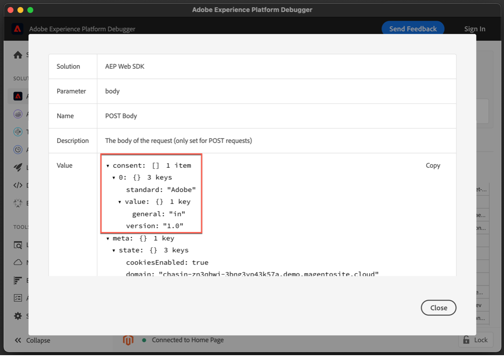

# Implementera samtycke med en plattform för samtyckeshantering (CMP) med plattformens SDK-tillägg

Många juridiska sekretessbestämmelser har infört krav på aktivt och specifikt samtycke när det gäller datainsamling, personalisering och andra användningsfall inom marknadsföring. För att uppfylla dessa krav kan Adobe Experience Platform inhämta information om samtycke i enskilda kundprofiler och använda dessa inställningar som en avgörande faktor i hur varje kunds data används i arbetsflöden för plattformen.

>[!NOTE]
>
>Adobe Experience Platform Launch håller på att integreras i Adobe Experience Platform som en serie datainsamlingstekniker. Flera terminologiska förändringar har introducerats i gränssnittet som du bör vara medveten om när du använder det här innehållet:
>
> * Platforma launchen (klientsidan) är nu **[[!DNL tags]](https://experienceleague.adobe.com/docs/experience-platform/tags/home.html?lang=sv)**
> * Platform launch Server Side is now **[[!DNL event forwarding]](https://experienceleague.adobe.com/docs/experience-platform/tags/event-forwarding/overview.html)**
> * Edge-konfigurationer är nu **[[!DNL datastreams]](https://experienceleague.adobe.com/docs/experience-platform/edge/fundamentals/datastreams.html)**

I den här självstudiekursen visas hur du implementerar och aktiverar data som inhämtats från en CMP (Consent Management Platform) med plattformstillägget för Web SDK i datainsamling. Vi gör detta med hjälp av båda Adobe-standarderna och IAB TCF 2.0-medgivandestandarden, med OneTrust eller SourcePoint som exempel på CMP.

I den här självstudiekursen används tillägget Platform Web SDK för att skicka data om samtycke till plattformen. En översikt över Web SDK finns på [den här sidan](https://experienceleague.adobe.com/docs/experience-platform/edge/home.html).

## Förutsättningar

Förutsättningarna för att använda Web SDK finns i listan [här](https://experienceleague.adobe.com/docs/experience-platform/edge/fundamentals/prerequisite.html#fundamentals).

På den sidan finns det ett krav på en&quot;händelsedatauppsättning&quot; och, precis som den låter, är detta en datauppsättning som innehåller data för upplevelsehändelser. Om du vill skicka medgivandeinformation med händelser, [Information om IAB TCF 2.0-samtycke](https://experienceleague.adobe.com/docs/experience-platform/landing/governance-privacy-security/consent/iab/dataset.html) fältgruppen måste läggas till i Experience Event-schemat:


För standard v2.0 för plattformsgodkännande behöver vi även tillgång till Adobe Experience Platform för att skapa ett enskilt XDM-profilschema och datauppsättning. En självstudiekurs om hur du skapar scheman finns på [Skapa ett schema med Schemaredigeraren](https://experienceleague.adobe.com/docs/experience-platform/xdm/tutorials/create-schema-ui.html#tutorials) och om du vill visa fältgruppen för samtycke och inställningsinformation går du till [Konfigurera en datauppsättning för inhämtning av samtycke och inställningsdata](https://experienceleague.adobe.com/docs/experience-platform/landing/governance-privacy-security/consent/adobe/dataset.html).

I den här självstudien förutsätts att du har tillgång till datainsamling och har skapat en taggegenskap på klientsidan med tillägget Web SDK installerat och ett arbetsbibliotek som skapats och byggts för utveckling. Dessa ämnen är detaljerade och demonstrerade i följande dokument:

* [Skapa eller konfigurera en egenskap](https://experienceleague.adobe.com/docs/experience-platform/tags/admin/companies-and-properties.html?lang=en#create-or-configure-a-property)
* [Översikt över bibliotek](https://experienceleague.adobe.com/docs/experience-platform/tags/publish/libraries.html)
* [Översikt över publicering](https://experienceleague.adobe.com/docs/experience-platform/tags/publish/overview.html)

Vi använder också [Felsökning för plattform](https://chrome.google.com/webstore/detail/adobe-experience-platform/bfnnokhpnncpkdmbokanobigaccjkpob) Chrome-tillägg för att inspektera och validera implementeringen.

Om du vill implementera IAB TCF-exemplet med en CMP på din egen webbplats behöver du tillgång till en CMP som OneTrust eller SourcePoint för att generera de data som de tillhandahåller. Du kan också följa med och se resultaten nedan.

## Använda Web SDK med Adobe Consent Standard (v1.0 eller v2.0)

>[!NOTE]
>
>1.0-standarden fasas ut till förmån för v2.0. Med standarden 2.0 kan du lägga till ytterligare data om samtycke som kan användas för att manuellt tillämpa medgivandeinställningar. Skärmbilderna nedan för plattformens SDK-tillägg är från versionen [2.4.0](https://experienceleague.adobe.com/docs/experience-platform/edge/release-notes.html#version-2.4.0) för det tillägg som är kompatibelt med antingen v1.0 eller v2.0 i Adobe Consent Standard.

Mer information om dessa standarder finns i [Stöd för kundernas samtycke](https://experienceleague.adobe.com/docs/experience-platform/edge/consent/supporting-consent.html).

### Steg 1: Konfigurera samtycke i Web SDK-tillägget

När vi har installerat tillägget Platform Web SDK i en Tags-egenskap kan vi konfigurera alternativen för att adressera medgivandedata på skärmen för tilläggskonfiguration:


Avsnittet Sekretess anger medgivandenivån för SDK om användaren inte tidigare har gett sitt medgivande. Detta anger standardtillståndet för insamling av samtycke och händelsedata i SDK. Den valda inställningen besvarar frågan om&quot;vad ska SDK göra om användaren ännu inte har gjort explicita medgivandeinställningar?&quot;

* In - Samla in händelser som inträffar innan användaren ger sitt medgivande.
* Ut - Släpp händelser som inträffar innan användaren ger sitt medgivande.
* Väntande - Köa händelser som inträffar innan användaren ger sitt medgivande.
* Tillhandahålls av dataelement

Om standardinställningen för samtycke är &quot;In&quot;, anger detta för SDK att den inte ska vänta på uttryckligt medgivande och att den ska samla in de händelser som inträffar innan användaren ger sitt medgivande. Dessa inställningar hanteras och lagras vanligtvis i en CMP.

Om standardinställningen för samtycke är &quot;Ut&quot;, anger detta för SDK att den inte ska samla in några händelser som inträffar innan användarens inställningar för anmälan har angetts. Besöksaktivitet som inträffar innan inställningen för samtycke har angetts inkluderas inte i data som skickas av SDK när samtycke har angetts. Om du till exempel bläddrar och visar en webbsida innan du väljer medgivandebanderollen, och den här inställningen &quot;Ut&quot; används, skickas inte rullningsaktiviteten och visningstiden om användaren senare ger ett uttryckligt medgivande för datainsamling.

Om standardinställningen för samtycke är Väntande kommer SDK att ställa in alla händelser som inträffar innan användaren ger sitt medgivande, så händelserna kan skickas efter att inställningarna för medgivande har angetts och efter att SDK initialt har konfigurerats under ett besök.

Med den här inställningen &quot;Väntande&quot; kommer ett försök att köra kommandon som kräver användarens inställningar för deltagande (till exempel händelsekommandot) att resultera i att kommandot köas i SDK:n. Dessa kommandon bearbetas inte förrän du har meddelat användarens inställningar för deltagande till SDK:n.

När en CMP samlar in användarens inställningar kan vi meddela dessa inställningar till SDK:n. I ett senare avsnitt nedan får vi se hur vi får tillgång till denna anmälningsinformation och använder den med Web SDK-tillägget.

&quot;Tillhandahålls av dataelement&quot; ger oss åtkomst till ett dataelement som innehåller eventuella medgivandeinställningsdata som samlats in av en anpassad kod eller en CMP på din webbplats, eller i ditt datalager. Ett dataelement som används för detta ändamål ska resultera i&quot;in&quot;,&quot;ut&quot; eller&quot;pending&quot;.

Obs! Den här konfigurationsinställningen för SDK bevaras inte för användarprofiler, den är specifik för att ställa in SDK:s beteende innan besökaren anger explicit samtycke.

Mer information om hur du konfigurerar Web SDK-tillägget finns i [SDK-tillägg för plattform - översikt](https://experienceleague.adobe.com/docs/experience-platform/edge/extension/web-sdk-extension-configuration.html?lang=en#configure-the-extension) och [Stöd för kundernas samtycke](https://experienceleague.adobe.com/docs/experience-platform/edge/consent/supporting-consent.html).

I det här exemplet väljer vi alternativet Väntar och väljer **Spara** för att spara konfigurationsinställningarna.

### Steg 2: Kommunicera i Inställningar för samtycke

Nu när vi har angett standardbeteendet för SDK kan vi använda taggar för att skicka en besökares uttryckliga medgivandeinställningar till Platform. Att skicka medgivandedata med Adobe 1.0 eller 2.0-standarden kan enkelt implementeras med `setConsent` Web SDK-åtgärd i dina taggar.

#### Ställa in samtycke med plattformsgodkännande Standard 1.0

Låt oss skapa en regel för att visa detta. Välj Regler i plattformstaggegenskapen och klicka sedan på den blå knappen Lägg till regler. Låt oss namnge regeln&quot;setAdobeConsent&quot; och välja att lägga till en händelse. För Händelsetyp väljer du &quot;Fönster inläst&quot; som aktiverar den här regeln varje gång en sida läses in på vår webbplats. Under Åtgärder väljer du sedan Lägg till för att öppna skärmen för åtgärdskonfiguration. Det är här vi ställer in data för samtycke. Välj listrutan &quot;Tillägg&quot; och välj &quot;Platform Web SDK&quot;, välj sedan &quot;Åtgärdstyp&quot; och välj &quot;Ange samtycke&quot;.

Välj &quot;Fyll i ett formulär&quot; under &quot;Samtyckesinformation&quot;. I den här regelåtgärden använder vi Web SDK för att ange medgivande till medgivandandarestandarden för Adobe 1.0 genom att fylla i formuläret som visas:


Vi kan välja att skicka&quot;In&quot;,&quot;Ut&quot; eller&quot;Tillhandahålls av dataelement&quot; med den här åtgärden för att ange samtycke. Ett dataelement här bör resultera i &quot;in&quot; eller &quot;out&quot;.

I det här exemplet väljer vi&quot;In&quot; för att ange att besökaren har godkänt att Web SDK skickar data till Platform. Välj den blå knappen &quot;Behåll ändringar&quot; om du vill spara den här åtgärden och sedan &quot;Spara&quot; om du vill spara regeln.

Obs! När en webbplatsbesökare har avanmält sig kan du inte ange användarens samtycke i SDK.

Dina taggregler kan aktiveras av flera olika inbyggda eller anpassade [händelser](https://experienceleague.adobe.com/docs/experience-platform/tags/extensions/adobe/core/overview.html) som kan användas för att skicka denna information om samtycke vid lämplig tidpunkt under en besökssession. I exemplet ovan använde vi händelsen loaded för fönstret för att utlösa regeln. I ett senare avsnitt kommer vi att använda en medgivandeinställningshändelse från en CMP för att utlösa en Set Consent-åtgärd. Du kan använda åtgärden Ange samtycke i en regel som aktiveras av en händelse som du föredrar som anger en inställning för deltagande.

#### Ställa in samtycke med plattformsgodkännande Standard 2.0

Version 2.0 av standarden för plattformsgodkännande fungerar med [XML](https://experienceleague.adobe.com/docs/platform-learn/tutorials/schemas/schemas-and-experience-data-model.html) data. Du måste också lägga till fältgruppen för samtycke och inställningsinformation i ditt profilschema i plattformen. Se [Samtyckesbearbetning i plattform](https://experienceleague.adobe.com/docs/experience-platform/landing/governance-privacy-security/consent/adobe/overview.html) om du vill ha mer information om standardversionen 2.0 av Adobe och den här fältgruppen.

Vi skapar ett anpassat kodelement för att skicka data till egenskaperna collect och metadata för det innehållsobjekt som visas i schemat nedan:


Fältgruppen Innehåll och Inställningsinformation innehåller fält för [XDM-datatyp för innehåll och inställningar](https://experienceleague.adobe.com/docs/experience-platform/xdm/data-types/consents.html#prerequisites) som kommer att innehålla de data för medgivandepreferenser som vi skickar till Platform med plattformens SDK-tillägg i vår regelåtgärd. För närvarande är de enda nödvändiga egenskaperna för att implementera Platform Consent Standard 2.0 insamlingsvärdet (val) och tidsvärdet för metadata, som markeras ovan med rött.

Låt oss skapa ett dataelement för dessa data. Välj Dataelement och den blå knappen Lägg till dataelement. Låt oss ringa detta &quot;xdm-medgivande 2.0&quot; och använda Core-tillägget, vi väljer en anpassad kodtyp. Du kan ange eller kopiera och klistra in följande data i det anpassade kodredigeringsfönstret:

```js
var dateString = new Date().toISOString();

return {
  collect: {
    val: "y"
  },
  metadata: {
    time: dateString
  }
}
```

Tidsfältet ska ange när användaren senast uppdaterade sina medgivandeinställningar. Vi skapar en tidsstämpel här som ett exempel med en standardmetod i JavaScript-objektet Date. Välj Spara för att spara den anpassade koden och välj Spara igen för att spara dataelementet.

Sedan väljer vi Regler och sedan den blå knappen Lägg till regel och skriver namnet&quot;setConsent onLoad - Consent 2.0&quot;. Låt oss välja händelsen Fönsterinläst som regelutlösare och sedan välja Lägg till under Åtgärder. Välj plattformens SDK-tillägg och välj Ange medgivande för åtgärdstypen. Standard ska vara Adobe och version 2.0 ska vara. För Värde använder vi det dataelement vi nyss skapade som innehåller de insamlings- och tidsvärden vi måste skicka till Platform:


För att granska den här exempelåtgärden anropar vi Set Consent från Platform Web SDK-tillägget och skickar in Standard och Version från formuläret, samtidigt som vi skickar värdena för samling och tid från dataelementet som vi skapade tidigare.

Klicka på den blå knappen Spara och spara regeln igen.

Vi har nu två regler, en för varje standard för plattformsgodkännande. I praktiken väljer du förmodligen en standard för alla webbplatser. Sedan ska vi skapa ett exempel med hjälp av IAB TCF 2.0-medgivandestandarden.

## Använda Web SDK med IAB TCF 2.0 Consent Standard

Du kan läsa mer om version 2.0 av IAB Transparency and Consent Framework på [IAB Europe webbplats](https://iabeurope.eu/transparency-consent-framework/).

Om du vill ange data för medgivandeinställningen med den här standarden måste vi lägga till schemafältgruppen IAB TCF 2.0 Consent Details i vårt Experience Event-schema i plattformen:


Den här fältgruppen innehåller de medgivandefält som krävs av IAB TCF 2.0-standarden. Mer information om scheman och fältgrupper finns i [XDM - systemöversikt](https://experienceleague.adobe.com/docs/experience-platform/xdm/home.html?lang=sv).

### Steg 1: Skapa ett dataelement för samtycke

För att kunna skicka data om medgivandehändelser från taggar med hjälp av IAB TCF 2.0-medgivandestandarden måste vi först skapa ett xdm-dataelement med de obligatoriska medgivandefälten:


I taggarnas klientsidesegenskap väljer du Dataelement och den blå knappen &quot;Lägg till dataelement&quot;. Vi namnger det här dataelementet&quot;xdm-medgivandeStrings&quot; för det här exemplet. Dessa xdm-fält kommer att innehålla användarens medgivandedata som krävs för IAB TCF 2.0-standarden.

I listrutan Tillägg väljer du &quot;Platform Web SDK&quot; och under Data Element Type väljer du &quot;XDM Object&quot;. xdm-mappningen ska visas så att du kan markera och expandera objektet &quot;medgivandeStrings&quot;, vilket visas på skärmbilden ovan.

Vi ställer in alla medgivandeSträngar enligt följande:

* **`consentStandard`**:  `IAB TCF`
* **`consentStandardVersion`**:  `2.0`
* **`consentStringValue`**:  `%IAB TCF Consent String%`
* **`containsPersonalData`**:  `False` (väljs från knappen Välj värde)
* **`gdprApplies`**:  `%IAB TCF Consent GDPR%`

The `consentStandard` och `consentStandardVersion` båda fälten är bara textsträngar för den standard vi använder, som är IAB TCF version 2.0. The `consentStringValue` refererar till ett dataelement med namnet&quot;IAB TCF Consent String&quot;. Procenttecknen som omger texten anger namnet på ett dataelement, och vi tittar på det om en stund. The `containsPersonalData` anger om IAB TCF 2.0-medgivandesträngen innehåller några personuppgifter med antingen &quot;True&quot; eller &quot;False&quot;. The `gdprApplies` anges antingen &quot;true&quot; för GDPR gäller, &quot;false&quot; för GDPR gäller inte eller &quot;undefined&quot; för unknown whether GDPR gäller. För närvarande kommer Web SDK att behandla&quot;undefined&quot; som&quot;true&quot;, vilket innebär att data om samtycke som skickas med&quot;gdprApplies: undefined&quot; kommer att behandlas som om besökaren befinner sig i ett område där GDPR gäller.

Se [godkännandedokumentation](https://experienceleague.adobe.com/docs/experience-platform/edge/consent/iab-tcf/with-launch.html#getting-started) om du vill ha mer information om dessa egenskaper och om IAB TCF 2.0 i -taggar.

### Steg 2: Skapa en regel för att ställa in samtycke med IAB TCF 2.0-standarden

Därefter skapar vi en regel för att ange samtycke med Web SDK när data för godkännande för den här standarden anges eller ändras av en webbplatsbesökare. I den här regeln ska vi också se hur vi kan hämta in dessa godkännandeändringssignaler från en CMP som [OneTrust](https://www.onetrust.com/products/cookie-consent/) eller [Källpunkt](https://www.sourcepoint.com/cmp/).

#### Lägga till en regelhändelse

Välj avsnittet Regler i plattformstaggegenskapen och klicka sedan på den blå knappen Lägg till regel. Vi namnger regeln setConsent - IAB och väljer Lägg till under Händelser. Vi ger händelsen namnet tcfapi addEventListener och väljer Öppna redigerare för att öppna den anpassade kodredigeraren.

Kopiera och klistra in följande kod i redigeringsfönstret:

```js
// Wait for window.__tcfapi to be defined, then trigger when the customer has completed their consent and preferences.
function addEventListener() {
  if (window.__tcfapi) {
    window.__tcfapi("addEventListener", 2, function (tcData, success) {
      if (success && (tcData.eventStatus === "useractioncomplete" || tcData.eventStatus === "tcloaded")) {
        // save the tcData.tcString properties in data elements
        _satellite.setVar("IAB TCF Consent String", tcData.tcString);
        _satellite.setVar("IAB TCF Consent GDPR", tcData.gdprApplies);
        trigger();
      }
    });
  } else {
    // window.__tcfapi wasn't defined. Check again in 100 milliseconds
    setTimeout(addEventListener, 100);
  }
}
addEventListener();
```

Den här koden skapar och kör helt enkelt en funktion som kallas `addEventListener`. Funktionen kontrollerar om `window.__tcfapi` -objektet finns, och om det gör det lägger det till en händelseavlyssnare enligt specifikationerna i API:t. Du kan läsa mer om dessa specifikationer i [IAB-repo](https://github.com/InteractiveAdvertisingBureau/GDPR-Transparency-and-Consent-Framework) på GitHub. Om händelseavlyssnaren har lagts till och webbplatsbesökaren har slutfört sina val för samtycke och inställningar, anger koden anpassade variabler för `tcData.tcString`och indikatorn för GDPR-regioner. Om du vill veta mer om IAB TCF kan du läsa IAB [webbplats](https://iabeurope.eu/transparency-consent-framework/) och [GitHub-repo](https://github.com/InteractiveAdvertisingBureau/GDPR-Transparency-and-Consent-Framework) för teknisk information. När du har angett dessa värden kör koden den utlösarfunktion som aktiverar den här regeln för körning.

Om `window.__tcfapi` -objektet fanns inte första gången funktionen kördes kommer funktionen att söka efter det igen var 100:e millisekund, så händelseavlyssnaren kan läggas till. Den sista kodraden kör helt enkelt `addEventListener` -funktionen som definieras i kodraderna ovanför den.

Sammanfattningsvis har vi skapat en funktion som kontrollerar om en besökare på webbplatsen har gett sitt samtycke med hjälp av en CMP-banner (eller anpassad). När inställningen för samtycke är angiven skapar koden två anpassade variabler (anpassade kodelement) som kan användas i vår regelåtgärd. När du har klistrat in ovanstående kod i det anpassade kodredigeringsfönstret för händelsen väljer du den blå knappen Spara för att spara regelhändelsen.

Nu ställer vi in åtgärden Ange medgivningsregel för att använda dessa värden och skicka dem till plattformen.

#### Lägg till en regelåtgärd

Välj Lägg till i avsnittet Åtgärder. Välj Platform Web SDK i listrutan under Tillägg. Välj Ange samtycke under Åtgärdstyp. Låt oss namnge den här åtgärden setConsent.

Välj Fyll i ett formulär i åtgärdskonfigurationen under Samtycksinformation. I Standard väljer du IAB TCF och i Version anger du 2.0. För värdet använder vi den anpassade variabeln från vår händelse och anger `%IAB TCF Consent String%` som kommer från [tcData](https://github.com/InteractiveAdvertisingBureau/GDPR-Transparency-and-Consent-Framework/blob/master/TCFv2/IAB%20Tech%20Lab%20-%20CMP%20API%20v2.md#tcdata) som vi tog med i vår anpassade funktion för händelsen rule ovan.

Under GDPR Applies kommer vi att använda den andra anpassade variabeln från vår event och ange `%IAB TCF Consent GDPR%` som också kommer från `tcData` som vi tog med i vår anpassade funktion för händelsen rule ovan. Om du vet att GDPR definitivt kommer att eller inte kommer att gälla för besökare på den här webbplatsen kan du välja Ja eller Nej, beroende på vad som är tillämpligt, i stället för att använda den anpassade variabeln (dataelementet). Du kan också använda villkorsstyrd logik i ett dataelement för att kontrollera om GDPR gäller och returnera rätt värde.

Under GDPR innehåller personuppgifter väljer du alternativet att ange om uppgifterna för den här användaren innehåller personuppgifter eller inte. Ett dataelement här ska vara true eller false.


Välj den blå knappen Spara för att spara funktionsmakrot och den blå knappen Spara (eller Spara i bibliotek) för att spara regeln. Nu har du implementerat dataelementet och regeln i taggar för att ange samtycke med hjälp av Web SDK-tillägget med IAB TCF 2.0-medgivandestandarden.

### Steg 3: Spara i bibliotek och bygg

Om du använder [arbetsbibliotek](https://experienceleague.adobe.com/docs/platform-learn/implement-in-websites/configure-tags/add-data-elements-rules.html#use-the-working-library-feature) har du redan sparat dessa ändringar och byggt ditt utvecklingsbibliotek:


### Steg 4: Inspect och validera datainsamling

På vår webbplats uppdaterar vi sidan och bekräftar biblioteksbygget i [Felsökning](https://chrome.google.com/webstore/detail/adobe-experience-cloud-de/ocdmogmohccmeicdhlhhgepeaijenapj) Kromtillägg, i taggmenyavsnittet:


Vi kan också kontrollera setConsent-anropet för Adobe 1.0- eller 2.0-standarderna i felsökningsplattformens Web SDK-avsnitt genom att välja POST Body-raden i nätverksbegäran där du ser `{"consent":[{"value":{"general":"in"},"version…`:



För att validera setConsent-anropet och vår regel för IAB TCF 2.0-standarden använder vi OneTrust-bannern på vår testwebbplats för att ange våra medgivandeinställningar och skapa de tcData som beskrivs ovan:


När du har valt&quot;Jag accepterar&quot; kan vi undersöka setConsent-anropet för IAB TCF 2.0-standarden i felsökningsplattformens Web SDK genom att välja på POSTENS innehållsrad i nätverksbegäran där du ser `{"consent":[{"value":"someAlphaNumericCharacters…`.


Här ser vi de data vi skapade tidigare i våra dataelement och taggregler. Egenskapen value innehåller de kodade tcString-data som vi såg tidigare.

OneTrust, SourcePoint och andra CMP som implementerar IAB TCF 2.0-standarden kommer alla att producera liknande data på våra sidor. Vi kan hämta dessa data och använda dem med Web SDK-tillägget i taggar med hjälp av den anpassade kodhändelsen i regeln som vi skapade ovan. Den anpassade koden är densamma oavsett vilken CMP som används för att generera IAB TCF 2.0-data. Den anpassade koden kan också användas med någon av standarderna för plattformsgodkännande (1.0 eller 2.0).

## Skicka data om samtycke med upplevelsehändelser

Du kanske har lagt märke till att vi inte refererade till dataelementet&quot;xdm-medgivandeStrings&quot; som vi skapade tidigare i ett dataelementfält i någon av våra regler. Det här dataelementet är avsett att användas när du behöver skicka medgivandedata med en Experience Event.


Eftersom det här dataelementet innehåller alla fält som krävs för IAB TCF 2.0-standarden, behöver du bara referera till dataelementet när du skickar xdm-data med dina Experience Events:


## Slutsats

Nu när vi har inspekterat och validerat data bör du se hur man implementerar och aktiverar data som vi fått från en CMP med plattformstillägget Web SDK för Platform.
