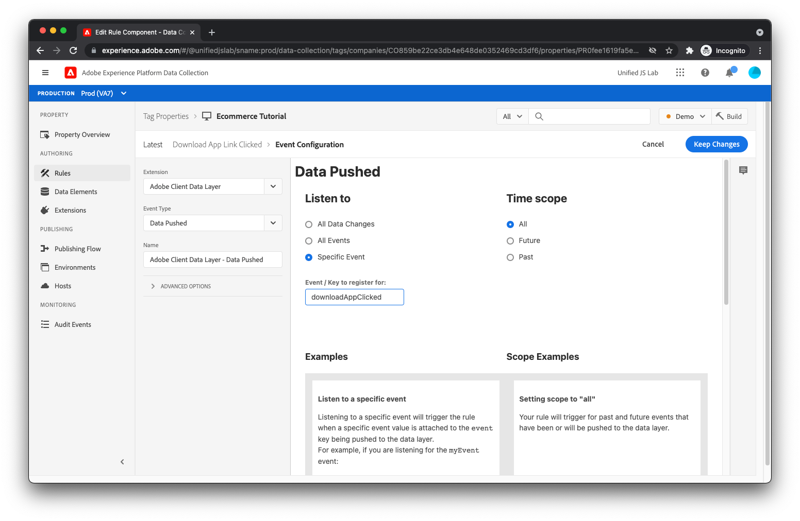

# Skapa ett dataelement och en regel för att spåra appnedladdningar

Som en påminnelse när du spårar när en användare klickar på [!UICONTROL Ladda ned appen] -länk överfördes du till datalagret enligt följande:

```js
window.adobeDataLayer.push({
  "event": "downloadAppClicked",
  "eventInfo": {
    "web": {
      "webInteraction": {
        "URL": "https://example.com/download",
        "name": "App Download",
        "type": "download"
      }
    }
  }
});
```

Du använde `eventInfo` som anger för datalagret att kommunicera dessa data tillsammans med händelsen, men till _not_ bevara data i datalagret. För en länkklickning är det inte användbart att lägga till information om den klickade länken till datalagret eftersom den inte kan användas för andra händelser som inträffar senare på sidan.

För den här implementeringen skickar du en upplevelsehändelse till Adobe Experience Platform som innehåller det sammanslagna resultatet av (1) det beräknade läget för datalagret och (2) innehållet i `eventInfo`.

För att göra detta måste du först skapa ett dataelement som sammanfogar dessa två informationssegment.

## Skapa ett dataelement

Om du vill skapa ett dataelement klickar du på [!UICONTROL Dataelement] i den vänstra menyn. Klicka sedan på [!UICONTROL Lägg till dataelement] länk.

Ange elementnamnet `computedStateAndEventInfo`. För [!UICONTROL Tillägg] fält, markera [!UICONTROL Core] om det inte redan är markerat. För [!UICONTROL Dataelementtyp] fält, markera [!UICONTROL Sammanfogade objekt]. Med det här dataelementet kan du sammanfoga flera objekt djupt. Det sammanfogade resultatet returneras av dataelementet.

För det första objektet som du vill ta med i kopplingen anger du `%event.fullState%`. Vid användning inuti en regel som utlöses av en [!UICONTROL Publicerade data] rule-händelse refererar det här till det beräknade läget för Adobe-klientdatalagret när regeln utlöstes.

Klicka [!UICONTROL Lägg till ytterligare].

För det andra objektet anger du `%event.eventInfo%`. Vid användning inuti en regel som utlöses av en [!UICONTROL Publicerade data] rule-händelse, detta refererar till `eventInfo` som har skickats till Adobe-klientdatalagret.


Dataelementet är färdigt. Spara dataelementet genom att klicka på [!UICONTROL Spara] -knappen.

## Skapa en regel

Så här skapar du regeln för att spåra klick på [!UICONTROL Ladda ned appen] länk, klicka först [!UICONTROL Regler] i den vänstra menyn.

Klicka [!UICONTROL Lägg till regel].

Ange regelnamnet _Klicka på länken Hämta program_.

## Lägg till en händelse

Klicka på [!UICONTROL Lägg till] knapp under [!UICONTROL Händelser]. Du visar nu att du är med i eventvyn. För [!UICONTROL Tillägg] fält, markera [!UICONTROL Adobe-klientdatalager]. För [!UICONTROL Händelsetyp] fält, markera [!UICONTROL Publicerade data].

Eftersom du bara vill att den här regeln ska aktiveras när `downloadAppClicked` händelsen skickas till datalagret, välj [!UICONTROL Specifik händelse] radio under [!UICONTROL Lyssna på] och text _downloadAppClick_ till [!UICONTROL Händelse/nyckel att registrera för]  textfält som visas.



Klicka [!UICONTROL Behåll ändringar].

## Lägga till en åtgärd

Nu när du är tillbaka i regelvyn klickar du på [!UICONTROL Lägg till] knapp under [!UICONTROL Åtgärder]. Du bör nu vara med i åtgärdsvyn. För [!UICONTROL Tillägg] fält, markera [!UICONTROL Adobe Experience Platform Web SDK]. För [!UICONTROL Åtgärdstyp] fält, markera [!UICONTROL Skicka händelse].

På skärmens högra sida hittar du [!UICONTROL Typ] fält och markera `web.webinteraction.linkClicks`.

För [!UICONTROL XDM-data] klickar du på väljarknappen för dataelementet och väljer [!UICONTROL computedStateAndEventInfo]. Det här är dataelementet som du nyss skapade.

För den här regeln (till skillnad från andra regler som du har skapat) kontrollerar du [!UICONTROL Dokumentet tas bort] kryssrutan. Detta anger i princip för SDK att användaren kommer att navigera bort från sidan när han/hon klickar på länken. Detta är viktigt eftersom SDK kan göra begäran på ett sätt som innebär att även om användaren navigerar bort från sidan, kommer begäran fortfarande att köras i bakgrunden och nå servern. Om den här kryssrutan inte är markerad kommer begäran inte att utföras på det här sättet och kommer därför troligtvis att avbrytas när det aktuella dokumentet tas bort.

Du kanske frågar dig själv: &quot;Det låter bra. Varför är inte det här alternativet alltid aktiverat då?&quot;

Det är lite komplicerat, men när den här funktionen används används en webbläsarmetod som kallas [`sendBeacon`](https://developer.mozilla.org/en-US/docs/Web/API/Navigator/sendBeacon) för att skicka begäran. När en begäran skickas med `sendBeacon`tillåter inte webbläsaren SDK (eller något annat) att komma åt data som returneras från servern. Om SDK skulle använda den här funktionen för varje begäran skulle SDK aldrig kunna ta emot några data från servern. Därför är det viktigt att du kontrollerar [!UICONTROL Dokumentet tas bort] kryssrutan endast när det aktuella dokumentet tas bort. I så fall kan svarsdata ändå tas bort.


Spara funktionsmakrot genom att klicka på [!UICONTROL Behåll ändringar] -knappen.

## Spara regeln

Din regel bör nu vara fullständig.


Spara regeln genom att klicka [!UICONTROL Spara].
