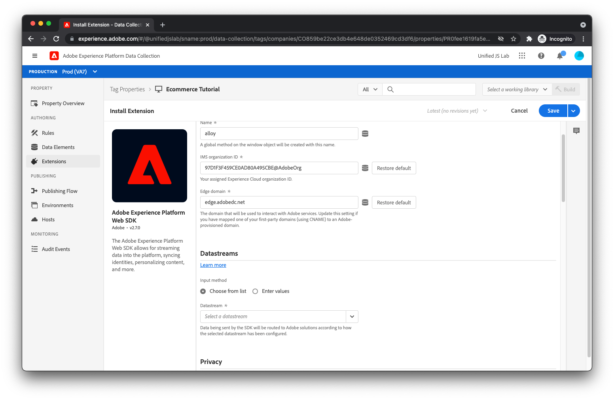

# Skapa en taggegenskap för Adobe Experience Platform och installera tillägg

Nu när kod på sidan för in data och händelser i datalagret är det dags för marknadsföraren att läsa data från datalagret och skicka dessa data till Adobe Experience Platform. Detta kräver vanligtvis två JavaScript-bibliotek:

* Adobe-klientdatalager: I tidigare steg skapade du en datalagerarray och överförde objekt till den. För att få åtkomst till data måste du läsa in JavaScript-biblioteket för klientdatalagret i Adobe, som ger dig möjlighet att få meddelanden om ändringar i datalagret och händelser och som även ger enkla sätt att få åtkomst till data.
* Adobe Experience Platform Web SDK: Detta JavaScript-bibliotek kommunicerar med Adobe Experience Platform Edge Network. SDK hanterar identitet, samtycke, datainsamling, personalisering, målgrupper med mera.

Även om du kan läsa in dessa individuella bibliotek på din webbplats och använda dem direkt, rekommenderar vi att du använder dem [Adobe Experience Platform-taggar](https://experienceleague.adobe.com/docs/experience-platform/tags/home.html?lang=sv). Med taggar kan du bädda in ett enda skript i HTML och använda användargränssnittet Tags för att distribuera både Adobe Client Data Layer och Adobe Experience Platform Web SDK. Med taggar kan du också skapa regler för att skicka data, bland annat. I den här självstudien används taggar för det här ändamålet och du förutsätts ha en grundläggande förståelse för hur taggar fungerar.

## Skapa en egenskap i taggar

Om du inte redan gjort det, [skapa en egenskap i taggar](https://experienceleague.adobe.com/docs/experience-platform/tags/admin/companies-and-properties.html#create-or-configure-a-property).

## Installera tillägget Adobe Client Data Layer

Installera tillägget Adobe Client Data Layer genom att gå till tilläggskatalogen, leta reda på tillägget och klicka på respektive [!UICONTROL Installera] -knappen. En konfigurationsskärm bör visas.

I den här självstudiekursen behöver du inte ändra standardvärdena. Klicka [!UICONTROL Spara].

## Installera Adobe Experience Platform Web SDK-tillägget

Installera sedan Adobe Experience Platform Web SDK-tillägget genom att hitta tillägget i tilläggskatalogen och klicka på respektive [!UICONTROL Installera] -knappen. En konfigurationsskärm bör visas.

I [Skapa ett datastream](../configure-the-server/create-a-datastream.md)skapade du en datastream som Adobe Experience Platform Edge Network refererar till för att avgöra var dina inkommande data ska skickas. När du gör en begäran från Adobe Experience Platform Web SDK till Edge Network, måste du ange vilket datastream Edge Network som ska referera.

Om du vill göra det hittar du [!UICONTROL Datastream] och välj den datastream du skapade tidigare. Du får samma datastream-miljöer som du såg i [Skapa ett datastream](../configure-the-server/create-a-datastream.md).

Som beskrivs i [Skapa ett datastream](../configure-the-server/create-a-dataset.md), har dessa datauppsättningsmiljöer en relation till taggar-miljöer. Anta att du har slutfört installationen av Adobe Experience Platform Web SDK-tillägget genom att skapa ett taggbibliotek som innehåller tillägget och sedan publicera biblioteket i en taggredigeringsmiljö. När taggbiblioteket har lästs in på webbsidan och Adobe Experience Platform Web SDK-tillägget gör en begäran till Edge Network, innehåller tillägget [!UICONTROL Utvecklingsmiljö] ID för datastream-miljö. Edge Network använder i sin tur detta ID för att läsa konfigurationen av [!UICONTROL Utvecklingsmiljö] datastream-miljö och vidarebefordra data till lämpliga Adobe-produkter.

För närvarande har du bara en utvecklingsdatastream-miljö, en mellanlagringsdatastream-miljö och en produktionsdatastream-miljö. Det är därför som användargränssnittet för tilläggskonfigurationen visar alla förmarkerade och oföränderliga. Det går dock att skapa flera datastream-utvecklingsmiljöer (en för dig och en för din medarbetare, kanske) med hjälp av användargränssnittet för datastream. Om du har flera utvecklingsdatastream-miljöer kan du välja vilken du vill använda för den här taggegenskapen.

Till sist rullar du nedåt och avmarkerar [!UICONTROL Aktivera klickdatainsamling]. Som standard spårar SDK automatiskt länkar åt dig. I den här självstudiekursen visar vi hur du kan spåra dina egna länkklick med hjälp av anpassad länkinformation.

Klicka på [!UICONTROL Spara] för att slutföra installationen av Adobe Experience Platform Web SDK-tillägget.

Lämpliga tillägg har installerats. Det är dags att skapa regler och dataelement.
