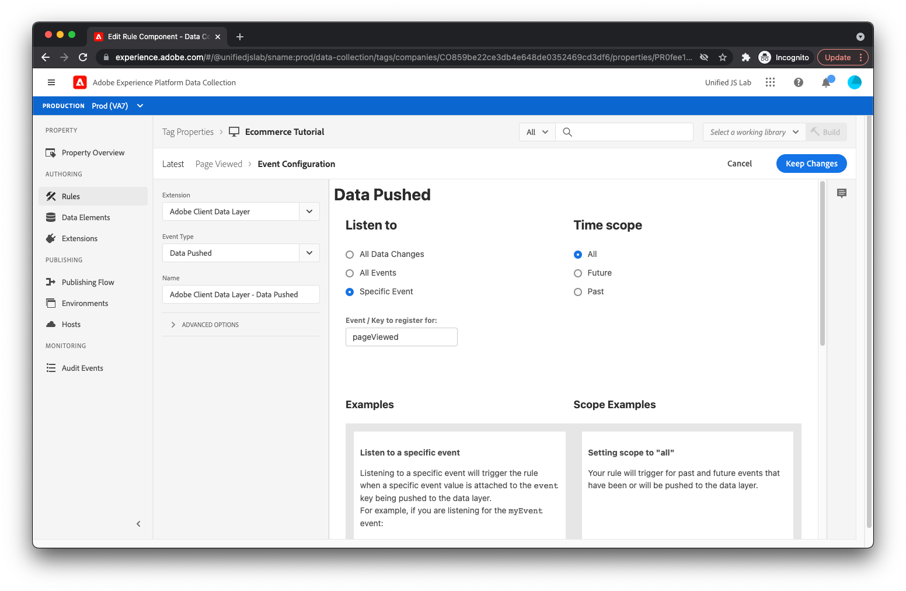

# Skapa regler för spårning av sidvy och e-handelshändelser

Om du vill spåra att användaren har visat produktsidan skapar du en regel i Adobe Experience Platform-taggar. Gör detta genom att klicka [!UICONTROL Regler] i den vänstra menyn klickar du på [!UICONTROL Lägg till regel].

Ange regelnamnet _Visad sida_.

## Lägg till en händelse

Klicka på [!UICONTROL Lägg till] knapp under [!UICONTROL Händelser]. Du visar nu att du är med i eventvyn. För [!UICONTROL Tillägg] fält, markera [!UICONTROL Adobe-klientdatalager]. För [!UICONTROL Händelsetyp] fält, markera [!UICONTROL Publicerade data].

Eftersom du bara vill att den här regeln ska aktiveras när `pageViewed` händelsen skickas till datalagret, markera [!UICONTROL Specifik händelse] under [!UICONTROL Lyssna på] och text _pageViewed_ till [!UICONTROL Händelse/nyckel att registrera för] textfält.

Klicka [!UICONTROL Behåll ändringar].

## Lägga till en åtgärd

Nu när du är tillbaka i regelvyn klickar du på [!UICONTROL Lägg till] knapp under [!UICONTROL Åtgärder]. Du bör nu vara med i åtgärdsvyn. För [!UICONTROL Tillägg] fält, markera [!UICONTROL Adobe Experience Platform Web SDK]. För [!UICONTROL Åtgärdstyp] fält, markera [!UICONTROL Skicka händelse]. Med den här åtgärden kan du skicka en upplevelsehändelse till Adobe Experience Platform Edge Network.

På skärmens högra sida hittar du [!UICONTROL Typ] fält och markera `web.webpagedetails.pageViews`. Det här är en av de kanoniska händelsetyper som Adobe Experience Platform tillhandahåller. Det representerar en sidvy.

För [!UICONTROL XDM-data] fält, ange `%event.fullState%`. Detta anger att det beräknade läget (kallas även fullständigt läge) för datalagret, som hämtas när regeln aktiveras, ska skickas som en del av upplevelsehändelsen.

Om de data du överförde till datalagret från webbplatsen inte överensstämmer med ditt XDM-schema, eller om du bara vill skicka en del av datalagrets beräknade tillstånd, använder du [!UICONTROL XDM-objekt] dataelementtyp (tillhandahålls av Adobe Experience Platform Web SDK-tillägget) för att skapa ett lämpligt objekt som matchar ditt schema.

Klicka på [!UICONTROL Behåll ändringar] -knappen.

## Spara regeln

Din regel bör nu vara fullständig.

Spara regeln genom att klicka [!UICONTROL Spara].

## Upprepa processen

Upprepa processen ovan för att skapa regler för när en produkt visas, en kundvagn öppnas och en produkt läggs till i kundvagnen. De enda skillnaderna mellan reglerna är regelnamnet, det värde som anges i [!UICONTROL Händelse/nyckel att registrera för] i [!UICONTROL Publicerade data] och [!UICONTROL Typ] i [!UICONTROL Skicka händelse] åtgärd. Här är värdena för varje regel:

Produktvisningsregel:

* **Regelnamn**: _Visad produkt_
* **Händelse/nyckel att registrera för** inom [!UICONTROL Publicerade data] händelse: `productViewed`
* **Typ** inom [!UICONTROL Skicka händelse] åtgärd: `commerce.productViews`

Öppen kundvagnsregel:

* **Regelnamn**: _Bild öppnad_
* **Händelse/nyckel att registrera för** inom [!UICONTROL Publicerade data] händelse: `cartOpened`
* **Typ** inom [!UICONTROL Skicka händelse] åtgärd: `commerce.productListOpens`

Produkt som lagts till i kundvagnsregel:

* **Regelnamn**: _Produkt tillagd i kundvagn_
* **Händelse/nyckel att registrera för** inom [!UICONTROL Publicerade data] händelse: `productAddedToCart`
* **Typ** inom [!UICONTROL Skicka händelse] åtgärd: `commerce.productListAdds`

Nu ska vi hantera spårningsklickningar på [!UICONTROL Ladda ned appen] länk.
