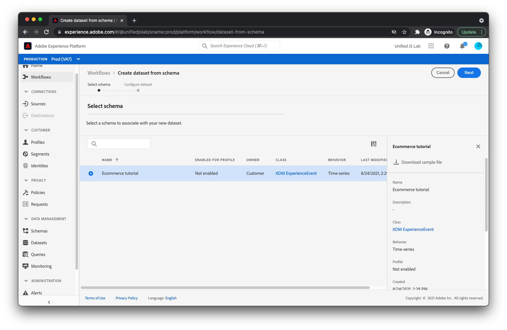

# Skapa en datauppsättning

Förutom att beskriva data som du ska skicka till Adobe Experience Platform behöver du en plats där du kan lagra data. I Adobe Experience Platform kallas de här bucklarna där du kan skicka data för datauppsättningar.

Om du vill skapa en datauppsättning går du till [!UICONTROL Datauppsättningar] i Adobe Experience Platform.

Klicka [!UICONTROL Skapa datauppsättning] i det övre högra hörnet.

Välj [!UICONTROL Skapa datauppsättning från schema] och markera [schemat som du skapade tidigare](create-a-schema.md).

Klicka [!UICONTROL Nästa] och ange ett namn och en beskrivning.

Klicka [!UICONTROL Slutför]. Din datauppsättning har skapats och är klar att ta emot data.

När du börjar skicka data till en datauppsättning validerar Adobe Experience Platform att de data du försöker placera i datauppsättningen överensstämmer med det tillämpade schemat. Om data inte överensstämmer med schemat avvisas data och placeras inte i datauppsättningen. Som ett resultat av detta valideringssteg kan användare av datauppsättningen (Adobe-produkter, tredje parter eller ditt eget företag) ha viss säkerhet när det gäller datauppsättningens struktur och renhet.

Mer information om hur du skapar datauppsättningar finns i [Användargränssnittshandbok för datauppsättningar](https://experienceleague.adobe.com/docs/experience-platform/catalog/datasets/user-guide.html).
