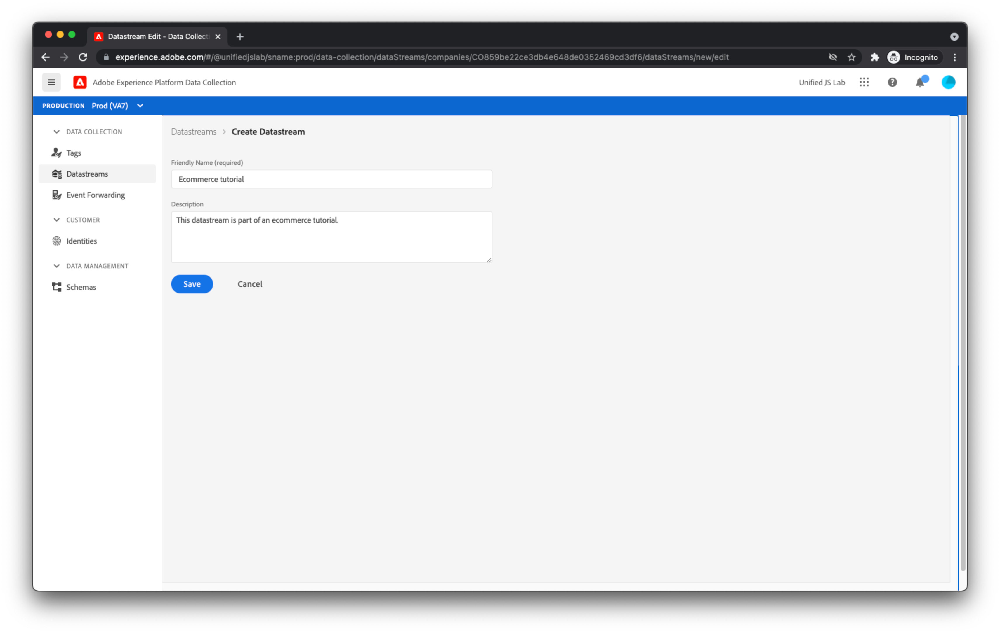

# Skapa ett datastream

De data du skickar från din webbplats når en uppsättning Adobe-servrar som kallas [Adobe Experience Platform Edge](https://business.adobe.com/products/experience-platform/experience-platform-edge-network.html). Detta nätverk kan skicka data till [Adobe Experience Platform dataset du skapade tidigare](create-a-schema.md) och andra produkter i Adobe Experience Cloud. Dessa Adobe-produkter kan också svara på data på din webbsida. Edge Network kan till exempel returnera personaliseringsinnehåll från Adobe Target.

Om du vill konfigurera vilka Adobe-produkter Edge Network skickar data till och från måste du skapa ett datastream. När Edge Network tar emot data från din webbsida, konsulterar den dataström du har skapat, läser dess konfiguration och vidarebefordrar data till rätt Adobe-produkter.

Om du vill skapa ett datastream navigerar du först till [!UICONTROL Datastreams] visa i [!UICONTROL Datainsamling]. Klicka [!UICONTROL Skapa dataström] i det övre högra hörnet. Ange ett namn för datastream.

På nästa skärm kan du konfigurera vilka Adobe-produkter som ska ta emot data som du skickar från din webbplats. I den här självstudiekursen aktiverar du bara Adobe Experience Platform och väljer den datauppsättning som du skapade tidigare (som kommer att vara standard) [!UICONTROL Prod] sandlåda) och klicka [!UICONTROL Spara].

Ditt datastream har skapats.

## Datastream-miljöer

Företagen har vanligtvis en kampanjväg för alla webbplatsuppdateringar. Någon på företaget (en marknadsförare eller tekniker, beroende på ändringarna) testar vanligtvis sina ändringar i en utvecklingsmiljö som bara den personen använder. När de känner sig bekväma med ändringarna befordras ändringarna till en staging-miljö där de får ytterligare testning. Äntligen publiceras ändringarna på produktionens webbplats. Datastreams stöder det här kampanjmönstret.

Efter att du klickat [!UICONTROL Spara]bör du ha lagt märke till att tre datastream-miljöer skapades automatiskt åt dig: [!UICONTROL Utvecklingsmiljö], [!UICONTROL Mellanlagringsmiljö]och [!UICONTROL Produktionsmiljö].

Om du klickar på varje datastream-miljö får alla samma konfiguration som du angav. Dessa miljöer kan dock anpassas individuellt.

Om du känner till Adobe Experience Platform Tags kanske du redan är bekväm med konceptet för en utvecklings-, staging- och produktionsmiljö. Miljöer i taggar är relaterade till miljöer i ett datastream. När du flyttar ett taggbibliotek genom arbetsflödet för taggpublicering från utveckling till staging till produktion, kommer den datastream-miljö som används också automatiskt att växla från [!UICONTROL Utvecklingsmiljö], till [!UICONTROL Mellanlagringsmiljö], till [!UICONTROL Produktionsmiljö]. Detta gör att du till exempel kan skicka data till en datauppsättning medan dina ändringar är under utveckling och skicka data till en annan datauppsättning när ändringarna är under produktion. På så sätt kan du hålla dina produktionsdata fria från skräpdata som du kan generera under utvecklingsprocessen. Vi diskuterar datastream-miljöer senare när du konfigurerar tillägg i taggegenskapen.

Servern är nu helt konfigurerad för att ta emot data från din webbsida.
