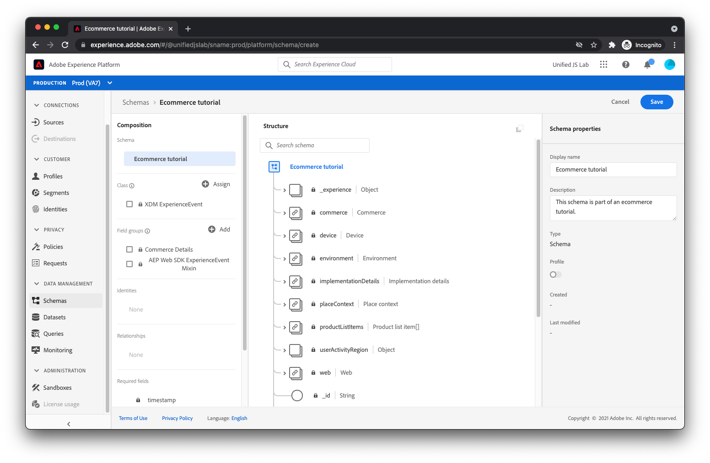

# Skapa ett schema

Som beskrivs i [Strukturera data](../structuring-your-data.md)måste data som skickas till Adobe Experience Platform vara i XDM. Mer specifikt måste dina data matcha en _schema_. Ett schema är i princip en beskrivning av hur data ska se ut. Den beskriver namnen på fälten och var de ska placeras i data. Den beskriver också vilken typ av värde varje fält ska ha (till exempel ett booleskt värde, en sträng med en längd på 12 tecken, en array med siffror).

Adobe Experience Platform har några färdiga byggstenar, så kallade fältgrupper som är vanliga inom branschen. För finanssektorn finns det t.ex. fältgrupper för saldoöverföringar och låneansökningar. För rese- och turismbranschen finns det fältgrupper för bokningar av flyg och inkvartering.

Vi rekommenderar att du använder de inbyggda fältgrupperna där det är möjligt när du skapar ditt schema. Vi förstår också att du kan behöva fält som är specifika för ditt eget företag. Därför kan du skapa egna fältgrupper som du kan använda i de scheman du skapar.

Låt oss gå igenom hur vi skapar ett schema för en vanlig e-handelswebbplats.

Navigera först till [!UICONTROL Scheman] i Adobe Experience Platform.

Välj [!UICONTROL Skapa schema] i det övre högra hörnet. En meny visas. Välj [!UICONTROL XDM ExperienceEvent].

Nu bör en dialogruta visas med en fråga om vilka fältgrupper du vill lägga till i schemat. Den första fältgruppen som du ska välja är fältgruppen med namnet [!UICONTROL AEP Web SDK ExperienceEvent]. Den här fältgruppen lägger till en uppsättning fält som rymmer data som automatiskt samlas in av Adobe Experience Platform Web SDK.

Eftersom webbplatsen för den här självstudiekursen är en e-handelswebbplats bör du även välja [!UICONTROL Handelsinformation] fältgrupp. Med den här gruppen kan du skicka vanliga affärsdata som vilka produkter som visas, läggs till i kundvagnen och köps.

Klicka på [!UICONTROL Lägg till fältgrupper] längst upp till höger i dialogrutan. Nu bör du se schemats struktur.

Fältgrupperna som du har lagt till visas till vänster. Om du väljer en fältgrupp markeras fälten till höger som har angetts av den fältgruppen. Ägna några minuter åt att utforska de tillgängliga fälten.

Äntligen väljer du [!UICONTROL Namnlöst schema] till vänster på skärmen anger du ett namn och en beskrivning till höger på skärmen och klickar på [!UICONTROL Spara].

Ditt schema har skapats. Nu ska vi lära oss hur du skapar en datauppsättning som innehåller dina data.

Mer information om att skapa scheman finns i [Skapa ett schema (UI)](https://experienceleague.adobe.com/docs/experience-platform/xdm/tutorials/create-schema-ui.html).
