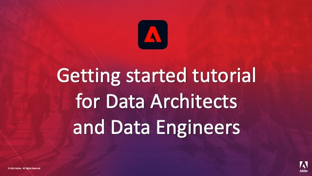

# Adobe Experience Platform självstudiekurser

Adobe Experience Platform är det mest kraftfulla, flexibla och öppna systemet på marknaden för att bygga och hantera kompletta lösningar som ger en bättre kundupplevelse. Med Experience Platform kan organisationer centralisera och standardisera kunddata och innehåll från alla system och tillämpa datavetenskap och maskininlärning för att dramatiskt förbättra utformningen och leveransen av avancerade, personaliserade upplevelser. Använd dessa videoklipp och självstudiekurser för att lära dig Experience Platform.

## Personalval

<table style="margin-top: 0 !important">
<tr>
  <td>
    
    

      <a href="intro-to-platform/a-customer-experience-powered-by-experience-platform.md">
    <strong>En kundupplevelse som bygger på Experience Platform</strong>
    </a>
    

    

    <em>Se hur Platform kan användas för att ge en kundupplevelse kraft</em>
    

  </td>
  <td>
    
    

      <a href="https://experienceleague.adobe.com/docs/platform-learn/getting-started-for-data-architects-and-data-engineers/overview.html">
    <strong>Komma igång med dataarkitekter och datatekniker</strong>
    </a>
    

    

    <em>Praktiska övningar för att komma igång</em>
    

  </td>
  <td>
    
    

      <a href="sources/overview.md">
    <strong>Om källkopplingar</strong>
    </a>
    

    

    <em>Importera data enkelt</em>
    

  </td>
   <!--
   <td>
    
    

      <a href="data-ingestion/create-datasets-and-ingest-data.md">
    <strong>Create Datasets and Ingest Data</strong>
    </a>
    

    

    <em>Ingest your dataset.</em>
    

  </td>
  <td>
    
    

      <a href="segments/create-segments.md">
    <strong>Create Segments</strong>
    </a>
    

    

    <em>Build segments based on your data.</em>
    

  </td>-->
</tr>
</table>

