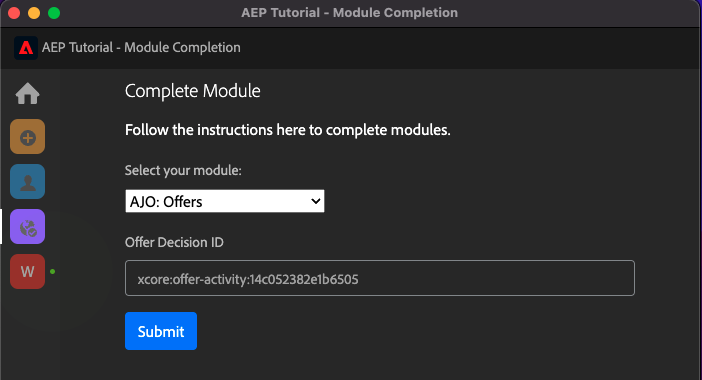

# Omfattande teknisk självstudiekurs för Adobe Experience Platform - Hur mäts slutförandet?

Du kan uppdatera din komplettering av den omfattande tekniska självstudiekursen för Adobe Experience Platform med det Chrome-tillägg som skapades.

När du har följt instruktionerna i modul 0 har du angett din organisations **Konfigurations-ID** i Chrome-tillägget och du har registrerat dig. Chrome-tillägget bör nu se ut så här. Klicka på den lila ikonen för att skicka in en modul.

Då ser du det här:

Genom att öppna listrutan kan du välja vilken modul du vill slutföra:

För att slutföra en modul måste du tillhandahålla ett bevis på att du är klar.

Nedan visas det förväntade korrekturet för varje modul.

## Komma igång

Förväntat slutförandebevis för modulen **Komma igång** är ID:t för det Demo System-projekt för webben som du har skapat.

ID:t för Demo System-projektet för webbformat ser ut så här: `--demoProfileLdap-- - OCUC`.

Välj **Komma igång** i listrutan anger du **ID för Demo System-projektet** och klicka på **Skicka** - knapp.

## Datainsamling och Web SDK

Förväntat slutförandebevis för modulen **Datainsamling och Web SDK** är namnet på datainsamlingsegenskapen för webben.

Namnet på egenskapen Datainsamling för webbformat ser ut så här: `--demoProfileLdap-- - Demo System (05/02/2022) (enablement) 1644046719474`.

Välj **Datainsamling och Web SDK** i listrutan anger du **Egenskapsnamn för datainsamling för webben** och klicka på **Skicka** - knapp.

## Dataintag

Förväntat slutförandebevis för modulen **Dataintag** är datauppsättnings-ID för de två datauppsättningar som du har skapat.

Formatet för datauppsättnings-ID ser ut så här: **5f069724723ef41916a8b5d2**.

`--demoProfileLdap-- - Demo System - Event Dataset for Website`

`--demoProfileLdap-- - Demo System - Profile Dataset for Website`

Välj **Dataintag** i listrutan anger du **Datauppsättnings-ID** för båda datauppsättningarna i indatafälten och klicka på **Skicka** - knapp.

## Kundprofil i realtid

Förväntat slutförandebevis för modulen **Kundprofil i realtid** är **Segment-ID** för segmentet som du skapade via användargränssnittet, `--demoProfileLdap-- - Male customers with interest in Montana Wind Jacket`.

Formatet för segment-ID ser ut så här: **8cb7034d-d4ae-4d26-a61f-a76559c12457**.

Välj **Kundprofil i realtid** i listrutan anger du **Segment-ID** i inmatningsfältet och klicka på **Skicka** - knapp.

## Frågetjänst

Förväntat slutförandebevis för modulen **Frågetjänst** är ditt datauppsättnings-ID `--demoProfileLdap--_callcenter_interaction_analysis` - datauppsättning som du får när du har slutfört modulen.

Formatet ser ut så här: **62076f68f14a9d194995d4e2**.

Välj **Frågetjänst** i listrutan anger du **Datauppsättnings-ID** i inmatningsfältet och klicka på **Skicka** - knapp.

## Intelligenta tjänster

Förväntat slutförandebevis för modulen **Intelligenta tjänster** är ditt ID **Kundens AI-tjänst för produktköpsförmån**.

Formatet ser ut så här: **12729** och du kan hämta det från URL:en när du har öppnat tjänsten.

Välj **Intelligenta tjänster** i listrutan anger du **Kundens AI-tjänste-ID** i inmatningsfältet och klicka på **Skicka** - knapp.

## Real-Time CDP

Förväntat slutförandebevis för modulen **Real-Time CDP** är ditt ID **Adobe Target Activity**.

Formatet ser ut så här: **111804**.

Välj **Real-Time CDP** i listrutan anger du **Adobe Target Activity ID** i inmatningsfältet och klicka på **Skicka** - knapp.

## AJO: Orchestration

Förväntat slutförandebevis för modulen **AJO: Orchestration** är eventID för `--demoProfileLdap--AccountCreationEvent`.

Formatet ser ut så här: **227402c540eb8f8855c6b2333adf6d54d7153d9d7d56fa475a686081c57473 6**.

Välj **AJO: Orchestration** i listrutan anger du ditt ** eventID** i inmatningsfältet och klickar på **Skicka** - knapp.

## AJO: Anpassade åtgärder

Förväntat slutförandebevis för modulen **AJO: Anpassade åtgärder** är eventID för din händelse `--demoProfileLdap--GeofenceEntry`.

Formatet ser ut så här: **fa42ab7982ba55f039eacec24c1e32e5c51b310c67f0fa559ab49b89b63f4934**.

Välj **AJO: Anpassade åtgärder** i listrutan anger du **eventID** i inmatningsfältet och klicka på **Skicka** - knapp.

## AJO: Erbjudanden

Förväntat slutförandebevis för modulen **AJO: Erbjudanden** är ID:t för **Erbjudandebeslut** som du skapade.

Du hittar **ID för erbjudandebeslut** som ser ut så här **xcore:offer-activity:1122fcc4603ea499**, här:

Välj **AJO: Erbjudanden** i listrutan anger du **ID för erbjudandebeslut** i inmatningsfältet och klicka på **Skicka** - knapp.

## AJO: Händelser

Förväntat slutförandebevis för modulen **AJO: Händelser** är eventID för `--demoProfileLdap--StoreEntryEvent`.

Formatet ser ut så här: **e3a8f0bdc0b609667cd96a72a6b1e5aafa0ddaf6ccf121c574e6a2030860a633**.

Välj **AJO: Händelser** i listrutan anger du **eventID** i inmatningsfältet och klicka på **Skicka** - knapp.

## CJA

Förväntat slutförandebevis för modulen **CJA** är ID:t för ditt projekt `--demoProfileLdap-- - Omnichannel Analysis`.

Formatet ser ut så här: **6217344f6249ac70c726db60** hittar du den i URL:en när du har öppnat projektet.

Välj **CJA** i listrutan anger du **Projekt-ID** i inmatningsfältet och klicka på **Skicka** - knapp.

## CJA: BigQuery

Förväntat slutförandebevis för modulen **CJA: BigQuery** är ditt ID **BigQuery**-connection.

Du hittar **Anslutnings-ID för BigQuery** som ser ut så här **85a2394d-8b94-410c-a239-4d8b94b10c38**, här:

Välj **CJA: BigQuery** i listrutan anger du **Anslutnings-ID för BigQuery** i inmatningsfältet och klicka på **Skicka** - knapp.

## RTCDP: EventHub

Förväntat slutförandebevis för modulen **RTCDP: EventHub** är ditt ID **Microsoft Azure Event Hub** mål i Adobe Experience Platform.

Du hittar **Mål-ID för Microsoft Azure Event Hub** som ser ut så här **fa3f7ce5-86fd-4096-bf7c-e586fdc096ba**, här:

Välj **RTCDP: EventHub** i listrutan anger du **Mål-ID för Microsoft Azure Event Hub** i inmatningsfältet och klicka på **Skicka** - knapp.

## RTCDP-anslutningar

Förväntat slutförandebevis för modulen **RTCDP-anslutningar** är din **Egenskaps-ID för händelsevidarebefordran**.

Du hittar **Egenskaps-ID för händelsevidarebefordran** som ser ut så här **PR40f44184c88472e9c19d8d602aab0de**, här:

Välj **RTCDP-anslutningar** i listrutan anger du **Egenskaps-ID för händelsevidarebefordran** i inmatningsfältet och klicka på **Skicka** - knapp.

## Apache Kafka

Förväntat slutförandebevis för modulen **Apache Kafka** är ID:t för din källkoppling `--demoProfileLdap-- - Kafka`.

ID:t ser ut så här **f843d50a-ee30-4ca8-a766-0e4f3d29a2f7** och du hittar den här:

Välj **Apache Kafka** i listrutan anger du **Flöde-ID** i inmatningsfältet och klicka på **Skicka** - knapp.

[Gå tillbaka till Alla moduler](./overview.md)
