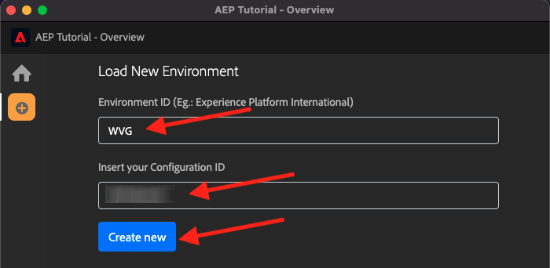
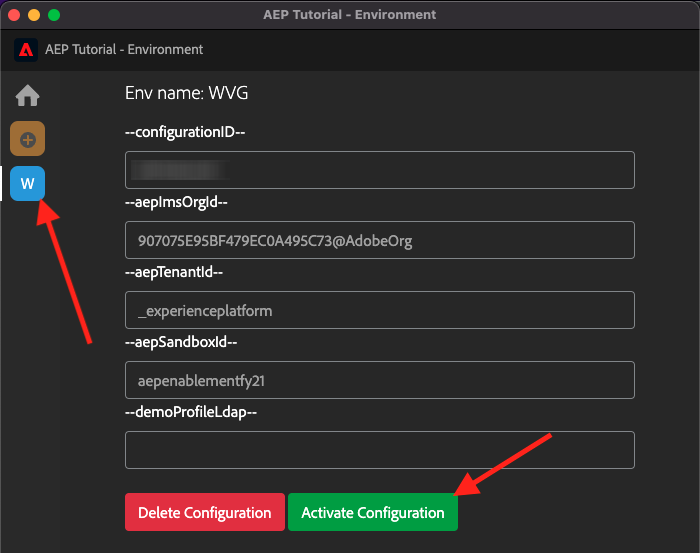
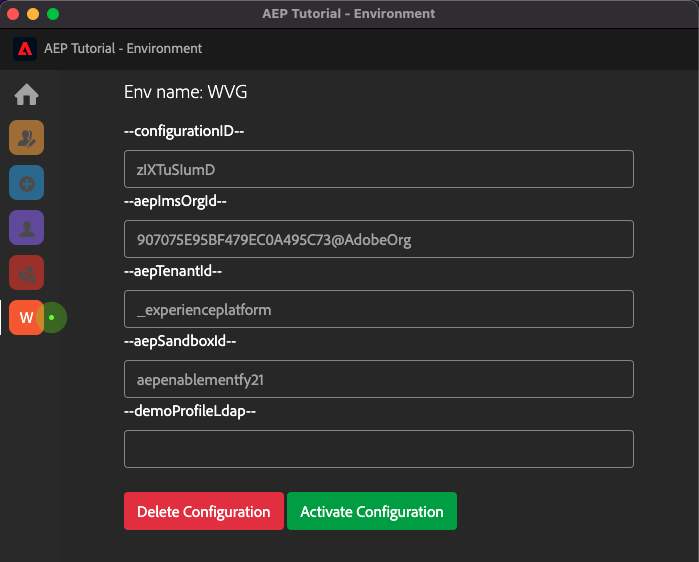
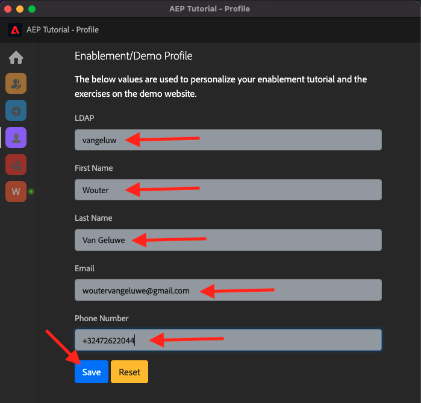

# 0.1 Installera Chrome-tillägget för Experience League-dokumentationen

## 0.1.1 Varför skapade vi ett Chrome-tillägg?

Dokumentationen har gjorts generisk så att den enkelt kan återanvändas av vem som helst, med valfri Adobe Experience Platform-instans.
Genom att göra dokumentationen återanvändbar, **Miljövariabler** introducerades i dokumentationen, vilket innebär att du hittar nedanstående **tangenter** i dokumentationen. Alla nycklar är en specifik variabel för en viss miljö, och Chrome-tillägget ändrar variabeln åt dig och gör det därför enkelt för dig att kopiera kod och text från självstudiesidorna och klistra in den i de olika användargränssnitt som du kommer att använda som en del av självstudiekursen.

Ett exempel på sådana värden finns nedan. För närvarande kan dessa värden inte användas än, men så fort du installerar och aktiverar Chrome-tillägget kommer dessa variabler att ändras till &quot;normal&quot; text som du kan kopiera och återanvända.

| Namn | Nyckel |
|:-------------:| :---------------:|
| AEP IMS-organisations-ID | `--aepImsOrgId--` |
| Klient-ID för AEP | `--aepTenantId--` |
| DCS Inlet ID | `--dcsInletId--` |
| Demonstrationsprofil LDAP | `--demoProfileLdap--` |

I skärmbilden nedan ser du en referens till `--aepTenantId--`.

När tillägget har installerats ändras den texten automatiskt så att den återspeglar dina instansspecifika värden.

Tillägget gör det även möjligt för dig att:

- Registrera dig för självstudiekursen
- Spåra förloppet genom att skicka in alla moduler som anges i [Hur mäts Slutförande?](../../completion.md)

## 0.1.2 Installera Chrome-tillägget

Om du vill installera Chrome-tillägget öppnar du webbläsaren Chrome och går till: [https://chrome.google.com/webstore/detail/platform-learn-configurat/hhnbkfgioecmhimdhooigajdajplinfi/related?hl=en&amp;authuser=0](https://chrome.google.com/webstore/detail/platform-learn-configurat/hhnbkfgioecmhimdhooigajdajplinfi/related?hl=en&amp;authuser=0). Du kommer då att se det här.

Klicka **Lägg till i Chrome**.

Du kommer då att se det här. Klicka **Lägg till tillägg**.

Tillägget installeras sedan och ett liknande meddelande visas.

I **tillägg** klickar du på **pusselbit** ikon och fäst **Plattformsutbildning - Konfiguration** tillägg till tilläggsmenyn.

## 0.1.2 Konfigurera Chrome-tillägget

Gå till [https://experienceleague.adobe.com/docs/platform-learn/comprehensive-technical-tutorial-v22/overview.html?lang=en](https://experienceleague.adobe.com/docs/platform-learn/comprehensive-technical-tutorial-v22/overview.html?lang=en) och klicka sedan på tilläggsikonen för att öppna den.

Du kommer då att se den här popup-rutan. Klicka på **+** ikon.

Ange ditt namn och det konfigurations-ID som skapades för din Adobe Experience Platform-miljö. Klicka **Skapa nytt**.

>[!IMPORTANT]
>
>Om du är anställd i Adobe: du hittar det konfigurations-ID som ska användas på den interna Github-repon (https://git.corp.adobe.com/vangeluw/platformenablement).
>
>Om du är Adobe Solution Partner kontaktar du din Solution Partner-kontakt eller mejl **spphelp@adobe.com**.

På den vänstra menyn i tillägget visas nu en ikon med dina initialer. Klicka på den. Mappningen mellan **Miljövariabler** och dina specifika instansvärden för Adobe Experience Platform. Klicka **Aktivera konfiguration**.

När du har aktiverat konfigurationen visas en grön punkt bredvid dina initialer. Detta innebär att ditt konfigurations-ID nu är aktivt. Du kommer även att se ett antal ytterligare menyalternativ.

Nu finns det två alternativ:

- Om du är en befintlig användare av aktiveringen med en befintlig konfiguration går du till **0.1.3 Befintlig användare - inloggning**
- Om du är en helt ny användare som startar den här självstudiekursen för första gången går du till **0.1.4 Registrering** och hoppa över **0.1.3 Befintlig användare - inloggning**

## 0.1.3 Befintlig användare - inloggning

>[!IMPORTANT]
>
>Utövning **0.1.3 Befintlig användare - inloggning** fungerar bara om du är en befintlig användare som tidigare har anmält sig till kursen.

Om du är en befintlig användare som konfigurerar det här Chrome-tillägget för första gången klickar du på den lila ikonen i den vänstra menyn. Du kommer då att se det här.

Fyll i värdena efter behov.

>[!IMPORTANT]
>
>The **LDAP** är det viktigaste fältet: ska du använda samma LDAP som du använde när du först registrerade dig för kursen. Detta säkerställer att dina förlopp läses in. Om du är osäker på vad din ldap är kan du ta en titt på din e-postadress. Använd texten före @-symbolen i din e-postadress som LDAP. Om din e-postadress är **vangeluw@adobe.com** ska den LDAP du anger här vara **vangeluw**).

Klicka **OK**.

Efter 30 sek-1 minut ändras skärmen och du återställs till **Startsida**, där du kommer att se detta:

Ditt Chrome-tillägg är nu konfigurerat och du kan nu kontrollera om allt fungerar som det ska.

## 0.1.4 Ny användare - Registrering

>[!IMPORTANT]
>
>Utövning **0.1.4 Ny användare - Registrering** är avsett för nya användare som startar den här självstudiekursen för första gången.

Om du är en ny användare som registrerar sig för kursen första gången klickar du på den gula ikonen på menyn. Du kommer då att se det här.

Fyll i fälten efter behov. Klicka **Spara**.

>[!IMPORTANT]
>
>The **LDAP** är det viktigaste fältet. Om du är osäker på vad din ldap är kan du ta en titt på din e-postadress. Använd texten före @-symbolen i din e-postadress som LDAP. Om din e-postadress är **vangeluw@adobe.com** ska den LDAP du anger här vara **vangeluw**).

Efter 30 sek-1 minut ändras skärmen och du återställs till **Startsida**, där du kommer att se detta:

Ditt Chrome-tillägg är nu konfigurerat och du kan nu kontrollera om allt fungerar som det ska.

## 0.1.5 Bekräfta självstudiekursens innehåll

Som test går du till [den här sidan](https://experienceleague.adobe.com/docs/platform-learn/comprehensive-technical-tutorial-v22/module4/ex3.html?lang=en).

Nu borde du se allt **Miljövariabler** har ersatts med deras sanna värden, baserat på konfigurations-ID:t i Chrome-tillägget.

Nu bör du ha en liknande vy som i nedanstående exempel, där miljövariablerna `--aepTenantId--` har ersatts med ditt faktiska innehavar-ID, som i det här fallet är **upplevelseplattform**.

Nästa steg: [0.2 Använd Demo System bredvid för att konfigurera klientegenskapen för Adobe Experience Platform Data Collection](./ex2.md)

[Gå tillbaka till modul 0](./getting-started.md)

[Gå tillbaka till Alla moduler](./../../overview.md)
