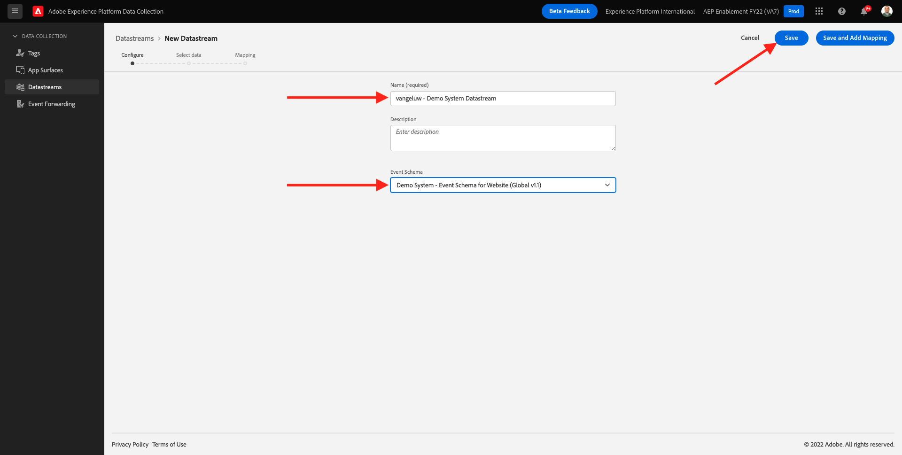
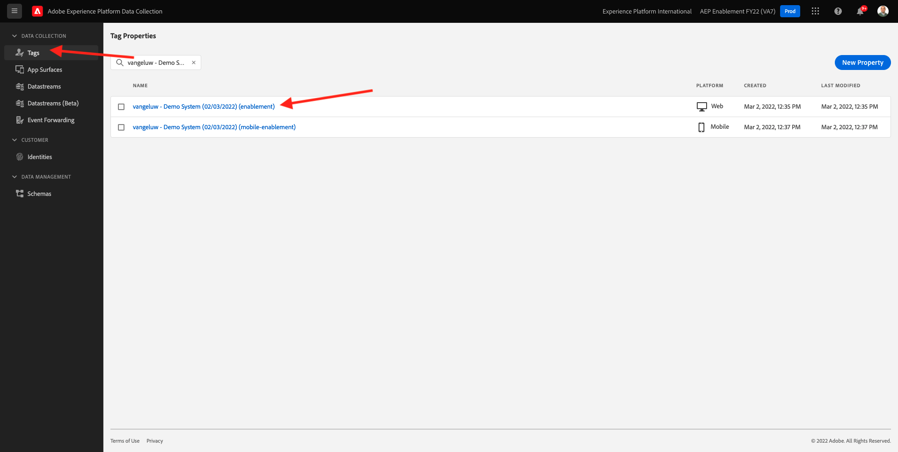
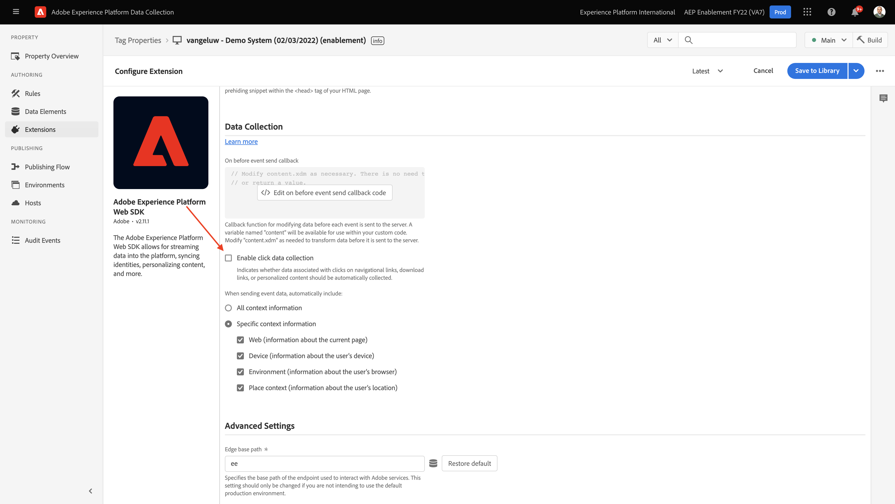
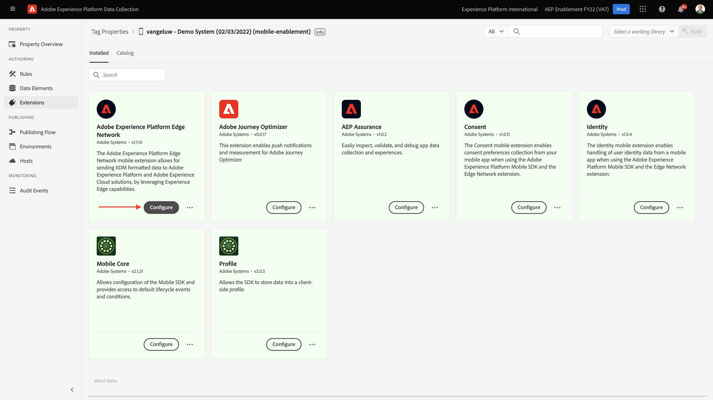

# 0.3 Skapa ditt datastream

Gå till [https://experience.adobe.com/#/data-collection/](https://experience.adobe.com/#/data-collection/). Efter föregående övning har du nu två datainsamlingsegenskaper: en för webben och en för mobilen.

Dessa egenskaper är nästan klara att användas, men innan du kan börja samla in data med dessa egenskaper måste du konfigurera en datastream. Du får mer information om vad ett datastream är och vad det betyder i Exercise 1.2.

Följ dessa steg tills vidare.

## 0.3.1 Skapa ditt datastream för webben

Klicka **[!UICONTROL Datastreams]** eller **[!UICONTROL Datastreams (beta)]**.

I skärmens övre högra hörn väljer du namnet på sandlådan, som bör vara `--aepSandboxId--`.

Klicka **[!UICONTROL Ny datastream]**.

För **[!UICONTROL Eget namn]** och för den valfria beskrivningen anger du `--demoProfileLdap-- - Demo System Datastream`. För händelseschema väljer du **Demonstrationssystem - händelseschema för webbplats (Global v1.1)**. Klicka **Spara**.

Du kommer då att se det här. Klicka **Lägg till tjänst**.

Välj tjänsten **[!UICONTROL Adobe Experience Platform]**, som visar ytterligare fält. Du kommer då att se det här.

För händelsedatauppsättning väljer du **Demo System - händelsedatauppsättning för webbplats (Global v1.1)** och för profildatauppsättning väljer du **Demonstrationssystem - profildatauppsättning för webbplats (Global v1.1)**. Klicka **Spara**.

Du kommer att se det här.

Det är allt för tillfället. I [Modul 1](./../module1/data-ingestion-launch-web-sdk.md) du får lära dig mer om Web SDK och hur du konfigurerar alla dess funktioner.

Klicka på i den vänstra menyn **[!UICONTROL Taggar]**.

Filtrera sökresultaten så att du kan se de två datainsamlingsegenskaperna. Öppna egenskapen för **Webb** genom att klicka på den.

Du kommer då att se det här. Klicka **Tillägg**.

På Adobe Experience Platform Web SDK-tillägget klickar du på **Konfigurera**.

Du kommer då att se det här. För **Datastreams** visas för närvarande ett värde som är 1. Nu måste du klicka på **Välj från lista** alternativknapp. I listrutan väljer du den dataström du skapade tidigare.

Se till att du har valt **Datastream**. TIPS: Du kan enkelt filtrera resultaten i listrutan genom att skriva `--demoProfileLdap--`.

Bläddra nedåt tills du ser **Datainsamling**. Kontrollera att kryssrutan för **Aktivera klickdatainsamling** är inte aktiverat. Klicka **Spara** för att spara ändringarna.

Gå till **Publiceringsflöde**.

Klicka på **...** for **Huvud** och sedan klicka **Redigera**.

Klicka **Lägg till alla ändrade resurser** och sedan klicka **Spara och bygg för utveckling**.

Ändringarna publiceras nu och är klara om några minuter.

## 0.3.2 Skapa ditt datastream för mobiler

Gå till [https://experience.adobe.com/#/data-collection/](https://experience.adobe.com/#/data-collection/).

Klicka **[!UICONTROL Datastreams]** eller **[!UICONTROL Datastreams (beta)]**.

I skärmens övre högra hörn väljer du namnet på sandlådan, som bör vara `--aepSandboxId--`.

Klicka **[!UICONTROL Ny datastream]**.

För **[!UICONTROL Eget namn]** och för den valfria beskrivningen anger du `--demoProfileLdap-- - Demo System Datastream (Mobile)`. För händelseschema väljer du **Demo System - händelseschema för mobilapp (Global v1.1)**. Klicka **Spara**.

Klicka **[!UICONTROL Spara]**.

Du kommer då att se det här. Klicka **Lägg till tjänst**.

Välj tjänsten **[!UICONTROL Adobe Experience Platform]**, som visar ytterligare fält. Du kommer då att se det här.

För händelsedatauppsättning väljer du **Demo System - händelsedatauppsättning för mobilapp (Global v1.1)** och för profildatauppsättning väljer du **Demo System - profildatauppsättning för mobilapp (Global v1.1)**. Klicka **Spara**.

Du kommer då att se det här.

Din datastream är nu klar att användas i din klientegenskap för Adobe Experience Platform Data Collection för mobilen.

Gå till **Taggar** och filtrera sökresultaten så att du kan se de två datainsamlingsegenskaperna. Öppna egenskapen för **Mobil** genom att klicka på den.

Du kommer då att se det här. Klicka **Tillägg**.

På **Adobe Experience Platform Edge Network** tillägg, klicka **Konfigurera**.

Du kommer då att se det här. Nu måste du välja rätt sandlåda och datastream som du precis konfigurerade. Sandlådan som ska användas är `--aepSandboxId--` och datastream anropas `--demoProfileLdap-- - Demo System Datastream (Mobile)`.

För **Edge Network-domän**, använd standarddomänen som är **edge.adobedc.net**.

Klicka **Spara** för att spara ändringarna.

Gå till **Publiceringsflöde**.

Klicka på **...** nästa **Huvud** och sedan klicka **Redigera**.

Klicka **Lägg till alla ändrade resurser** och sedan klicka **Spara och bygg för utveckling**.

Ändringarna publiceras nu och är klara om några minuter.

Nästa steg: [0.4 Använda webbplatsen](./ex4.md)

[Gå tillbaka till modul 0](./getting-started.md)

[Gå tillbaka till Alla moduler](./../../overview.md)