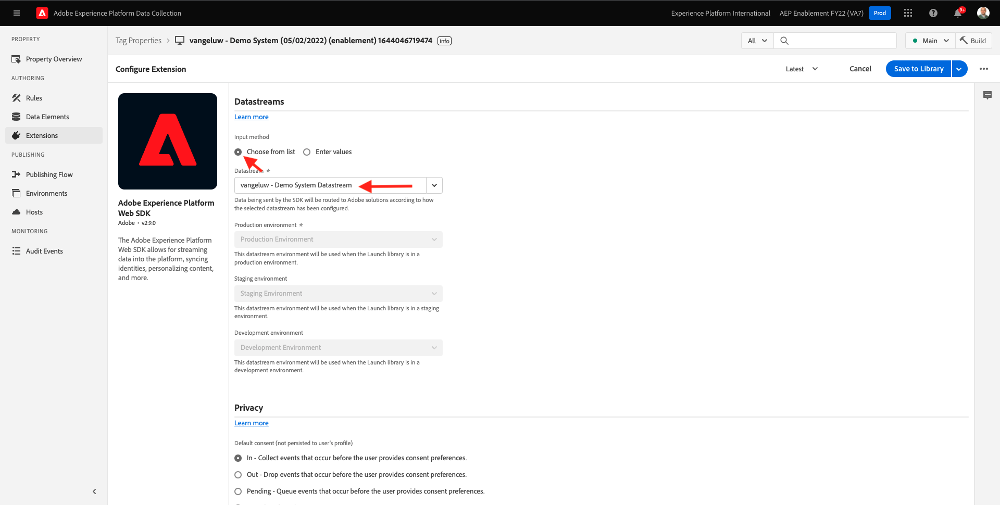
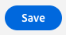
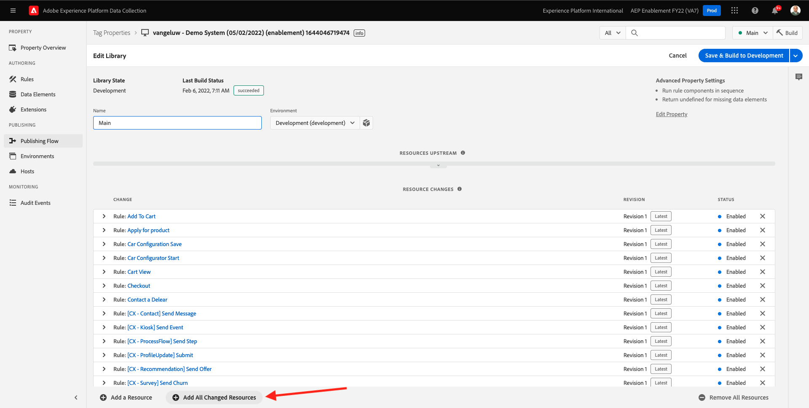

# 1.3 - Introduktion till Adobe Experience Platform Data Collection

## Kontext

Nu ska vi titta närmare på byggstenarna i Adobe Experience Platform Data Collection för att förstå vad som är installerat på demowebbplatsen. Du kommer att ha en närmare titt på Adobe Experience Platform Web SDK-tillägget, du konfigurerar ett dataelement och en regel och du får lära dig hur du publicerar ett bibliotek.

## 1.3.1 - Adobe Experience Platform Web SDK-tillägg

Ett tillägg är en paketerad uppsättning kod som utökar Adobe Experience Platform Data Collection-gränssnittet och biblioteksfunktionerna. Adobe Experience Platform Data Collection är plattformen och tillägg fungerar som appar som körs på plattformen. Alla tillägg som används i självstudiekursen skapas och hanteras av Adobe, men tredjepartsleverantörer kan skapa egna tillägg för att begränsa mängden anpassad kod som Adobe Experience Platform Data Collection-användare måste hantera.

Gå till [Adobe Experience Platform Data Collection](https://experience.adobe.com/launch/) och markera **Taggar**.

Det här är egenskapssidan för Adobe Experience Platform Data Collection som du såg tidigare.

I modul 0 skapade Demo System två klientegenskaper: en för webbplatsen och en för mobilappen. Hitta dem genom att söka efter `--demoProfileLdap--` i **[!UICONTROL Sök]** box.

Öppna **Webb** -egenskap.

Därefter visas sidan Egenskapsöversikt. Klicka på **[!UICONTROL Tillägg]** till vänster. Klicka på **[!UICONTROL Konfigurera]** under Adobe Experience Platform Web SDK Extension.

Välkommen till Adobe Experience Platform Web SDK! Här kan du konfigurera tillägget med datastream som du skapade i [Utövning 0.2](./../module0/ex2.md) samt lite mer avancerad konfiguration. Du kommer bara att konfigurera två inställningar för den här övningen.

StandardEdge-domänen är alltid **edge.adobedc.net**. Om du har implementerat en CNAME-konfiguration i din Adobe Experience Cloud- eller Adobe Experience Platform-miljö måste du uppdatera **[!UICONTROL Edge Domain]**. Din Adobe Experience Platform-instans använder den här Edge-domänen: `--webSdkEdgeDomain--`.

Om Edge Domain är en annan för din instans än standarddomänen uppdaterar du Edge Domain. Med en edge-domän kan du konfigurera en första part-spårningsserver, som sedan använder en CNAME-konfiguration i serverdelen för att säkerställa att data samlas in i Adobe.

Se till att **[!UICONTROL Välj från lista]** alternativknappen är markerad under **[!UICONTROL Datastreams]** och välj det datastream som har namnet: `--demoProfileLdap-- - Demo System Datastream`, från listan i **[!UICONTROL Datastream]** box.

Klicka **[!UICONTROL Spara]** för att gå tillbaka till vyn Tillägg.

## 1.3.2 Dataelement

Dataelement är byggstenarna för dataordlistan (eller datamappningen). Använd dataelement för att samla in, ordna och leverera data över marknadsförings- och annonseringsteknologier.

Ett enskilt dataelement är en variabel vars värde kan mappas till frågesträngar, URL:er, cookie-värden, JavaScript-variabler och så vidare. Du kan referera till det här värdet genom dess variabelnamn i Adobe Experience Platform Data Collection. Den här samlingen dataelement blir en ordbok med definierade data som du kan använda för att skapa regler (händelser, villkor och åtgärder). Den här dataordlistan delas av alla Adobe Experience Platform Data Collection för användning med alla tillägg som du har lagt till i din egenskap.

Du kommer nu att redigera ett befintligt dataelement i ett Web SDK-anpassat format.

Klicka på Dataelement i den vänstra listen för att gå till sidan Dataelement.

>[!NOTE]
>
>Du redigerar bara ett dataelement i den här övningen, men du kan se **[!UICONTROL Lägg till dataelement]** på den här sidan, som skulle användas för att lägga till en ny variabel i dataordlistan. Detta kan sedan användas i hela Adobe Experience Platform Data Collection. Se gärna vilka andra dataelement som redan finns, huvudsakligen med lokal lagring som datakälla.

Skriv i sökfältet **XDM - produktvy** och klicka på det dataelement som returneras.

På den här skärmen visas XDM-objektet som du ska redigera. Experience Data Model (XDM) är ett koncept som kommer att utforskas mycket mer i den här tekniska självstudiekursen, men för närvarande räcker det att förstå att det är det format som Adobe Experience Platform Web SDK kräver. Du kommer att lägga till lite mer information till de data som samlas in på artikelsidorna på demowebbplatsen.

Klicka på plusknappen bredvid **webb** längst ned i trädet.

Klicka på plusknappen bredvid **webPageDetails**.

Klicka på **siteSection**. Nu ser du det **siteSection** är inte länkad till något dataelement än. Låt oss ändra på det.

Rulla uppåt och ange texten `%Product Category%`. Klicka **[!UICONTROL Spara]**.

Nu är Adobe Experience Platform Web SDK Extension installerat och du har uppdaterat ett dataelement för att samla in data mot en XDM-struktur. Nu ska vi kontrollera reglerna som skickar data vid rätt tidpunkt.

## 1.3.3 Regler

Adobe Experience Platform Data Collection är ett regelbaserat system. Den söker efter användarinteraktion och associerade data. När villkoren som beskrivs i reglerna är uppfyllda utlöser regeln det tillägg, skript eller den klientkod som du identifierade.

Bygg regler för att integrera data och funktionalitet i marknadsförings- och annonseringsteknologier som förenar olika produkter i en enda lösning.

Låt oss dela upp regeln som skickar data på artikelsidor.

Klicka på **[!UICONTROL Regler]** till vänster.

**[!UICONTROL Sök]** for `Product View`.

Klicka på regeln som returneras.

Låt oss titta på de enskilda elementen som utgör den här regeln. För alla regler Om en angiven **[!UICONTROL Händelse]** inträffar, **[!UICONTROL Villkor]** utvärderas, sedan anges **[!UICONTROL Åtgärder]** äger rum vid behov.

Klicka på händelsen **Anpassad händelse - produktvy**. Det här är vyn som läses in.

Klicka på **Händelsetyp** nedrullningsbar meny.

Här visas några av de standardinteraktioner som du kan använda för att signalera till Adobe Experience Platform Data Collection att köra åtgärderna om villkoren är uppfyllda.

Klicka **[!UICONTROL Avbryt]** för att gå tillbaka till regeln.

Klicka på åtgärden **Skicka &quot;Product View&quot;-händelse till AEP**.

Här ser du de data som skickas till Adobe Edge av Adobe Experience Platform Web SDK. Mer specifikt använder du **legering** **[!UICONTROL Instance]** för Web SDK. Konfigurera en annan **[!UICONTROL Instance]** skulle kunna möjliggöra att olika datastreams används, bland annat. Du har angett händelsen **[!UICONTROL Typ]** som **commerce.productViews** och de XDM-data du skickar är **XDM - produktvy** dataelement som du ändrade tidigare.

Nu när du har tittat på regeln kan du publicera alla ändringar i Adobe Experience Platform Data Collection.

## 1.3.4 Publicera i ett bibliotek

Slutligen, för att kunna validera regeln och dataelementet som du just har uppdaterat måste du publicera ett bibliotek som innehåller de redigerade objekten i vår egenskap. Här följer några snabba steg i **[!UICONTROL Publicering]** i Adobe Experience Platform Data Collection.

Klicka **[!UICONTROL Publiceringsflöde]** i den vänstra navigeringen

Klicka på det befintliga biblioteket, kallat **Huvud**.

Klicka på **Lägg till alla ändrade resurser** -knappen.

Bläddra nedåt för att se de flesta resurserna förbli som **Revision 1 (senaste)** men de två vi har ändrat - **Dataelement: ruleArticlePages** och **Tillägg: Adobe Experience Platform Web SDK** markeras med bara **Senaste**.

Klicka på **Spara och bygg för utveckling** -knappen.

Det kan ta några minuter att skapa biblioteket och när det är klart visas en grön punkt till vänster om biblioteksnamnet.

Som du ser på skärmen Publiceringsflöde finns det mycket mer att göra med publiceringsprocessen i Adobe Experience Platform Data Collection som ligger utanför kursens räckvidd. Vi kommer bara att använda ett enda bibliotek i vår utvecklingsmiljö.

Nästa steg: [1.4 Webbdatainsamling på klientsidan](./ex4.md)

[Gå tillbaka till modul 1](./data-ingestion-launch-web-sdk.md)

[Gå tillbaka till Alla moduler](./../../overview.md)
