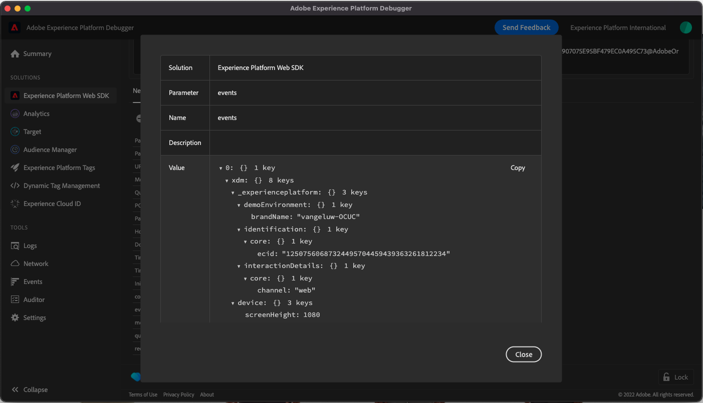

# 1.4 Webbdatainsamling på klientsidan

## 1.4.1 Validera data i begäran

### Installera Adobe Experience Platform Debugger

Felsökaren Experience Platform är ett tillägg för webbläsarna Chrome och Firefox som gör att du kan se Adobe-tekniken som används på dina webbsidor. Ladda ned den version du föredrar:

- [Firefox-tillägg](https://addons.mozilla.org/en-US/firefox/addon/adobe-experience-platform-dbg/)

- [Kromtillägg](https://chrome.google.com/webstore/detail/adobe-experience-platform/bfnnokhpnncpkdmbokanobigaccjkpob)

Om du aldrig har använt Felsökning tidigare - och den här är en annan än den tidigare Adobe Experience Cloud Debugger - kan du titta på den här fem minuter långa översiktsvideon:

>[!VIDEO](https://video.tv.adobe.com/v/32156?quality=12&learn=on)

Eftersom du läser in demowebbplatsen i inkognito-läge måste du se till att Experience Platform Debugger även är tillgänglig i inkognito-läge. Om du vill göra det går du till **chrome://extensions** i webbläsaren och öppna felsökningstillägget Experience Platform.

Kontrollera att dessa två inställningar är aktiverade:

- Utvecklarläge
- Tillåt inkognitiv

### Öppna demowebbplatsen

Gå till [https://builder.adobedemo.com/projects](https://builder.adobedemo.com/projects). När du har loggat in med din Adobe ID ser du det här. Klicka på webbplatsprojektet för att öppna det.

På **Skärmar** sida, klicka **Kör**.

Du kommer då att se din demowebbplats öppnas. Markera URL-adressen och kopiera den till Urklipp.

Öppna ett nytt inkognito-webbläsarfönster.

Klistra in webbadressen till demowebbplatsen, som du kopierade i föregående steg. Du ombeds sedan logga in med din Adobe ID.

Välj kontotyp och slutför inloggningsprocessen.

Därefter visas webbplatsen i ett inkognitivt webbläsarfönster. För varje demonstration måste du använda ett nytt, inkognitivt webbläsarfönster för att läsa in webbadressen till demowebbplatsen.

### Använd Experience Platform Debugger för att se anropen till Edge

Kontrollera att demowebbplatsen är öppen och klicka på Experience Platform-ikonen för felsökningstillägget.

Felsökaren öppnas och visar information om implementeringen som har skapats i Adobe Experience Platform Data Collection Property. Kom ihåg att du felsöker tillägget och reglerna som du just har redigerat.

Klicka på **[!UICONTROL Logga in]** till höger om du vill autentisera. Om du redan har en webbläsarflik öppen med Adobe Experience Platform Data Collection-gränssnittet kommer autentiseringssteget att vara automatiskt och du behöver inte ange ditt användarnamn och lösenord igen.

Klicka på knappen för att ladda om på demowebbplatsen för att ansluta felsökaren till den specifika fliken.

Bekräfta att felsökaren är **[!UICONTROL Ansluten till startsidan]** enligt bilden ovan och klicka sedan på **[!UICONTROL lock]** om du vill låsa felsökaren till demowebbplatsen. Om du inte gör detta fortsätter felsökaren att växla för att visa implementeringsinformationen på den webbläsarflik som är i fokus, vilket kan vara förvirrande.

Gå sedan till valfri sida på demowebbplatsen, till exempel **Män** kategorisida.

Klicka nu **[!UICONTROL Experience Platform Web SDK]** i den vänstra navigeringen för att se **[!UICONTROL Nätverksförfrågningar]**.

Varje begäran innehåller **[!UICONTROL händelser]** rad.

Klicka för att öppna **[!UICONTROL händelser]** rad. Observera hur du kan se **web.webpagedetails.pageViews** -händelsen samt andra variabler som inte är installerade enligt **Web SDK ExperienceEvent XDM** format.

Den här typen av förfrågningsinformation visas också på fliken Nätverk. Filtrera förfrågningar med **interagera** för att hitta begäranden som skickas av Web SDK. Du hittar all information om XDM-nyttolasten i Request Payload Headers:

Nästa steg: [1.5 Implementera Adobe Analytics och Adobe Audience Manager](./ex5.md)

[Gå tillbaka till modul 1](./data-ingestion-launch-web-sdk.md)

[Gå tillbaka till Alla moduler](./../../overview.md)
