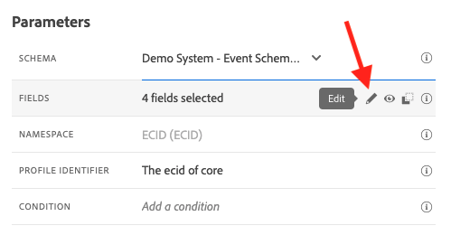
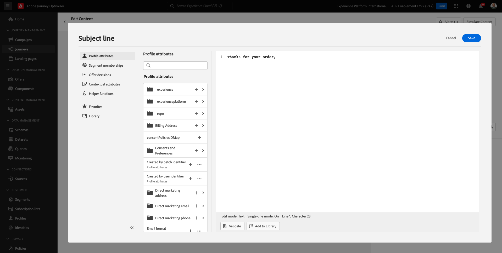
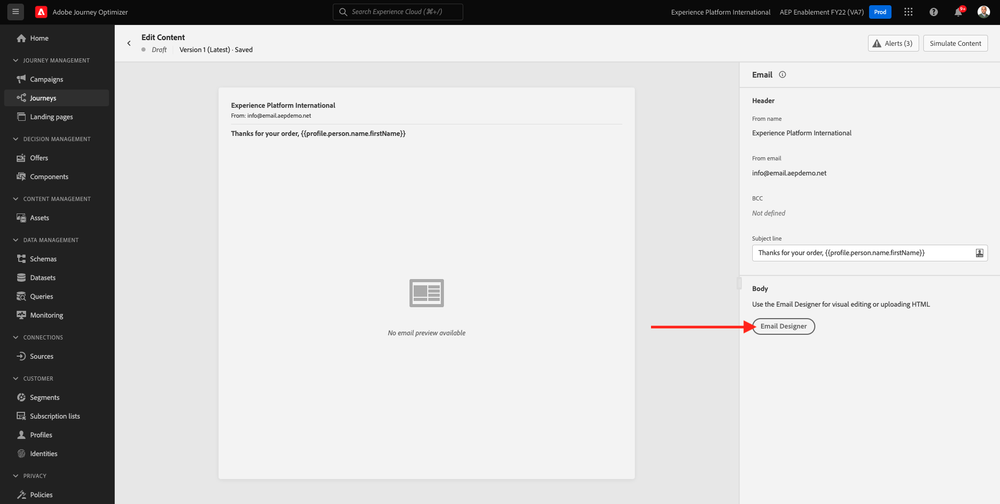
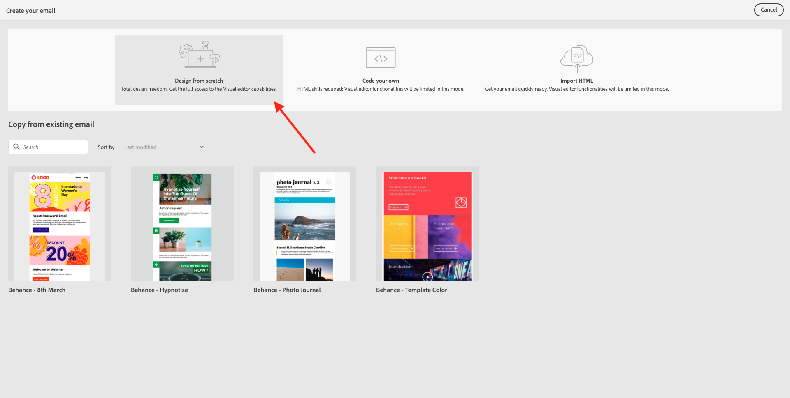
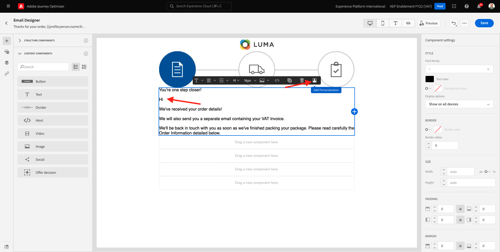
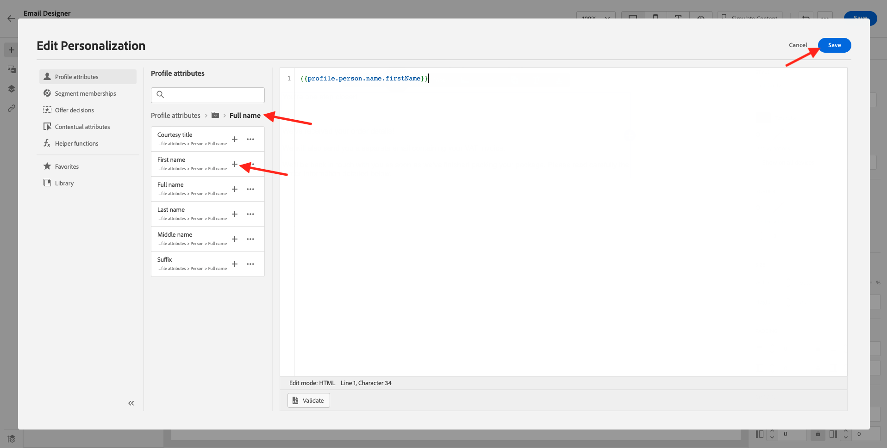
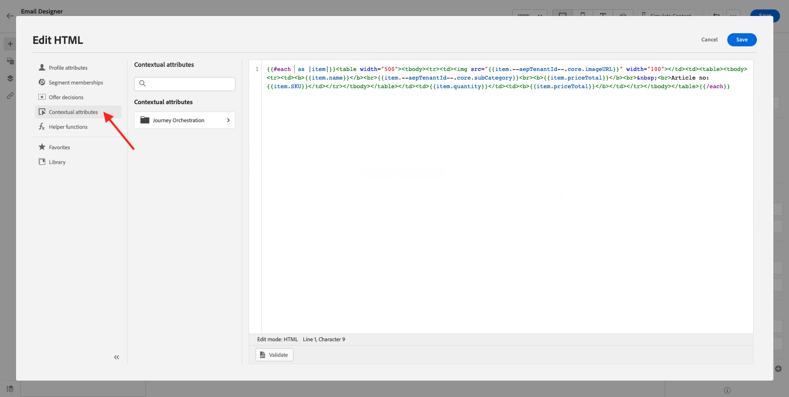
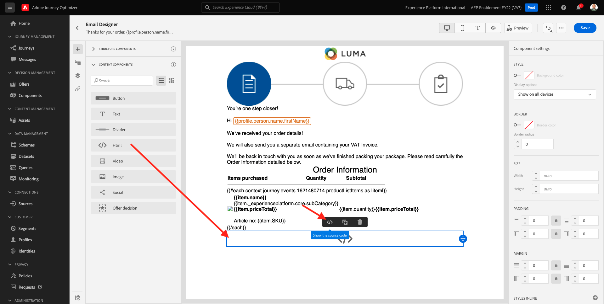
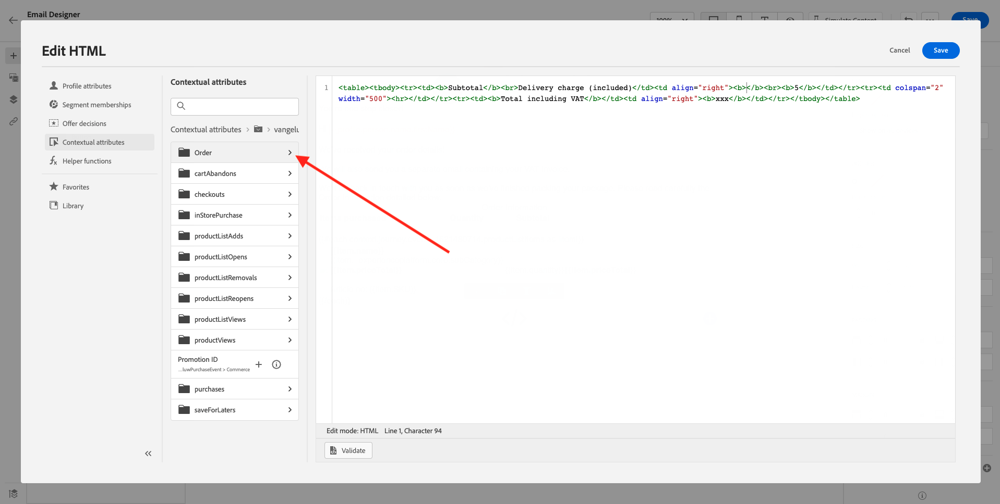

# 10.1 Konfigurera en utlösarbaserad resa - orderbekräftelse

Logga in på Adobe Journey Optimizer genom att gå till [Adobe Experience Cloud](https://experience.adobe.com). Klicka **Journey Optimizer**.


Du omdirigeras till **Startsida**  i Journey Optimizer. Kontrollera först att du använder rätt sandlåda. Sandlådan som ska användas anropas `--aepSandboxId--`. Om du vill ändra från en sandlåda till en annan klickar du på **PRODUKTIONSprodukt (VA7)** och välj sandlådan i listan. I det här exemplet heter sandlådan **AEP-aktivering FY22**. Då är du i **Startsida** vy över din sandlåda `--aepSandboxId--`.


## 10.1.1 Skapa din aktivitet

Gå till menyn **Konfigurationer** och klicka **Hantera** under **Händelser**.


På **Händelser** visas en liknande vy. Klicka **Skapa händelse**.


Därefter visas en tom händelsekonfiguration.


Först och främst ger du evenemanget ett namn som detta: `--demoProfileLdap--PurchaseEvent`och lägg till en beskrivning enligt följande: `Purchase Event`.


Nästa är **Händelsetyp** markering. Välj **Unitary**.


Nästa är **Typ av händelse-ID** markering. Välj **Systemgenererat**


Nästa steg är schemavalet. Ett schema förbereddes för den här övningen. Använd schemat `Demo System - Event Schema for Website (Global v1.1) v.1`.


När du har valt schemat visas ett antal fält i **Nyttolast** -avsnitt. Klicka på **Redigera/Penna** om du vill lägga till fler fält till den här händelsen.



Du kommer då att se den här popup-rutan. Du måste nu markera ytterligare kryssrutor för att få tillgång till ytterligare data när den här händelsen aktiveras.


Först markerar du kryssrutan på raden `--aepTenantId--`.


Bläddra nedåt och markera kryssrutan på raden `productListItems`.


Bläddra nedåt och markera kryssrutan på raden `commerce`.


Klicka på **OK**.

Därefter ser du att fler fält har lagts till i händelsen. Klicka **Spara**.


Din nya aktivitet delas sedan och du ser din aktivitet i listan över tillgängliga händelser nu.

Klicka på aktiviteten igen för att öppna **Redigera händelse** skärm igen.
Hovra över **Nyttolast** om du vill visa de tre ikonerna igen. Klicka på **Visa nyttolast** ikon.


Nu visas ett exempel på den förväntade nyttolasten. Händelsen har ett unikt ID för Orchestration-händelse som du kan hitta genom att rulla nedåt i nyttolasten tills du ser `_experience.campaign.orchestration.eventID`.


Händelse-ID är det som måste skickas till Adobe Journey Optimizer för att utlösa den resa som du bygger i nästa steg. Skriv ned detta eventID, som du behöver i ett av de följande stegen.
`"eventID": "ef6dd943c94fe1b4763c098ccd1772344662f2a9f614513106cb5ada8be36857"`

Klicka **OK**, följt av **Avbryt**.

Händelsen är nu konfigurerad och klar att användas.

## 10.1.2 Skapa din resa

Gå till menyn **Resor** och klicka **Skapa resa**.


Du kommer då att se det här. Ge resan ett namn. Använd `--demoProfileLdap-- - Order Confirmation journey`. Klicka **OK**.


Först måste du lägga till din händelse som startpunkt för din resa. Sök efter din aktivitet `--demoProfileLdap--PurchaseEvent` och dra och släpp det på arbetsytan. Klicka **OK**.


Nästa, under **Åtgärder**, sök efter **E-post** och lägg till det på arbetsytan.


Ange **Kategori** till **Marknadsföring** och välj en e-postyta som gör att du kan skicka e-post. I det här fallet är e-postytan som ska väljas **E-post**. Se till att kryssrutorna för **Klicka på e-post** och **e-post öppnas** båda är aktiverade.


Nästa steg är att skapa ett meddelande. Det gör du genom att klicka **Redigera innehåll**.


Nu ser du det här. Klicka på **Subject line** textfält.


Börja skriva i textområdet **Tack för din beställning,**



Ämnesraden är inte färdig än. Därefter måste du ta in en personaliseringstoken för fältet **Förnamn** som lagras under `profile.person.name.firstName`. Bläddra nedåt i den vänstra menyn för att hitta **Person** > **Fullständigt namn** >  **Förnamn** och klicka på **+** om du vill lägga till en personaliseringstoken på ämnesraden. Klicka **Spara**.


Du kommer då tillbaka hit. Klicka **E-postdesigner** för att skapa e-postens innehåll.



På nästa skärm klickar du på **Designa från grunden**.



På den vänstra menyn hittar du de strukturkomponenter som du kan använda för att definiera e-postmeddelandets struktur (rader och kolumner).

Dra och släpp 8 gånger **1:1-kolumn** på arbetsytan, som bör ge dig följande:


Gå till **Innehållskomponenter**.


Dra och släpp en **Bild** -komponenten på första raden. Klicka **Bläddra**.


Gå till mappen **enablement-assets** markerar du filen **luma-logo.png** och klicka **Välj**.


Du är nu tillbaka här. Klicka på bilden för att markera den och använd sedan **Storlek** för att göra logotypbilden lite mindre.


Gå till **Innehållskomponenter** och dra och släppa **Bild** -komponenten på den andra raden. Välj **Bildkomponent** men klicka inte på Bläddra.


Klistra in bildens URL-adress i fältet **Källa**: `https://parsefiles.back4app.com/hgJBdVOS2eff03JCn6qXXOxT5jJFzialLAHJixD9/29043bedcde632a9cbe8a02a164189c9_preparing.png`. Den här bilden ligger utanför Adobe.


När du ändrar omfånget till ett annat fält återges bilden och du ser detta:


Nästa, gå till **Innehållskomponenter** och dra och släppa **Text** -komponenten på den tredje raden.


Markera standardtexten i den komponenten **Skriv texten här.** och ersätta den med texten nedan:

```javascript
You’re one step closer!

Hi 

We've received your order details!

We will also send you a separate email containing your VAT Invoice.

We'll be back in touch with you as soon as we've finished packing your package. Please read carefully the Order Information detailed below.
```


Placera markören bredvid texten **Hej** och klicka **Lägg till personalisering**.



Navigera till **Person** > **Fullständigt namn** > **Förnamn** och klicka på **+** om du vill lägga till en personaliseringstoken på ämnesraden. Klicka **Spara**.



Då ser du det här:


Nästa, gå till **Innehållskomponenter** och dra och släppa **Text** på fjärde raden.


Markera standardtexten i den komponenten **Skriv texten här.** och ersätta den med texten nedan:

`Order Information`

Ändra teckenstorleken till **26px** och centrera texten i den här cellen. Då får du den här:


Nästa, gå till **Innehållskomponenter** och dra och släppa **HTML** på femte raden. Klicka på komponenten HTML och sedan på **Visa källkoden**.


I **Redigera HTML** popup, klistra in HTML:

```<table><tbody><tr><td><b>Items purchased</b></td><td></td><td><b>Quantity</b></td><td><b>Subtotal</b></td></tr><tr><td colspan="4" width="500"><hr></td></tr></tbody></table>```

Klicka **Spara**.


Du får den här då. Klicka **Spara** för att spara förloppet.


Gå till **Innehållskomponenter** och dra och släppa **HTML** på sjätte raden. Klicka på komponenten HTML och sedan på **Visa källkoden**.


I **Redigera HTML** popup, klistra in HTML:

```{{#each xxx as |item|}}<table width="500"><tbody><tr><td></td><td><table><tbody><tr><td><b>{{item.name}}</b><br>{{item.--aepTenantId--.core.subCategory}}<br><b>{{item.priceTotal}}</b><br>&nbsp;<br>Article no: {{item.SKU}}</td></tr></tbody></table></td><td>{{item.quantity}}</td><td><b>{{item.priceTotal}}</b></td></tr></tbody></table>{{/each}}```

Då får du den här:


Nu måste du ersätta **xxx** med en referens till objektet productListItems som är en del av händelsen som utlöser resan.


Först, ta bort **xxx** i HTML-koden först.


Klicka på **Sammanhangsberoende attribut**. Det här sammanhanget skickas till meddelandet från resan.



Du kommer då att se det här. Klicka på pilen bredvid **Journey Orchestration** fördjupa dig.


Klicka på pilen bredvid **Händelser** fördjupa dig.


Klicka på pilen bredvid `--demoProfileLdap--PurchaseEvent` fördjupa dig.


Klicka på pilen bredvid **productListItems** fördjupa dig.


Klicka på **+** ikon bredvid **Namn** för att lägga till den på arbetsytan. Du får den här då. Du måste nu välja  **.name** som anges i skärmbilden nedan och sedan bör du ta bort **.name**.


Du får den här då. Klicka **Spara**.


Du är tillbaka i e-postdesignern nu. Klicka **Spara** för att spara förloppet.


Nästa, gå till **Innehållskomponenter** och dra och släppa **HTML** på den sjunde raden. Klicka på komponenten HTML och sedan på **Visa källkoden**.



I **Redigera HTML** popup, klistra in HTML:

```<table><tbody><tr><td><b>Subtotal</b><br>Delivery charge (included)</td><td align="right"><b>xxx</b><br><b>5</b></td></tr><tr><td colspan="2" width="500"><hr></td></tr><tr><td><b>Total including VAT</b></td><td align="right"><b>xxx</b></td></tr></tbody></table>```

Det finns två referenser till **xxx** i den här HTML-koden. Nu måste du ersätta varje **xxx** med en referens till objektet productListItems som är en del av händelsen som utlöser resan.


Ta först bort den första **xxx** i HTML-koden.


Klicka på **Sammanhangsberoende attribut**.


Klicka på pilen bredvid **Journey Orchestration** fördjupa dig.


Klicka på pilen bredvid **Händelser** fördjupa dig.


Klicka på pilen bredvid `--demoProfileLdap--PurchaseEvent` fördjupa dig.


Klicka på pilen bredvid **Handel** fördjupa dig.


Klicka på pilen bredvid **Order** fördjupa dig.



Klicka på **+** ikon bredvid **Prissumma** för att lägga till den på arbetsytan.


Du får den här då. Ta bort den andra **xxx** i HTML-koden.


Klicka på **+** ikon bredvid **Prissumma** igen för att lägga till den på arbetsytan.


Du kan också lägga till fältet **Valuta** inifrån **Order** på arbetsytan, som du ser här.
När du är klar klickar du på **Spara** för att spara ändringarna.


Du kommer sedan tillbaka till e-postdesignern. Klicka **Spara** igen.


Gå tillbaka till meddelandekontrollpanelen genom att klicka på **pil** bredvid texten på ämnesraden i det övre vänstra hörnet.


Klicka på pilen i det övre vänstra hörnet för att gå tillbaka till din resa.


Klicka **OK** för att stänga e-poståtgärden.


Klicka **Publicera** för att publicera din resa.


Klicka **Publicera** igen.


Din resa är nu publicerad.


## 10.1.5 Uppdatera klientegenskapen för Adobe Experience Platform Data Collection

Gå till [Adobe Experience Platform Data Collection](https://experience.adobe.com/launch/) och markera **Taggar**.

Det här är egenskapssidan för Adobe Experience Platform Data Collection som du såg tidigare.


I modul 0 skapade Demo System två klientegenskaper: en för webbplatsen och en för mobilappen. Hitta dem genom att söka efter `--demoProfileLdap--` i **[!UICONTROL Sök]** box. Klicka för att öppna **Webb** -egenskap.


Gå till **Dataelement**. Söka efter och öppna dataelementet **XDM - Inköp**.


Du kommer då att se det här. Navigera till fältet **_experience.campaign.orchestration.eventID** och fyll i ditt eventID här. Det eventID som ska fyllas i här är det eventID som du skapade som en del av övning 10.1.2. Klicka **Spara** eller **Spara i bibliotek**.


Spara ändringarna i din klientegenskap och publicera sedan ändringarna genom att uppdatera ditt utvecklingsbibliotek.


Ändringarna är nu distribuerade och kan testas.

## 10.1.6 Testa e-postmeddelandet med orderbekräftelsen på demowebbplatsen

Låt oss testa den uppdaterade resan genom att köpa en produkt på demowebbplatsen.

Gå till [https://builder.adobedemo.com/projects](https://builder.adobedemo.com/projects). När du har loggat in med din Adobe ID ser du det här. Klicka på webbplatsprojektet för att öppna det.


På **Skärmar** sida, klicka **Kör**.


Du kommer då att se din demowebbplats öppnas. Markera URL-adressen och kopiera den till Urklipp.


Öppna ett nytt inkognito-webbläsarfönster.


Klistra in webbadressen till demowebbplatsen, som du kopierade i föregående steg. Du ombeds sedan logga in med din Adobe ID.


Välj kontotyp och slutför inloggningsprocessen.


Därefter visas webbplatsen i ett inkognitivt webbläsarfönster. För varje demonstration måste du använda ett nytt, inkognitivt webbläsarfönster för att läsa in webbadressen till demowebbplatsen.


Klicka på logotypikonen för Adobe i det övre vänstra hörnet av skärmen för att öppna profilvisningsprogrammet.


Ta en titt på panelen Profilvisningsprogram och kundprofilen i realtid med **Experience Cloud ID** som primär identifierare för den här okända kunden.


Gå till sidan Register/Login. Klicka **SKAPA ETT KONTO**.


Fyll i detaljerna och klicka **Registrera** därefter omdirigeras du till föregående sida.


Lägg valfri produkt i kundvagnen och gå till **Kundvagn** sida. Klicka **Gå till kassan**.


Verifiera sedan fälten på utcheckningssidan och klicka på **Utcheckning**.


Du får sedan en orderbekräftelse via e-post inom några sekunder.


Du har gjort klart den här övningen.

Nästa steg: [10.2 Konfigurera en batchbaserad nyhetsbrevsresa](./ex2.md)

[Gå tillbaka till modul 10](./journeyoptimizer.md)

[Gå tillbaka till Alla moduler](../../overview.md)
