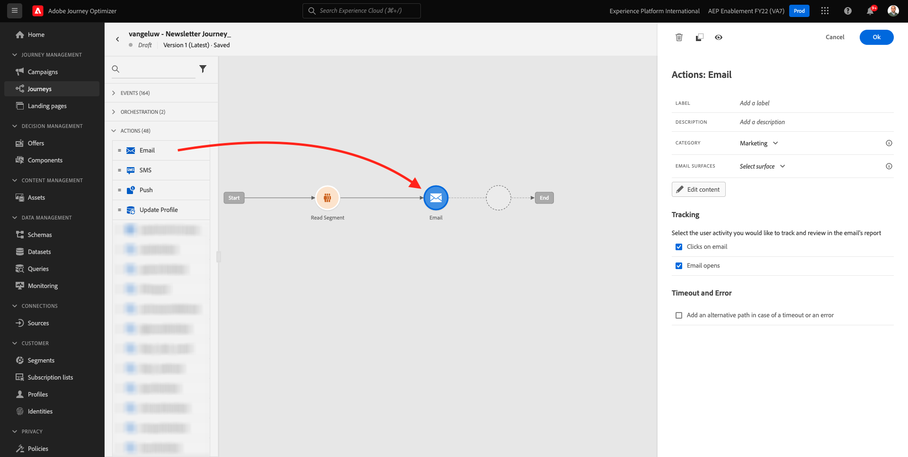

# 10.2 Konfigurera en batchbaserad nyhetsbrevsresa

Logga in på Adobe Journey Optimizer genom att gå till [Adobe Experience Cloud](https://experience.adobe.com). Klicka **Journey Optimizer**.

Du omdirigeras till **Startsida**  i Journey Optimizer. Kontrollera först att du använder rätt sandlåda. Sandlådan som ska användas anropas `--aepSandboxId--`. Om du vill ändra från en sandlåda till en annan klickar du på **PRODUKTIONSprodukt (VA7)** och välj sandlådan i listan. I det här exemplet heter sandlådan **AEP-aktivering FY22**. Då är du i **Startsida** vy över din sandlåda `--aepSandboxId--`.

## 10.2.1 Skapa nyhetsbrev

Nu kan du skapa en gruppbaserad resa. Till skillnad från den händelsebaserade resan i den föregående övningen som bygger på inkommande upplevelsehändelser eller segmentposter eller utträden för att utlösa en resa för en viss kund, riktar sig batchbaserade resor till ett helt segment med unikt innehåll som nyhetsbrev, engångskampanjer eller allmän information eller regelbundet med liknande innehåll som skickas regelbundet, till exempel födelsedagskampanjer och påminnelser.

Gå till menyn **Resor** och klicka **Skapa resa**.

Till höger ser du ett formulär där du måste ange resans namn och beskrivning. Ange följande värden:

- **Namn**: `--demoProfileLdap-- - Newsletter Journey`. Till exempel: **vangeluw - Newsletter Journey**.
- **Beskrivning**: Månatligt nyhetsbrev

Klicka **OK**.

Under **Orchestration**, dra och släppa **Läs segment** på arbetsytan. Det innebär att resan, när den har publicerats, börjar med att hämta hela segmentets målgrupp, som sedan blir målgrupp för resan och budskapet. Klicka **Markera ett segment**.

I **Välj ett segment** popup, sök efter din ldap och välj det segment du skapade i [Modul 6 - CDP i realtid - Bygg ett segment och vidta åtgärder](../module6/real-time-cdp-build-a-segment-take-action.md) namngiven `--demoProfileLdap-- - Interest in PROTEUS FITNESS JACKSHIRT`. till exempel: vangeluw - Intresse för PROTEUS FITNESS JACKSHIRT. Klicka **Spara**.

Klicka **OK**.

I den vänstra menyn hittar du **Åtgärder** och dra och släppa **E-post** på arbetsytan.

Ange **Kategori** till **Marknadsföring** och välj en e-postyta som gör att du kan skicka e-post. I det här fallet är e-postytan som ska väljas **E-post**. Se till att kryssrutorna för **Klicka på e-post** och **e-post öppnas** båda är aktiverade.

Nästa steg är att skapa ett meddelande. Det gör du genom att klicka **Redigera innehåll**.

Nu ser du det här. Klicka på **Subject line** textfält.

Ange den här texten för ämnesraden: `Luma Newsletter - your monthly update has arrived.`. Klicka **Spara**.

Du kommer då tillbaka hit. Klicka **E-postdesigner** för att börja skapa e-postinnehållet.

Du kommer då att se det här. Klicka **Importera HTML**.

På popup-skärmen måste du dra och släppa HTML-filen i e-postmeddelandet. Du hittar mallen HTML [här](../../assets/html/ajo-newsletter.html.zip). Ladda ned zip-filen med HTML-mallen till den lokala datorn och packa upp den på skrivbordet.

Dra och släpp filen **ajo-newsletter.html** för att ladda upp den i Journey Optimizer. Klicka **Importera**.

Det här e-postinnehållet är klart att användas eftersom det har all förväntad personalisering, bilder och text. Endast platshållaren för erbjudandet är tom.

Du kan få ett felmeddelande: **Fel vid försök att hämta resurser**. Det här är länkat till bilden i e-postmeddelandet.

Om du får det här felet markerar du bilden och klickar på **Redigera bild** -knappen.

Klicka **Assets Essentials** för att gå tillbaka till ditt AEM Assets Essentials-bibliotek.

Du kommer då att se den här popup-rutan. Navigera till mappen **enablement-assets** och markera bilden **luma-newsletterContent.png**. Klicka **Välj**.

Ditt enkla nyhetsbrev är nu klart. Klicka **Spara**.

Gå tillbaka till meddelandekontrollpanelen genom att klicka på **pil** bredvid texten på ämnesraden i det övre vänstra hörnet.

Klicka på pilen i det övre vänstra hörnet för att gå tillbaka till din resa.

Klicka **OK** för att stänga e-poståtgärden.

Din nyhetsbrevsresa är nu klar att publiceras. Lägg märke till att **Schema** där du kan växla den här resan från att vara en engångskampanj till en återkommande kampanj. Klicka på **Schema** -knappen.

Du kommer då att se det här. Välj **En gång**.

Välj ett datum och en tid inom en timme så att du kan testa din resa. Klicka **OK**.

>[!NOTE]
>
>Datum och tid för sändning av meddelande måste vara inom mer än en timme.

Klicka **Publicera**.

Klicka **Publicera** igen.

Din grundläggande nyhetsbrevsresa är nu publicerad. E-postmeddelandet med nyhetsbrevet skickas så som du har definierat det i ditt schema, och din resa stoppas så fort som det senaste e-postmeddelandet har skickats.

Du har gjort klart den här övningen.

Nästa steg: [10.3 Använda personalisering i ett e-postmeddelande](./ex3.md)

[Gå tillbaka till modul 10](./journeyoptimizer.md)

[Gå tillbaka till Alla moduler](../../overview.md)
