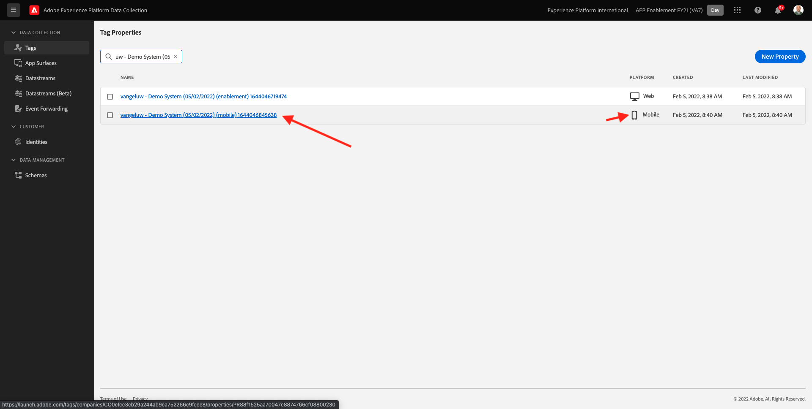
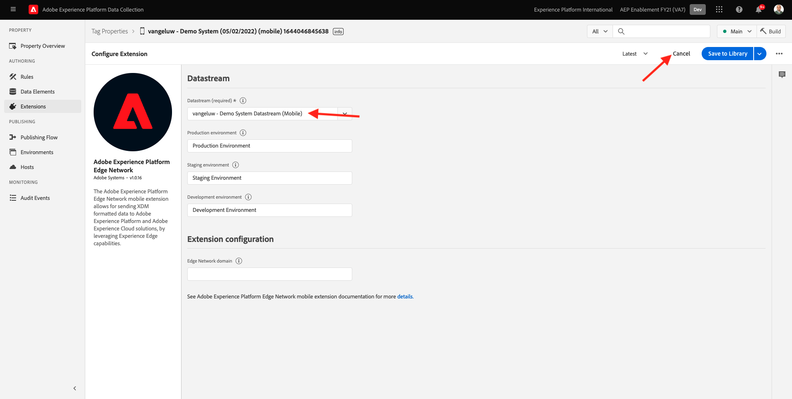
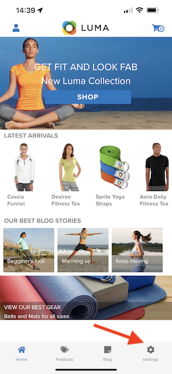
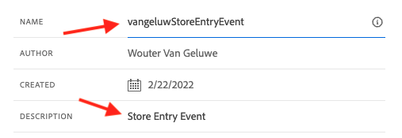
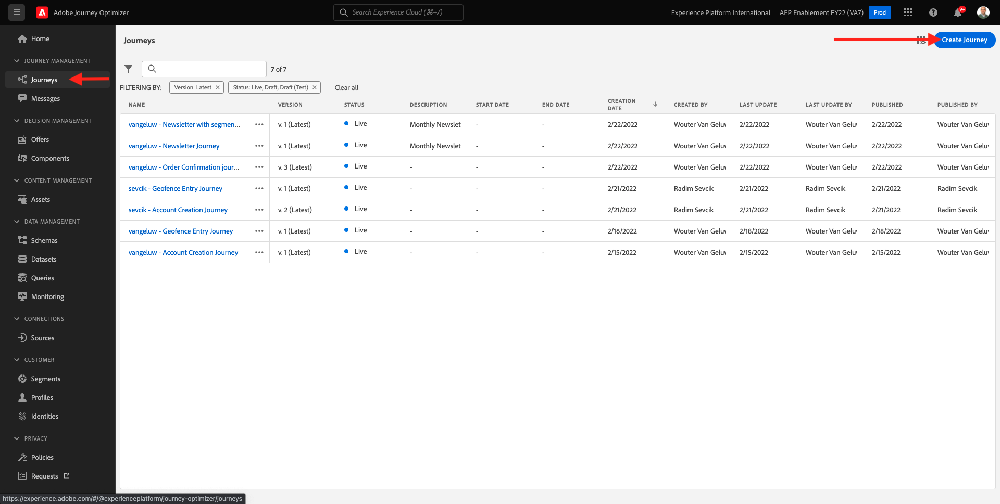
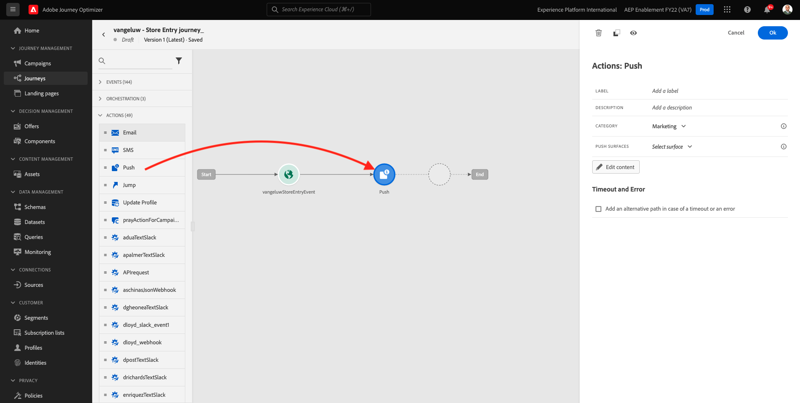
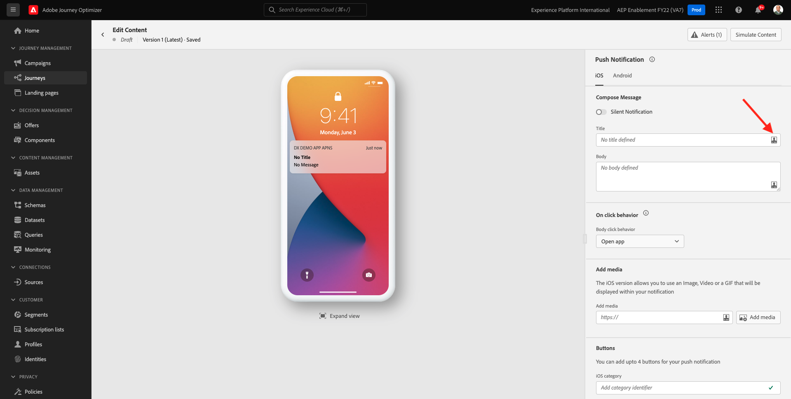
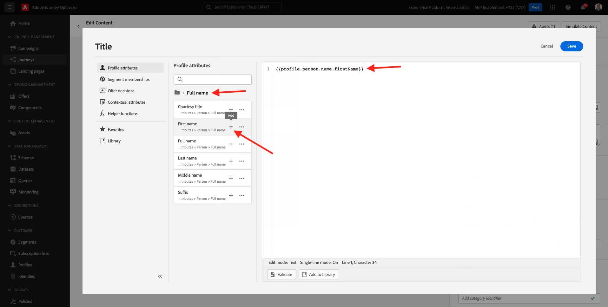

# 10.4 Konfigurera och använda push-meddelanden för iOS

Om du vill använda push-meddelanden med Adobe Journey Optimizer finns det ett antal inställningar att kontrollera och känna till.

Här följer alla inställningar som ska verifieras:

- Datauppsättningar och scheman i Adobe Experience Platform
- Datastream för mobiler
- Datainsamlingsegenskap för mobiler
- Appyta för push-certifikat
- Testa dina push-inställningar med AEP Assurance

Vi granskar dem en i taget.

Logga in på Adobe Journey Optimizer genom att gå till [Adobe Experience Cloud](https://experience.adobe.com). Klicka **Journey Optimizer**.

Du omdirigeras till **Startsida**  i Journey Optimizer. Kontrollera först att du använder rätt sandlåda. Sandlådan som ska användas anropas `--aepSandboxId--`. Om du vill ändra från en sandlåda till en annan klickar du på **PRODUKTIONSprodukt (VA7)** och välj sandlådan i listan. I det här exemplet heter sandlådan **AEP-aktivering FY22**. Då är du i **Startsida** vy över din sandlåda `--aepSandboxId--`.

## 10.4.1 Push datasets

Adobe Journey Optimizer använder datauppsättningar för att lagra exempelvis push-tokens från mobila enheter eller interaktioner med push-meddelanden (som: skickat meddelande, meddelande öppnat osv.) i en datauppsättning i Adobe Journey Optimizer.

Du kan hitta dessa datauppsättningar genom att gå till **[!UICONTROL Datauppsättningar]** på menyn till vänster på skärmen. Om du vill visa systemdatauppsättningar klickar du på filterikonen.

Aktivera alternativet **Visa systemdatauppsättningar** och söka efter **AJO**. Du ser då de datauppsättningar som används för push-meddelanden.

## 10.4.2 Datastream för mobiler

Gå till [https://experience.adobe.com/#/data-collection/](https://experience.adobe.com/#/data-collection/).

Gå till den vänstra menyn **[!UICONTROL Datastream]** och söka efter din datastream som du har skapat i [Utövning 0.2](./../module0/ex2.md), som har namnet `--demoProfileLdap-- - Demo System Datastream (Mobile)`. Klicka för att öppna den.

Klicka **Redigera** på **Adobe Experience Platform** service.

Du kommer då att se de datastream-inställningar som har definierats och i vilka datamängdshändelser och profilattribut lagras.

Inga ändringar behövs. Datastream är nu klar att användas i din datainsamlingsklientegenskap för mobilen.

## 10.4.3 Granska din datainsamlingsegenskap för mobiler

Gå till [https://experience.adobe.com/#/data-collection/](https://experience.adobe.com/#/data-collection/). Som en del av [Utövning 0.1](./../module0/ex1.md), 2 egenskaper för datainsamling skapades.
Du har redan använt dessa egenskaper för datainsamlingsklienten som en del av tidigare moduler.

Klicka för att öppna datainsamlingsegenskapen för mobilen.

Gå till din Data Collection-egenskap **Tillägg**. Du kommer då att se de olika tillägg som behövs för mobilappen. Klicka för att öppna tillägget **Adobe Experience Platform Edge Network**.

Då ser du att ditt datastream för mobilen är länkat här. Klicka på **Avbryt** för att gå tillbaka till översikten över tilläggen.

Du kommer då tillbaka hit. Tillägget för **AEP Assurance**. AEP Assurance hjälper er att inspektera, bevisa, simulera och validera hur ni samlar in data eller levererar upplevelser i er mobilapp. Du kan läsa mer om AEP Assurance och Project Griffon här [https://aep-sdks.gitbook.io/docs/beta/project-griffon](https://aep-sdks.gitbook.io/docs/beta/project-griffon).

Klicka på **Konfigurera** för att öppna tillägget **Adobe Journey Optimizer**.

Du kommer då att se att det är här som datauppsättningen för spårning av push-händelser är länkad.

Du behöver inte göra några ändringar i din Data Collection-egenskap.

## 10.4.4 Granska konfigurationen av appytan

Gå till [https://experience.adobe.com/#/data-collection/](https://experience.adobe.com/#/data-collection/). Gå till den vänstra menyn **Appytor** och open, appytan för **DX Demo App APNS**.

Sedan visas den konfigurerade appytan för iOS och Android.

## 10.4.5 Testa konfigurationen av push-meddelanden med AEP Assurance.

När appen har installerats hittar du den på enhetens hemskärm. Klicka på ikonen för att öppna programmet.

När du använder appen första gången ombeds du logga in med din Adobe ID. Slutför inloggningsprocessen.

När du har loggat in visas ett meddelande som ber dig att skicka meddelanden. Vi skickar meddelanden som en del av självstudiekursen, så klicka **Tillåt**.

Då ser du appens hemsida. Gå till **Inställningar**.

I inställningarna ser du att det för närvarande finns en **Offentligt projekt** har lästs in i appen. Klicka **Eget projekt**.

Du kan nu läsa in ett anpassat projekt. Klicka på QR-koden för att enkelt läsa in ditt projekt.

Efter träning 0.1 fick du det här resultatet. Klicka för att öppna **Mobilt butiksprojekt** som skapades åt dig.

Om du av misstag har stängt webbläsarfönstret, eller för framtida demonstrations- eller aktiveringssessioner, kan du även komma åt webbplatsprojektet genom att gå till [https://builder.adobedemo.com/projects](https://builder.adobedemo.com/projects). När du har loggat in med din Adobe ID ser du det här. Klicka på ditt mobilappsprojekt för att öppna det.

Du kommer då att se det här. Klicka **Integreringar**.

Du måste välja datainsamlingsegenskapen för mobilen som skapades i övning 0.1. Klicka på **Kör**.

Då visas den här popup-rutan som innehåller en QR-kod. Skanna QR-koden inifrån mobilappen.

Sedan visas ditt projekt-ID i appen. Sedan kan du klicka på **Spara**.

Gå tillbaka till **Startsida** i appen. Ditt program är nu klart att användas.

Du måste nu skanna en QR-kod för att ansluta den mobila enheten till AEP Assurance-sessionen.

Om du vill starta en AEP Assurance-session går du till [https://experience.adobe.com/#/@experienceplatform/griffon](https://experience.adobe.com/#/@experienceplatform/griffon). Klicka **Skapa session**.

Klicka **Starta**.

Fyll i värdena:

- Sessionsnamn: use `--demoProfileLdap-- - push debugging` och ersätt ldap med din ldap
- Bas-URL: use **dxdemo://default**

Klicka på **Nästa**.

Sedan visas en QR-kod på skärmen som du bör skanna med din iOS-enhet.

Öppna kameramappen på din mobila enhet och skanna QR-koden som visas av AEP Assurance.

Då visas en popup-skärm där du ombeds ange PIN-koden. Kopiera PIN-koden från skärmen AEP Assurance och klicka på **Anslut**.

Du kommer då att se det här.

I AEP Assurance ser du nu att en enhet är till AEP Assurance-sessionen.

Gå till **Push-felsökning**. Du kommer att se något liknande.

Förklaring:

- Den första kolumnen, **Klient** visas de tillgängliga identifierarna på din iOS-enhet. Du ser ett ECID och en push-token.
- Den andra kolumnen visar **Profil** information, med ytterligare information om vilken plattform Push Token finns i (APNS eller APNSSandbox). Om du klickar på **Inspect-profil** kommer du till Adobe Experience Platform och du ser hela kundprofilen i realtid.
- I den tredje kolumnen visas **Appkonfiguration** som inrättades som en del av övningen **10.5.4 Skapa appkonfiguration i Launch**

Klicka på knappen **Skicka push-meddelande** -knappen.

Du måste se till att **DX Demo** appen är inte öppen när du klickar på **Skicka push-meddelande** -knappen. Om appen är öppen kan push-meddelandet tas emot i bakgrunden och inte visas.

Du kommer då att se ett sådant här push-meddelande på din mobila enhet.

Om du har fått ett push-meddelande betyder det att konfigurationen är korrekt och fungerar som den ska.

## 10.4.6 Skapa en ny händelse

Gå till menyn **Reseadministration** och klicka **Hantera** under **Händelser**.

På **Händelser** visas en liknande vy. Klicka **Skapa händelse**.

Därefter visas en tom händelsekonfiguration.

Först och främst ger du evenemanget ett namn som detta: `--demoProfileLdap--StoreEntryEvent` och ange beskrivning till `Store Entry Event`.

Nästa är **Händelsetyp** markering. Välj **Unitary**.

Nästa är **Typ av händelse-ID** markering. Välj **Systemgenererat**

Nästa steg är schemavalet. Ett schema förbereddes för den här övningen. Använd schemat `Demo System - Event Schema for Mobile App (Global v1.1) v.1`.

När du har valt schemat visas ett antal fält i **Nyttolast** -avsnitt. Din händelse är nu helt konfigurerad.

Du borde se det här då. Klicka **Spara**.

Händelsen är nu konfigurerad och sparad. Klicka på aktiviteten igen för att öppna **Redigera händelse** skärm igen.

Hovra över **Nyttolast** och klicka på **Visa nyttolast** ikon.

Nu visas ett exempel på den förväntade nyttolasten.

Händelsen har ett unikt ID för Orchestration-händelse som du kan hitta genom att rulla nedåt i nyttolasten tills du ser `_experience.campaign.orchestration.eventID`.

Händelse-ID är det som måste skickas till Adobe Experience Platform för att utlösa den resa som du ska bygga i nästa steg. Skriv ned detta eventID, som du behöver det i nästa steg.
`"eventID": "e3a8f0bdc0b609667cd96a72a6b1e5aafa0ddaf6ccf121c574e6a2030860a633"`

Klicka **OK**, följt av **Avbryt**.

## 10.4.7 Skapa en resa

Gå till menyn **Resor** och klicka **Skapa resa**.

Du kommer då att se det här. Ge resan ett namn. Använd `--demoProfileLdap-- - Store Entry journey`. Klicka **OK**.

Först måste du lägga till din händelse som startpunkt för din resa. Sök efter din aktivitet `--demoProfileLdap--StoreEntryEvent` och dra och släpp det på arbetsytan. Klicka **OK**.

Nästa, under **Åtgärder**, sök efter **Push** åtgärd.
Dra och släpp **Push** på arbetsytan.

Ange **Kategori** till **Marknadsföring** och välj en push-yta som gör att du kan skicka push-meddelanden. I det här fallet är e-postytan som ska väljas **Push-iOS-Android**.

Nästa steg är att skapa ett meddelande. Det gör du genom att klicka **Redigera innehåll**.

Du kommer då att se det här. Klicka på **personalisering** ikonen för **Titel** fält.

Du kommer då att se det här. Du kan nu välja valfritt profilattribut direkt i kundprofilen i realtid.

Sök efter fältet **Förnamn** klickar du på **+** ikon bredvid fältet **Förnamn**. Du kommer då att se personaliseringstoken för förnamn som läggs till: **{{profile.person.name.firstName}}**.

Lägg sedan till texten **, välkommen till vår butik!** bakom **{{profile.person.name.firstName}}**.

Klicka **Spara**.

Du har den här nu. Klicka på **personalisering** ikonen för **Brödtext** fält.

Ange den här texten **Klicka här för att få 10 % rabatt när du köper idag!** och klicka **Spara**.

Du får den här då. Klicka på pilen i det övre vänstra hörnet för att gå tillbaka till din resa.

Klicka **OK** för att stänga din push-åtgärd.

Klicka **Publicera**.

Klicka **Publicera** igen.

Din resa är nu publicerad.

## 10.4.8 Testa din resa och skicka ett push-meddelande

I DX Demo 2.0-mobilapplikationen går du till **Inställningar** skärm. Klicka på **Butikspost** -knappen.

>[!NOTE]
>
>The **Butikspost** håller på att implementeras. Du hittar det inte i appen än.

Stäng appen omedelbart efter att du klickat på **Butikspost** -ikonen, annars visas inte push-meddelandet.

Efter några sekunder visas meddelandet.

Du har gjort klart den här övningen.

Nästa steg: [10.5 Skapa en affärsevenemangsresa](./ex5.md)

[Gå tillbaka till modul 10](./journeyoptimizer.md)

[Gå tillbaka till Alla moduler](../../overview.md)
