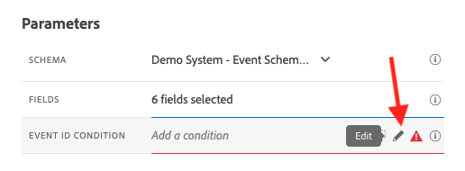
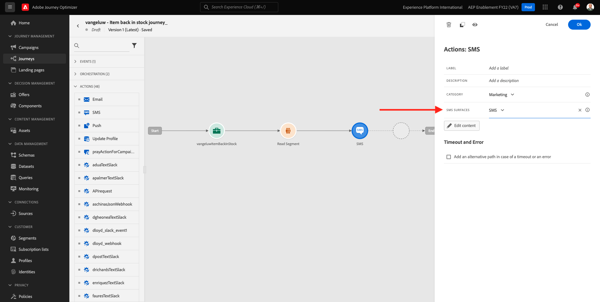
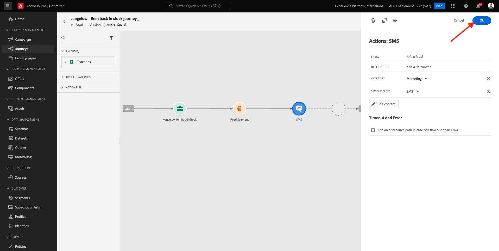

# 10.5 Skapa en affärsevenemangsresa

Logga in på Adobe Journey Optimizer genom att gå till [Adobe Experience Cloud](https://experience.adobe.com). Klicka **Journey Optimizer**.


Du omdirigeras till **Startsida**  i Journey Optimizer. Kontrollera först att du använder rätt sandlåda. Sandlådan som ska användas anropas `--aepSandboxId--`. Om du vill ändra från en sandlåda till en annan klickar du på **PRODUKTIONSprodukt (VA7)** och välj sandlådan i listan. I det här exemplet heter sandlådan **AEP-aktivering FY22**. Då är du i **Startsida** vy över din sandlåda `--aepSandboxId--`.


## 10.5.1 Skapa en affärshändelse

Klicka på **Konfigurationer**. Klicka på **Hantera** knappen i **Händelser** kort.


Affärshändelser är en ny typ av händelser som du kan skapa i Journey Optimizer. Till skillnad från **Unitary** händelser som du har skapat i tidigare moduler aktiveras inte affärshändelserna av kunden utan av organisationen. Nu ska du skapa en affärshändelse.

Klicka **Skapa händelse**.


Ange följande värden i formuläret för att skapa händelse:

- **Namn**: `--demoProfileLdap--ItemBackInStock`. Till exempel: **vangeluwItemBackInStock**
- **Beskrivning**: Den här händelsen utlöses när en produkt är tillbaka i lager
- **Typ**: välj **Företag** i listrutan


För schemat väljer du **Demo System - händelseschema för JO-affärshändelser (Global v1.1) v.1**. Du måste nu markera de fält i schemat som du behöver för vår användning.


Följ de här stegen:

Klicka på **penna** ikon i fältet där det står **1 fält markerat**.


Markera alla tillgängliga fält i schemat och klicka sedan på **OK**.


För villkoret: Du måste ange vilka poster i det här schemat som ska utlösa affärshändelsen.

Följ de här stegen:

Klicka på **penna** ikon i fältet där det står **Lägg till ett villkor**.



Utöka `--aepTenantId--` objekt, expandera objektet **joBusinessEvents** och dra och släpp fältet **eventName** på arbetsytan.


För fältet **eventName** anger du följande värde: `--demoProfileLdap--ItemBackInStock`. Till exempel: vangeluwItemBackInStock.
Klicka **OK**.


Klicka **OK**.


Slutligen bör ditt formulär för att skapa event se ut så här. Klicka **Spara** för att spara tid åt er verksamhet.


## 10.5.2 Skapa en affärshändelseresa

Nu kan ni utnyttja den här affärshändelsen och budskapet inuti en resa. Gå till **Resor**. Klicka **Skapa resa**.


Till höger ser du ett formulär där du måste ange resans namn och beskrivning. Ange följande värden:

- **Namn**: `--demoProfileLdap-- - Item back in stock journey`. Till exempel: vangeluw - objekt tillbaka i lagerresa
- **Beskrivning**: Den här resan skickar ett SMS när en artikel är tillbaka i lager till besökare som har visat intresse.

Klicka **OK**.


I den vänstra menyn, under **Händelser** söker du efter din ldap. Du hittar den tidigare skapade affärshändelsen `--demoProfileLdap--ItemBackInStock`. Dra och släpp den här händelsen på arbetsytan eftersom det här blir startpunkten på resan.


Som du ser kan du **Läs segment** aktiviteten har automatiskt lagts till på arbetsytan. Det beror på att affärshändelserna bara skickar en utlösare för resan för att läsa ett visst segment, som sedan hämtar listan över profiler för den resan.

Klicka på **Läs segment** aktivitet.
The **Läs segment** Du måste välja det segment som du vill meddela om den affärshändelse som just har inträffat. Klicka på **Markera ett segment** fält.


I **Välj ett segment** popup, sök efter din ldap och välj det segment du skapade i [Modul 6 - CDP i realtid - Bygg ett segment och vidta åtgärder](../module6/real-time-cdp-build-a-segment-take-action.md) namngiven `--demoProfileLdap-- - Interest in PROTEUS FITNESS JACKSHIRT`. till exempel: vangeluw - Intresse för PROTEUS FITNESS JACKSHIRT. Klicka **Spara**.


Klicka på **OK**.


Nästa steg är att dra och släppa den åtgärd som vi vill utföra på den här resan. Välj åtgärd **SMS** och sedan dra och släppa det efter villkoret du just lade till.


Ange **Kategori** till **Marknadsföring** och väljer en liten yta som gör att du kan skicka små mängder. I det här fallet är e-postytan som ska väljas **SMS**.



Nästa steg är att skapa ett meddelande. Det gör du genom att klicka **Redigera innehåll**.


Nu visas meddelandekontrollpanelen där du kan konfigurera texten i ditt SMS. Klicka på **Skriv meddelande** för att skapa meddelandet.


Ange följande text: `Hi {{profile.person.name.firstName}}, the Proteus Fitness Jackshirt is back in stock at Luma.`. Klicka **Spara**.


Gå tillbaka till meddelandekontrollpanelen genom att klicka på **pil** bredvid texten på ämnesraden i det övre vänstra hörnet.


Nu visas den slutförda SMS-åtgärden. Klicka **OK**.



Din resa är nu klar att publiceras. Klicka **Publicera**.


Klicka **Publicera** igen.


Din resa är nu publicerad, du kan testa den!


## 10.5.3 Testa din affärshändelseresa

Nu simulerar du en produkts ombyggnad genom att välja en ny händelse mot **Demo System - händelseschema för JO-affärshändelser (Global v1.1) v.1** med Postman.

Klicka på **Källor** och klicka sedan på **Konton** -fliken.


På **Konton** hittar du kontot med namnet **Journey Optimizer Business Events**. Klicka på den för att öppna den.


Det här kontot har bara ett dataflöde. Klicka på dataflödets namn för att markera det.


Klicka **Kopiera schemanyttolast** i den högra menyn. Det här alternativet kopierar hela **kurva** om du vill infoga en post mot **Demo System - händelseschema för JO-affärshändelser (Global v1.1) v.1** till Urklipp.


Klistra in kommandot Rulla i en textredigerare


Låt oss titta närmare på denna förfrågan,

- Begäran om POST skickas till DCS Inlet ID
- Begäran refererar till schemat, datauppsättningen och organisations-ID:t.
- Slutligen innehåller den xdmEntity-noden som representerar de data som vi vill skapa i datauppsättningen.

Du måste nu ersätta följande `xdmEntity` rad...

```json
"xdmEntity": {
  "_experienceplatform": {
    "joBusinessEvents": {
      "eventDescription": "string",
      "eventName": "string",
      "stockEventId": "string"
    }
  },
  "_id": "/uri-reference",
  "eventType": "advertising.completes",
  "timestamp": "2018-11-12T20:20:39+00:00"
}
```

...På den här raden måste du verifiera field eventName som det ska stå `--demoProfileLdap--ItemBackInStock`, som representerar det villkor som du har angett i din affärshändelse för att utlösa din resa.

```json
"xdmEntity": {
  "_experienceplatform": {
    "joBusinessEvents": {
      "eventDescription": "Product Proteus Fitness Jackshirt is back in stock",
      "eventName": "--demoProfileLdap--ItemBackInStock",
      "stockEventId": "1"
    }
  },
  "_id": "/uri-reference",
  "eventType": "productBackInStock",
  "timestamp": "2021-04-19T15:25:39+00:00"
}
```

Den uppdaterade **kurva** kommandot ska se ut så här:


Markera allt och kopiera det till Urklipp.

Öppna Postman. Till vänster om Postman klickar du på **Importera**.


Välj **Raw-text** och klistra in kommandot som tidigare kopierats här. Klicka **Fortsätt**.


Klicka **Importera**.


Postman har automatiskt konverterat **kurva** till ett REST-kommando som är klart att aktiveras, tryck bara på **Skicka** för att begära att posten ska skapas i datauppsättningen.


Kontrollera att din begäran har tagits emot. Leta efter en **200 OK** status i postman.


SMS:et kan ta några minuter att komma fram till din mobiltelefon. Om det inte gör det, **Intressen av Proteus Fitness Jackshirts** segment får inte innehålla en profil med rätt mobiltelefon. Gå i så fall till Lumas webbplats. **Proteus Fitness Jackshirt** produkt och registrering samtidigt som du ser till att du anger rätt mobiltelefonnummer.


Du har nu avslutat den här övningen.

Nästa steg: [Sammanfattning och fördelar](./summary.md)

[Gå tillbaka till modul 10](./journeyoptimizer.md)

[Gå tillbaka till Alla moduler](../../overview.md)
